# 博客文章与项目数据管理功能设计

## 概述

本设计旨在为 Next.js 个人网站添加数据持久化能力，将博客文章和项目从硬编码迁移到灵活的存储方案。设计遵循**极简原则**，避免过度设计，选择最适合个人博客场景的技术方案。

### 业务目标

- 实现博客文章和项目数据的持久化存储
- 支持便捷的内容管理（增删改查）
- 保持前端现有功能不变，仅替换数据源
- 降低开发和运维复杂度
- 为未来扩展预留空间

### 核心设计原则

**简洁性优先**
- 避免引入不必要的技术层级
- 优先使用 Next.js 原生能力
- 减少外部依赖和服务

**适度架构**
- 个人博客无需企业级分层架构
- 选择符合规模的技术方案
- 保持代码清晰易懂

**渐进增强**
- 先满足核心需求，后续按需扩展
- 预留接口但不过度设计

### 技术方案对比

#### 方案一：纯文件系统（推荐）

| 技术组件 | 选型 | 理由 |
|---------|------|------|
| 数据存储 | Markdown/JSON 文件 | 零依赖，易于版本控制，可直接编辑 |
| 内容解析 | gray-matter + unified | Next.js 生态成熟方案 |
| 部署方式 | Vercel 一体化部署 | 零成本，自动构建，无需独立后端 |
| 管理方式 | Git + 文件编辑器 | 版本控制友好，简单直观 |

**优势**：
- ✅ 无需数据库和后端服务
- ✅ 内容即代码，Git 版本控制
- ✅ Vercel 部署零配置
- ✅ 可使用 Markdown 编写，支持富文本
- ✅ 离线编辑，本地预览

**劣势**：
- ⚠️ 非技术人员管理门槛高（需了解 Git）
- ⚠️ 无可视化管理后台（可通过 CMS 集成解决）

#### 方案二：Next.js API Routes + 数据库（备选）

| 技术组件 | 选型 | 理由 |
|---------|------|------|
| 后端框架 | Next.js API Routes | 无需独立后端，与前端同一项目 |
| 数据库 | Vercel Postgres / Supabase | 免费额度，托管服务，零运维 |
| ORM 工具 | Prisma | TypeScript 友好，自动生成类型 |
| 部署方式 | Vercel 一体化部署 | 前后端统一部署 |

**优势**：
- ✅ 统一项目，无需维护独立后端
- ✅ 支持动态内容管理
- ✅ 可集成可视化管理后台
- ✅ 数据库查询性能好

**劣势**：
- ⚠️ 增加数据库依赖和成本
- ⚠️ 需要处理数据库迁移和备份
- ⚠️ 复杂度高于文件系统

#### 方案三：无头 CMS（适合快速上线）

| 技术组件 | 选型 | 理由 |
|---------|------|------|
| 内容管理 | Contentful / Sanity / Strapi | 开箱即用的管理后台 |
| 数据获取 | CMS SDK / GraphQL | 官方提供完整 API |
| 部署方式 | Vercel 前端 + CMS 托管 | 前端静态化，CMS 云端托管 |

**优势**：
- ✅ 可视化管理后台
- ✅ 富文本编辑器、媒体管理等开箱即用
- ✅ 多人协作支持
- ✅ API 性能和稳定性有保障

**劣势**：
- ⚠️ 部分服务收费或有使用限制
- ⚠️ 数据存储在第三方平台
- ⚠️ 学习特定 CMS 的 API

### 最终推荐方案

**基于你的背景（前端开发）和场景（个人博客），推荐采用方案一「文件系统 + Markdown」作为主方案**，理由如下：

1. **零成本**：无需数据库和后端服务器
2. **极简**：符合个人博客规模，避免过度设计
3. **版本控制友好**：所有内容在 Git 中可追溯
4. **易于迁移**：纯文件，随时可切换到其他方案
5. **性能优异**：静态生成，CDN 缓存

**如果未来需要可视化管理后台，可以无缝集成以下工具**：
- **Tina CMS**：基于 Git 的可视化编辑器，完美适配文件系统
- **Decap CMS**（原 Netlify CMS）：开源 Git-based CMS
- **Forestry**：Git-backed CMS

这些工具直接编辑你的 Markdown/JSON 文件，无需改变存储方案

## 整体架构

采用**文件系统 + Markdown** 方案，将博客文章和项目数据存储为本地文件，Next.js 在构建时读取文件生成静态页面。

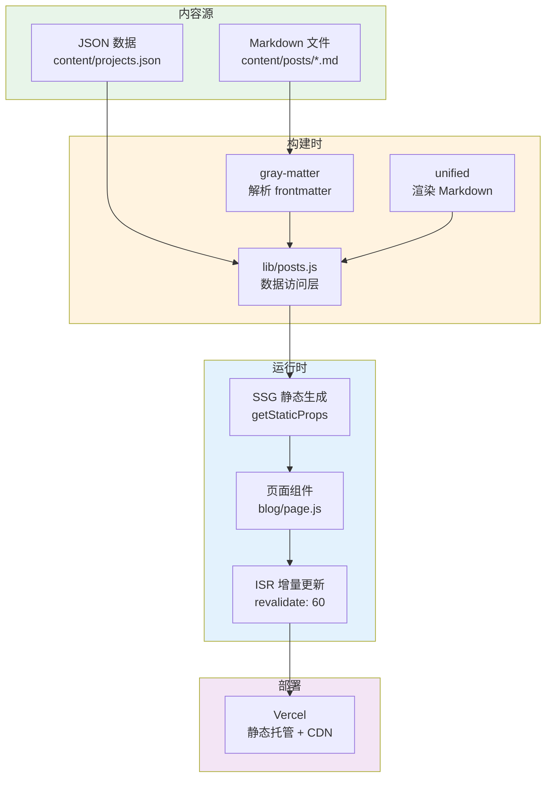

### 数据流转

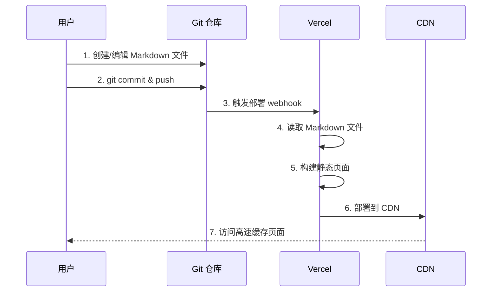

### 架构优势

| 特性 | 说明 |
|------|------|
| 零依赖 | 无需数据库、后端服务器、API 层 |
| 版本控制 | 所有内容在 Git 中可追溯、可回滚 |
| 极致性能 | 静态页面 + CDN 全球加速 |
| 零成本 | Vercel 免费额度足够个人使用 |
| SEO 友好 | 预渲染 HTML，搜索引擎直接索引 |
| 简单直观 | 直接编辑文件，无需学习 API |
| 易于备份 | 全部内容在 Git 仓库，天然备份 |
| 离线编辑 | 本地开发服务器预览 |

## 目录结构设计

```
andylili-website-nextjs/
├── content/                    # 内容目录（新增）
│   ├── posts/                 # 博客文章 Markdown 文件
│   │   ├── nextjs-blog-tutorial.md
│   │   ├── react-performance-tips.md
│   │   └── css-grid-vs-flexbox.md
│   └── projects.json          # 项目数据 JSON 文件
├── app/
│   ├── blog/
│   │   ├── [slug]/
│   │   │   └── page.js           # 文章详情页
│   │   └── page.js               # 博客列表页
│   ├── projects/
│   │   └── page.tsx              # 项目展示页
│   ├── lib/
│   │   ├── posts.js              # 博客数据访问层（重构）
│   │   ├── projects.js           # 项目数据访问层（新增）
│   │   └── markdown.js           # Markdown 解析工具（新增）
│   └── ...
├── public/
│   └── images/                # 图片资源
└── package.json
```

### 目录说明

| 目录/文件 | 职责 |
|---------|------|
| content/posts/ | 存放所有博客文章的 Markdown 文件，文件名即为 slug |
| content/projects.json | 项目数据的 JSON 文件，包含所有项目信息 |
| app/lib/posts.js | 读取 Markdown 文件，解析 frontmatter，提供数据访问方法 |
| app/lib/projects.js | 读取 projects.json，提供项目数据访问方法 |
| app/lib/markdown.js | 封装 unified 等工具，将 Markdown 转 HTML |

## 数据模型设计

### 博客文章 Markdown 结构

每篇文章为一个 `.md` 文件，使用 **frontmatter**（YAML 头信息）+ **Markdown 正文**格式。

**文件命名规则**：
- 文件名即为 slug（URL 标识符）
- 仅包含小写字母、数字和连字符
- 示例：`nextjs-blog-tutorial.md`

**Frontmatter 字段定义**：

| 字段名 | 类型 | 必填 | 说明 | 示例值 |
|--------|------|------|------|--------|
| title | String | 是 | 文章标题 | 使用Next.js构建现代博客 |
| date | String | 是 | 发布日期，YYYY-MM-DD 格式 | 2024-03-27 |
| excerpt | String | 是 | 摘要，1-200 字符 | 学习如何使用Next.js... |
| image | String | 否 | 封面图片 URL | /images/nextjs-blog.jpg |
| tags | Array | 否 | 标签数组 | ["Next.js", "React"] |
| readingTime | Number | 否 | 阅读时长（分钟） | 8 |
| featured | Boolean | 否 | 是否推荐，默认 false | true |

**文件示例**：

```
---
title: 使用Next.js构建现代博客
date: 2024-03-27
excerpt: 学习如何使用Next.js、MDX和Vercel构建高性能的现代博客网站。
image: /images/nextjs-blog.jpg
tags:
  - Next.js
  - React
  - 博客
readingTime: 8
featured: true
---

## 简介

这是一篇关于如何使用 Next.js 构建博客的详细教程...

### 为什么选择 Next.js

Next.js 提供了以下优势：

- 服务端渲染 (SSR)
- 静态站点生成 (SSG)
- API Routes

...
```

### 项目数据 JSON 结构

所有项目存放在单个 `content/projects.json` 文件中。

**字段定义**：

| 字段名 | 类型 | 必填 | 说明 | 示例值 |
|--------|------|------|------|--------|
| id | Number | 是 | 项目唯一 ID | 1 |
| title | String | 是 | 项目名称 | 电商网站开发 |
| description | String | 是 | 项目描述 | 使用React和Node.js构建... |
| technologies | Array | 否 | 技术栈数组 | ["React", "Node.js"] |
| image | String | 否 | 项目封面图 | /images/ecommerce.jpg |
| githubUrl | String | 否 | GitHub 仓库地址 | https://github.com/user/repo |
| demoUrl | String | 否 | 在线演示地址 | https://demo.example.com |
| featured | Boolean | 否 | 是否精选，默认 false | true |
| order | Number | 否 | 显示顺序，默认 999 | 1 |

**文件示例**：

```json
[
  {
    "id": 1,
    "title": "电商网站开发",
    "description": "使用React和Node.js构建的全栈电商平台，包含商品展示、购物车、支付等功能。",
    "technologies": ["React", "Node.js", "MongoDB", "Stripe"],
    "image": "/images/ecommerce.jpg",
    "githubUrl": "https://github.com/user/ecommerce",
    "demoUrl": "https://demo.example.com",
    "featured": true,
    "order": 1
  },
  {
    "id": 2,
    "title": "任务管理应用",
    "description": "基于Next.js的协作任务管理工具，支持团队协作、任务分配和进度跟踪。",
    "technologies": ["Next.js", "TypeScript", "Firebase"],
    "image": "/images/task-manager.jpg",
    "githubUrl": "https://github.com/user/tasks",
    "demoUrl": "https://tasks.example.com",
    "featured": false,
    "order": 2
  }
]
```

## 技术实现方案

### 依赖包安装

需要安装以下 npm 包：

| 包名 | 版本 | 用途 |
|------|------|------|
| gray-matter | ^4.0.3 | 解析 Markdown frontmatter |
| remark | ^15.0.1 | Markdown 处理工具链 |
| remark-html | ^16.0.1 | 将 Markdown 转换为 HTML |
| remark-gfm | ^4.0.0 | 支持 GitHub Flavored Markdown |

**安装命令**：

```bash
npm install gray-matter remark remark-html remark-gfm
```

### 数据访问层实现

#### Markdown 解析工具 (lib/markdown.js)

**职责**：封装 Markdown 到 HTML 的转换逻辑

**核心功能**：
- 使用 unified + remark 处理 Markdown
- 支持 GFM（表格、任务列表等）
- 返回 HTML 字符串

**关键逻辑**：

```
输入：Markdown 字符串
 ↓
remark 解析为 AST（抽象语法树）
 ↓
remark-gfm 插件处理扩展语法
 ↓
remark-html 转换为 HTML
 ↓
输出：HTML 字符串
```

**对外接口**：
- `async function markdownToHtml(markdown)` - 返回 HTML 字符串

#### 博客数据访问层 (lib/posts.js)

**职责**：读取、解析和查询博客文章

**核心流程**：

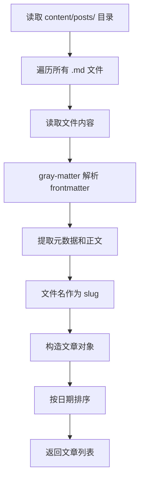

**对外接口**：

| 方法名 | 参数 | 返回值 | 说明 |
|--------|------|---------|------|
| getAllPosts() | 无 | Promise<Post[]> | 获取所有文章，按日期降序 |
| getFeaturedPosts() | 无 | Promise<Post[]> | 获取 featured=true 的文章 |
| getPostBySlug(slug) | slug: string | Promise<Post \| null> | 根据 slug 获取单篇文章 |
| getPostSlugs() | 无 | string[] | 获取所有文章的 slug（用于 generateStaticParams） |

**实现要点**：

1. **读取文件**：使用 Node.js `fs` 模块读取 `content/posts/` 目录
2. **解析 frontmatter**：使用 `gray-matter` 分离元数据和正文
3. **slug 生成**：从文件名提取（去掉 `.md` 后缀）
4. **Markdown 转 HTML**：在 `getPostBySlug` 中调用 `markdownToHtml`
5. **排序**：按 `date` 字段降序排列

**数据对象结构**：

```typescript
interface Post {
  slug: string           // 文件名（不含 .md）
  title: string          // frontmatter.title
  date: string           // frontmatter.date
  excerpt: string        // frontmatter.excerpt
  image?: string         // frontmatter.image
  tags?: string[]        // frontmatter.tags
  readingTime?: number   // frontmatter.readingTime
  featured?: boolean     // frontmatter.featured
  content?: string       // Markdown 转换后的 HTML（仅详情页）
}
```

#### 项目数据访问层 (lib/projects.js)

**职责**：读取和查询项目数据

**核心流程**：

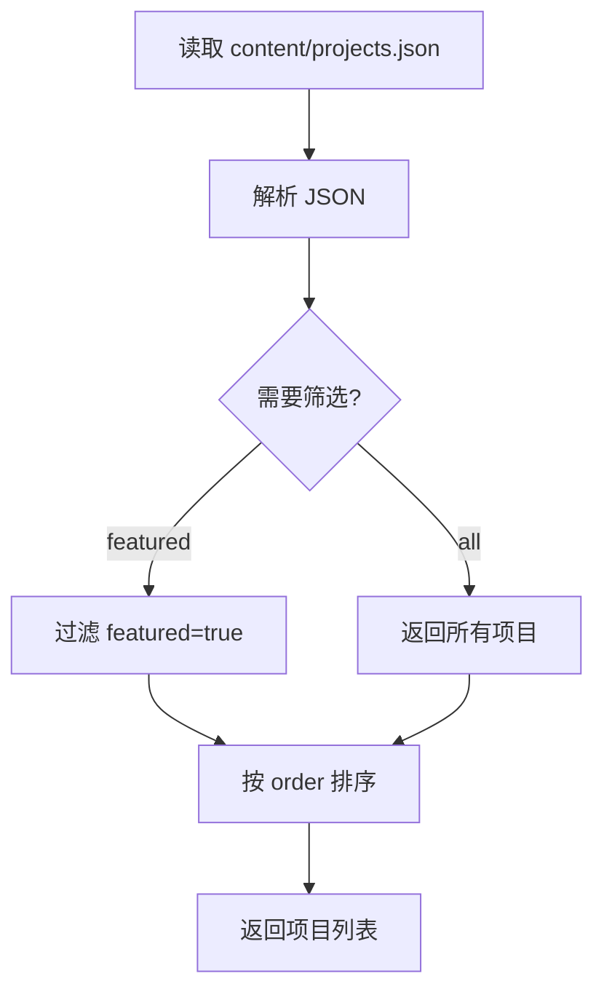

**对外接口**：

| 方法名 | 参数 | 返回值 | 说明 |
|--------|------|---------|------|
| getAllProjects() | 无 | Promise<Project[]> | 获取所有项目，按 order 升序 |
| getFeaturedProjects() | 无 | Promise<Project[]> | 获取 featured=true 的项目 |
| getProjectById(id) | id: number | Promise<Project \| null> | 根据 ID 获取单个项目 |

**数据对象结构**：

```typescript
interface Project {
  id: number
  title: string
  description: string
  technologies?: string[]
  image?: string
  githubUrl?: string
  demoUrl?: string
  featured?: boolean
  order?: number
}
```

### 前端页面集成

#### 博客列表页 (app/blog/page.js)

**改造要点**：

1. 删除原有的 `import { getAllPosts } from '../lib/posts'`
2. 重新导入新的数据访问层：`import { getAllPosts } from '../lib/posts'`
3. 保持组件代码不变（因为数据结构兼容）

**数据获取模式**：

- 使用 Next.js 15 的服务端组件特性
- 在组件顶层调用 `await getAllPosts()`
- 构建时读取文件，生成静态 HTML

**缓存策略**：

- 默认为静态生成（SSG）
- 可配置 ISR：`export const revalidate = 3600` // 每小时重新生成

#### 文章详情页 (app/blog/[slug]/page.js)

**改造要点**：

1. 导入新的数据访问方法：`import { getPostBySlug, getPostSlugs } from '../../lib/posts'`
2. 实现 `generateStaticParams`：调用 `getPostSlugs()` 返回所有 slug
3. 在组件中调用 `getPostBySlug(params.slug)` 获取文章详情
4. 使用 `dangerouslySetInnerHTML` 渲染 HTML 内容

**关键逻辑**：

```
generateStaticParams:
  ↓
  获取所有 slug 列表
  ↓
  Next.js 预生成所有文章页面

页面组件：
  ↓
  根据 slug 获取文章内容
  ↓
  渲染 frontmatter 和 HTML 正文
```

**HTML 渲染示例**：

```jsx
<div 
  className="prose prose-lg"
  dangerouslySetInnerHTML={{ __html: post.content }}
/>
```

**样式处理**：

- 推荐使用 Tailwind Typography 插件（`@tailwindcss/typography`）
- 为 Markdown 生成的 HTML 添加 `prose` 类名，自动应用排版样式

#### 项目展示页 (app/projects/page.tsx)

**改造要点**：

1. 删除组件内的硬编码 projects 数组
2. 导入：`import { getAllProjects } from '../lib/projects'`
3. 在组件顶层调用：`const projects = await getAllProjects()`
4. 保持 ProjectCard 组件不变

**注意事项**：

- 如果原组件为 `'use client'`，需改为服务端组件（删除 `'use client'` 声明）
- 数据结构兼容，仅需调整数据来源

### 构建与部署

#### 本地开发

**启动开发服务器**：

```bash
npm run dev
```

- Next.js 会实时读取 `content/` 目录下的文件
- 修改 Markdown 文件后刷新浏览器即可看到更新

#### Vercel 部署

**配置步骤**：

1. 将项目推送到 GitHub
2. 在 Vercel 控制台导入仓库
3. 自动检测为 Next.js 项目，零配置
4. 点击 Deploy

**自动化流程**：

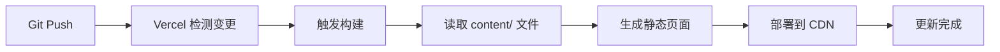

**环境变量**：

无需配置环境变量，所有数据在构建时读取。

**构建输出**：

- 每篇文章生成一个静态 HTML 文件
- 列表页生成一个静态 HTML 文件
- 所有页面部署到 Vercel 的全球 CDN

### 性能优化

#### 静态生成策略

| 页面 | 生成策略 | 说明 |
|------|---------|------|
| 博客列表 | SSG | 构建时生成，极速加载 |
| 文章详情 | SSG + generateStaticParams | 预生成所有文章页面 |
| 项目展示 | SSG | 构建时生成 |

#### ISR （可选）

如果需要定期更新而不重新构建，可启用 ISR：

```javascript
// app/blog/page.js
export const revalidate = 3600 // 每小时重新验证
```

**ISR 工作流程**：

1. 首次访问返回缓存页面
2. 超过 revalidate 时间后，后台重新生成页面
3. 下次访问返回新页面

#### 图片优化

使用 Next.js Image 组件：

```jsx
import Image from 'next/image'

<Image 
  src={post.image} 
  alt={post.title}
  width={800}
  height={400}
  className="rounded-lg"
/>
```

**优化效果**：
- 自动响应式图片
- 懒加载
- WebP 格式转换
- CDN 加速
| data.pagination.total | Integer | 总记录数 |
| data.pagination.page | Integer | 当前页码 |
| data.pagination.limit | Integer | 每页数量 |
| data.pagination.totalPages | Integer | 总页数 |

**响应示例**（成功）：

```
{
  "success": true,
  "data": {
    "posts": [
      {
        "id": 1,
        "slug": "nextjs-blog-tutorial",
        "title": "使用Next.js构建现代博客",
        "excerpt": "学习如何使用Next.js、MDX和Vercel构建高性能的现代博客网站。",
        "coverImage": "https://example.com/cover.jpg",
        "publishedAt": "2024-03-27T00:00:00Z",
        "readingTime": 8,
        "featured": true,
        "tags": ["Next.js", "React", "博客"],
        "viewCount": 125
      }
    ],
    "pagination": {
      "total": 15,
      "page": 1,
      "limit": 10,
      "totalPages": 2
    }
  }
}
```

#### 获取单篇文章详情

**接口描述**：根据 slug 获取文章完整内容

| 项目 | 内容 |
|------|------|
| 请求方法 | GET |
| 请求路径 | /api/posts/:slug |
| 认证要求 | 无 |

**路径参数**：

| 参数名 | 类型 | 说明 | 示例 |
|--------|------|------|------|
| slug | String | 文章 URL 标识符 | nextjs-blog-tutorial |

**响应结构**：

| 字段 | 类型 | 说明 |
|------|------|------|
| success | Boolean | 请求是否成功 |
| data | Object | 文章完整对象（包含 content 字段） |

**响应示例**（成功）：

```
{
  "success": true,
  "data": {
    "id": 1,
    "slug": "nextjs-blog-tutorial",
    "title": "使用Next.js构建现代博客",
    "excerpt": "学习如何使用Next.js...",
    "content": "<p>这是一篇关于如何使用Next.js构建博客的详细教程...</p>",
    "coverImage": "https://example.com/cover.jpg",
    "publishedAt": "2024-03-27T00:00:00Z",
    "readingTime": 8,
    "featured": true,
    "tags": ["Next.js", "React", "博客"],
    "viewCount": 126,
    "createdAt": "2024-03-20T10:00:00Z",
    "updatedAt": "2024-03-27T15:30:00Z"
  }
}
```

**响应示例**（文章不存在）：

```
{
  "success": false,
  "error": {
    "code": "POST_NOT_FOUND",
    "message": "文章不存在"
  }
}
```

#### 创建新文章

**接口描述**：创建一篇新的博客文章

| 项目 | 内容 |
|------|------|
| 请求方法 | POST |
| 请求路径 | /api/posts |
| 认证要求 | 需要（未来扩展） |
| Content-Type | application/json |

**请求体参数**：

| 字段名 | 类型 | 必填 | 说明 | 验证规则 |
|--------|------|------|------|---------|
| slug | String | 是 | URL 标识符 | 唯一，仅包含字母数字和连字符 |
| title | String | 是 | 文章标题 | 1-200 字符 |
| excerpt | String | 是 | 摘要 | 1-500 字符 |
| content | String | 是 | 正文内容 | 不为空 |
| coverImage | String | 否 | 封面图 URL | 有效的 URL 格式 |
| publishedAt | String | 否 | 发布时间 | ISO 8601 格式，默认当前时间 |
| readingTime | Integer | 否 | 阅读时长 | 大于 0 的整数 |
| featured | Boolean | 否 | 是否推荐 | 默认 false |
| tags | Array | 否 | 标签数组 | 字符串数组 |
| status | String | 否 | 状态 | draft 或 published，默认 draft |

**请求示例**：

```
{
  "slug": "react-hooks-guide",
  "title": "React Hooks 完全指南",
  "excerpt": "深入理解 React Hooks 的使用场景和最佳实践",
  "content": "<p>React Hooks 改变了我们编写组件的方式...</p>",
  "coverImage": "https://example.com/react-hooks.jpg",
  "readingTime": 12,
  "featured": false,
  "tags": ["React", "Hooks", "JavaScript"],
  "status": "published"
}
```

**响应结构**：

| 字段 | 类型 | 说明 |
|------|------|------|
| success | Boolean | 请求是否成功 |
| data | Object | 创建的文章对象（含 id、createdAt 等自动生成字段） |

**响应示例**（成功）：

```
{
  "success": true,
  "data": {
    "id": 5,
    "slug": "react-hooks-guide",
    "title": "React Hooks 完全指南",
    "excerpt": "深入理解 React Hooks...",
    "content": "<p>React Hooks 改变了...</p>",
    "coverImage": "https://example.com/react-hooks.jpg",
    "publishedAt": "2024-03-28T08:00:00Z",
    "readingTime": 12,
    "featured": false,
    "tags": ["React", "Hooks", "JavaScript"],
    "viewCount": 0,
    "status": "published",
    "createdAt": "2024-03-28T08:00:00Z",
    "updatedAt": "2024-03-28T08:00:00Z"
  }
}
```

**响应示例**（验证失败）：

```
{
  "success": false,
  "error": {
    "code": "VALIDATION_ERROR",
    "message": "参数验证失败",
    "details": [
      {
        "field": "slug",
        "message": "slug 已存在"
      },
      {
        "field": "title",
        "message": "标题不能为空"
      }
    ]
  }
}
```

#### 更新文章

**接口描述**：更新现有文章内容

| 项目 | 内容 |
|------|------|
| 请求方法 | PUT |
| 请求路径 | /api/posts/:id |
| 认证要求 | 需要（未来扩展） |
| Content-Type | application/json |

**路径参数**：

| 参数名 | 类型 | 说明 |
|--------|------|------|
| id | Integer | 文章 ID |

**请求体参数**：所有字段均为可选，仅更新提供的字段

| 字段名 | 类型 | 说明 |
|--------|------|------|
| title | String | 文章标题 |
| excerpt | String | 摘要 |
| content | String | 正文内容 |
| coverImage | String | 封面图 URL |
| publishedAt | String | 发布时间 |
| readingTime | Integer | 阅读时长 |
| featured | Boolean | 是否推荐 |
| tags | Array | 标签数组 |
| status | String | 状态 |

**响应结构**：与创建文章响应相同，返回更新后的文章对象

#### 删除文章

**接口描述**：软删除文章（将状态改为 archived）或永久删除

| 项目 | 内容 |
|------|------|
| 请求方法 | DELETE |
| 请求路径 | /api/posts/:id |
| 认证要求 | 需要（未来扩展） |

**路径参数**：

| 参数名 | 类型 | 说明 |
|--------|------|------|
| id | Integer | 文章 ID |

**查询参数**：

| 参数名 | 类型 | 必填 | 说明 |
|--------|------|------|------|
| permanent | Boolean | 否 | 是否永久删除，默认 false（软删除） |

**响应示例**（成功）：

```
{
  "success": true,
  "message": "文章已删除"
}
```

#### 增加文章阅读量

**接口描述**：用户访问文章时增加阅读计数

| 项目 | 内容 |
|------|------|
| 请求方法 | POST |
| 请求路径 | /api/posts/:slug/view |
| 认证要求 | 无 |

**路径参数**：

| 参数名 | 类型 | 说明 |
|--------|------|------|
| slug | String | 文章 slug |

**响应示例**：

```
{
  "success": true,
  "data": {
    "viewCount": 127
  }
}
```

#### 图片优化

使用 Next.js Image 组件：

```jsx
import Image from 'next/image'

<Image 
  src={post.image} 
  alt={post.title}
  width={800}
  height={400}
  className="rounded-lg"
/>
```

**优化效果**：
- 自动响应式图片
- 懒加载
- WebP 格式转换
- CDN 加速

### 项目 API

#### 获取所有项目列表

**接口描述**：返回所有活跃状态的项目，按 order 字段排序

| 项目 | 内容 |
|------|------|
| 请求方法 | GET |
| 请求路径 | /api/projects |
| 认证要求 | 无 |

**查询参数**：

| 参数名 | 类型 | 必填 | 说明 | 示例 |
|--------|------|------|------|------|
| featured | Boolean | 否 | 仅返回精选项目 | true |
| status | String | 否 | 状态过滤：active/archived，默认 active | active |

**响应结构**：

| 字段 | 类型 | 说明 |
|------|------|------|
| success | Boolean | 请求是否成功 |
| data | Array | 项目列表 |

**响应示例**：

```
{
  "success": true,
  "data": [
    {
      "id": 1,
      "title": "电商网站开发",
      "description": "使用React和Node.js构建的全栈电商平台...",
      "technologies": ["React", "Node.js", "MongoDB", "Stripe"],
      "coverImage": "https://example.com/ecommerce.jpg",
      "githubUrl": "https://github.com/user/ecommerce",
      "demoUrl": "https://demo.example.com",
      "featured": true,
      "order": 1,
      "createdAt": "2024-03-15T09:00:00Z"
    }
  ]
}
```

#### 获取单个项目详情

**接口描述**：根据 ID 获取项目详细信息

| 项目 | 内容 |
|------|------|
| 请求方法 | GET |
| 请求路径 | /api/projects/:id |
| 认证要求 | 无 |

**路径参数**：

| 参数名 | 类型 | 说明 |
|--------|------|------|
| id | Integer | 项目 ID |

**响应结构**：与列表接口返回的单个对象相同

#### 创建新项目

**接口描述**：添加新的项目记录

| 项目 | 内容 |
|------|------|
| 请求方法 | POST |
| 请求路径 | /api/projects |
| 认证要求 | 需要（未来扩展） |
| Content-Type | application/json |

**请求体参数**：

| 字段名 | 类型 | 必填 | 说明 | 验证规则 |
|--------|------|------|------|---------|
| title | String | 是 | 项目名称 | 1-200 字符 |
| description | String | 是 | 项目描述 | 不为空 |
| technologies | Array | 否 | 技术栈 | 字符串数组 |
| coverImage | String | 否 | 封面图 URL | 有效的 URL 格式 |
| githubUrl | String | 否 | GitHub 地址 | 有效的 URL 格式 |
| demoUrl | String | 否 | 演示地址 | 有效的 URL 格式 |
| featured | Boolean | 否 | 是否精选 | 默认 false |
| order | Integer | 否 | 显示顺序 | 默认 999 |
| status | String | 否 | 状态 | active 或 archived，默认 active |

**请求示例**：

```
{
  "title": "任务管理应用",
  "description": "基于Next.js的协作任务管理工具...",
  "technologies": ["Next.js", "TypeScript", "Firebase"],
  "coverImage": "https://example.com/task-manager.jpg",
  "githubUrl": "https://github.com/user/task-manager",
  "demoUrl": "https://tasks.example.com",
  "featured": true,
  "order": 2
}
```

#### 更新项目

**接口描述**：更新现有项目信息

| 项目 | 内容 |
|------|------|
| 请求方法 | PUT |
| 请求路径 | /api/projects/:id |
| 认证要求 | 需要（未来扩展） |

**路径参数**：

| 参数名 | 类型 | 说明 |
|--------|------|------|
| id | Integer | 项目 ID |

**请求体参数**：所有字段均为可选，仅更新提供的字段（同创建接口）

#### 删除项目

**接口描述**：软删除或永久删除项目

| 项目 | 内容 |
|------|------|
| 请求方法 | DELETE |
| 请求路径 | /api/projects/:id |
| 认证要求 | 需要（未来扩展） |

**路径参数**：

| 参数名 | 类型 | 说明 |
|--------|------|------|
| id | Integer | 项目 ID |

**查询参数**：

| 参数名 | 类型 | 必填 | 说明 |
|--------|------|------|------|
| permanent | Boolean | 否 | 是否永久删除，默认 false |

### API 通用规范

#### 错误响应格式

所有错误响应遵循统一结构：

| 字段 | 类型 | 说明 |
|------|------|------|
| success | Boolean | 固定为 false |
| error | Object | 错误信息对象 |
| error.code | String | 错误代码 |
| error.message | String | 错误描述 |
| error.details | Array | 详细错误信息（可选） |

**常见错误码**：

| 错误码 | HTTP 状态码 | 说明 |
|--------|------------|------|
| VALIDATION_ERROR | 400 | 参数验证失败 |
| POST_NOT_FOUND | 404 | 文章不存在 |
| PROJECT_NOT_FOUND | 404 | 项目不存在 |
| DUPLICATE_SLUG | 409 | slug 已存在 |
| INTERNAL_ERROR | 500 | 服务器内部错误 |
| UNAUTHORIZED | 401 | 未授权（未来功能） |

#### CORS 配置

后端服务需配置 CORS 以允许前端跨域请求：

| 配置项 | 值 | 说明 |
|--------|-----|------|
| Access-Control-Allow-Origin | * 或前端域名 | 允许的来源 |
| Access-Control-Allow-Methods | GET, POST, PUT, DELETE, OPTIONS | 允许的 HTTP 方法 |
| Access-Control-Allow-Headers | Content-Type, Authorization | 允许的请求头 |

#### 分页约定

所有列表接口支持分页，遵循以下规则：

- 默认每页 10 条记录
- 最大每页 50 条记录
- 页码从 1 开始
- 返回总记录数和总页数便于前端渲染分页组件

## 内容管理工作流

### 创建新文章

**操作步骤**：

1. 在 `content/posts/` 目录创建新的 `.md` 文件
2. 文件名使用 slug 格式（小写字母 + 连字符）
3. 添加 frontmatter 头信息
4. 编写 Markdown 正文
5. Git commit 并 push
6. Vercel 自动构建部署

**示例流程**：

```
flowchart LR
    A[本地创建 .md 文件] --> B[编写内容]
    B --> C[git add & commit]
    C --> D[git push]
    D --> E[Vercel 检测变更]
    E --> F[自动构建]
    F --> G[生成新页面]
    G --> H[部署上线]
```

### 编辑现有文章

**操作步骤**：

1. 直接编辑 `content/posts/` 中的 `.md` 文件
2. 修改 frontmatter 或正文
3. Git commit 并 push
4. Vercel 自动重新构建

**版本控制优势**：
- 每次修改都有 Git 记录
- 可以回滚到任意历史版本
- 支持 diff 比较，查看修改内容

### 删除文章

**操作步骤**：

1. 删除对应的 `.md` 文件
2. Git commit 并 push
3. Vercel 重新构建后该文章页面不再生成

### 管理项目

**操作步骤**：

1. 编辑 `content/projects.json` 文件
2. 增加、修改或删除 JSON 对象
3. Git commit 并 push
4. Vercel 自动部署

**JSON 编辑工具**：
- VS Code：内置 JSON 格式验证和提示
- 在线 JSON 编辑器：确保格式正确

### 本地预览

**在提交前预览效果**：

```bash
npm run dev
```

- 访问 `http://localhost:3000/blog` 查看文章列表
- 访问 `http://localhost:3000/blog/文章slug` 查看详情
- 访问 `http://localhost:3000/projects` 查看项目

**热更新**：
- 修改 Markdown 文件后保存
- 浏览器自动刷新显示最新内容

## 数据迁移

### 现有数据迁移到 Markdown

将 `app/lib/posts.js` 中的硬编码数据转换为 Markdown 文件。

**迁移步骤**：

1. 为每篇文章创建对应的 `.md` 文件
2. 从现有数据提取字段填充 frontmatter
3. 将 `content` 字段作为正文（如果是 HTML，需转换为 Markdown）

**字段映射**：

| 现有字段 | Markdown 文件 |
|---------|-------------|
| slug | 文件名（去掉 .md） |
| title | frontmatter.title |
| date | frontmatter.date |
| excerpt | frontmatter.excerpt |
| image | frontmatter.image |
| tags | frontmatter.tags |
| readingTime | frontmatter.readingTime |
| featured | frontmatter.featured |
| content | Markdown 正文 |

**示例迁移**：

原有数据：
```javascript
{
  slug: 'nextjs-blog-tutorial',
  title: '使用Next.js构建现代博客',
  date: '2024-03-27',
  excerpt: '学习如何使用Next.js...',
  content: '<p>这是一篇关于...</p>',
  image: '/images/nextjs.jpg',
  tags: ['Next.js', 'React'],
  readingTime: 8,
  featured: true
}
```

转换为文件 `content/posts/nextjs-blog-tutorial.md`：

```
---
title: 使用Next.js构建现代博客
date: 2024-03-27
excerpt: 学习如何使用Next.js...
image: /images/nextjs.jpg
tags:
  - Next.js
  - React
readingTime: 8
featured: true
---

这是一篇关于...（将 HTML 转为 Markdown）
```

**HTML 到 Markdown 转换工具**：
- 在线工具：https://www.convertsimple.com/convert-html-to-markdown/
- 命令行工具：`pandoc`

### 项目数据迁移

将 `app/projects/page.tsx` 中的硬编码数组提取到 `content/projects.json`。

**迁移步骤**：

1. 创建 `content/projects.json` 文件
2. 复制现有的 projects 数组
3. 调整字段名（如果需要）
4. 保存 JSON 文件

**字段映射**：

大部分字段直接保持一致，无需调整。

## 扩展功能

### 可视化管理后台集成

如果未来需要可视化编辑界面，可集成以下工具：

#### Tina CMS（推荐）

**特点**：
- 基于 Git 的内容管理系统
- 可视化编辑 Markdown 文件
- 实时预览
- 免费套餐可用

**集成方式**：

1. 安装 Tina CMS：`npm install tinacms`
2. 配置 `.tina/config.ts` 指向 `content/posts/` 目录
3. 启动 Tina 管理后台
4. 直接在浏览器中编辑 Markdown

**优势**：
- 与现有方案完美兼容
- 不改变文件结构
- 依然使用 Git 版本控制

#### Decap CMS（原 Netlify CMS）

**特点**：
- 开源 Git-based CMS
- 配置简单
- 支持多种字段类型

**集成方式**：

1. 在 `public/admin/` 创建配置文件
2. 配置 `config.yml` 指向 Markdown 文件
3. 访问 `/admin` 路径进入管理后台

#### Forestry / CloudCannon

**特点**：
- 托管型 CMS
- 富文本编辑器
- 媒体管理

**适用场景**：
- 需要多人协作
- 非技术人员管理内容

### 搜索功能

基于文件系统方案的搜索实现：

#### 客户端搜索（简单）

**实现思路**：

1. 在构建时生成所有文章的搜索索引 JSON
2. 客户端加载索引文件
3. 使用 JavaScript 过滤匹配文章

**搜索索引示例**：

```json
[
  {
    "slug": "nextjs-blog-tutorial",
    "title": "使用Next.js构建现代博客",
    "excerpt": "学习如何使用Next.js...",
    "tags": ["Next.js", "React"]
  }
]
```

**搜索逻辑**：

```javascript
function searchPosts(posts, keyword) {
  return posts.filter(post => 
    post.title.toLowerCase().includes(keyword.toLowerCase()) ||
    post.excerpt.toLowerCase().includes(keyword.toLowerCase()) ||
    post.tags?.some(tag => tag.toLowerCase().includes(keyword.toLowerCase()))
  )
}
```

#### 全文搜索（高级）

**集成 Algolia**：

1. 注册 Algolia 账号（有免费额度）
2. 构建时将文章数据推送到 Algolia
3. 前端集成 Algolia 搜索组件

**优势**：
- 支持中文分词
- 实时搜索提示
- 高亮关键词

### 评论系统

集成第三方评论系统：

| 方案 | 特点 | 适用场景 |
|------|------|----------|
| Giscus | 基于 GitHub Discussions，免费 | 技术博客 |
| Utterances | 基于 GitHub Issues，开源 | 技术博客 |
| Disqus | 功能强大，有广告 | 通用博客 |
| Waline | 开源、自托管 | 需要完全控制 |

**Giscus 集成示例**：

1. 启用 GitHub Discussions
2. 在文章页面嵌入 Giscus 组件
3. 评论自动关联到对应的 Discussion

### 阅读统计

#### 简单方案：集成 Google Analytics

**步骤**：

1. 创建 GA4 媒体资源
2. 安装 `@next/third-parties`
3. 在 `layout.tsx` 中添加 GA 组件
4. 在 GA 控制台查看数据

#### 高级方案：自建统计

**如果未来添加数据库**，可存储阅读量：

1. 每篇文章增加 `viewCount` 字段
2. 用户访问时通过 API 增加计数
3. 展示阅读量

**当前方案不支持**（无数据库），但可使用 GA 数据。

### RSS 订阅

生成 RSS feed 供读者订阅：

**实现方式**：

1. 创建 `app/feed.xml/route.ts`
2. 读取所有文章
3. 生成 RSS XML 格式
4. 访问 `/feed.xml` 获取 RSS

**RSS 格式示例**：

```xml
<?xml version="1.0" encoding="UTF-8"?>
<rss version="2.0">
  <channel>
    <title>我的博客</title>
    <link>https://yourdomain.com</link>
    <item>
      <title>文章标题</title>
      <link>https://yourdomain.com/blog/slug</link>
      <description>文章摘要</description>
      <pubDate>Mon, 27 Mar 2024 00:00:00 GMT</pubDate>
    </item>
  </channel>
</rss>
```

### Sitemap 生成

Next.js 15 原生支持 sitemap：

**实现方式**：

1. 创建 `app/sitemap.ts`
2. 读取所有文章 slug
3. 返回 sitemap 数组
4. Next.js 自动生成 `/sitemap.xml`

**示例逻辑**：

```typescript
export default async function sitemap() {
  const posts = await getAllPosts()
  
  return [
    {
      url: 'https://yourdomain.com',
      lastModified: new Date(),
    },
    ...posts.map(post => ({
      url: `https://yourdomain.com/blog/${post.slug}`,
      lastModified: new Date(post.date),
    }))
  ]
}
```

## 最佳实践

### Markdown 编写规范

1. **Frontmatter 必填字段**：title、date、excerpt
2. **日期格式统一**：YYYY-MM-DD
3. **slug 命名规范**：小写字母 + 数字 + 连字符，避免中文
4. **图片路径**：统一放在 `public/images/` 目录
5. **标签一致性**：保持标签命名统一（如大小写）

### 性能优化

1. **图片优化**：使用 next/image 组件
2. **懒加载**：文章列表仅加载当前页
3. **CDN 缓存**：Vercel 自动配置
4. **预渲染**：所有页面预生成为静态 HTML

### SEO 优化

1. **Metadata 配置**：在每个页面组件中导出 `metadata`
2. **Open Graph**：添加 OG 图片和描述
3. **Sitemap**：自动生成 sitemap.xml
4. **Robots.txt**：配置爬虫规则

### 备份策略

1. **Git 仓库**：主要备份，所有内容在版本控制中
2. **多远程仓库**：GitHub + GitLab/Gitee 镜像
3. **本地备份**：定期 clone 仓库到本地
4. **图片备份**：图片也在 Git 中，或使用图床服务

### 安全性

1. **输入验证**：渲染 Markdown 时防止 XSS
2. **HTTPS**：Vercel 自动启用
3. **环境变量**：敏感信息不提交到 Git
4. **依赖更新**：定期更新 npm 包修复漏洞

### 目录结构

```
express-backend/
├── src/
│   ├── config/              # 配置文件
│   │   ├── database.js      # 数据库连接配置
│   │   └── server.js        # 服务器配置（端口、CORS等）
│   ├── controllers/         # 控制器层
│   │   ├── postController.js    # 博客文章控制器
│   │   └── projectController.js # 项目控制器
│   ├── services/            # 业务逻辑层
│   │   ├── postService.js       # 文章业务逻辑
│   │   └── projectService.js    # 项目业务逻辑
│   ├── middlewares/         # 中间件
│   │   ├── errorHandler.js      # 错误处理中间件
│   │   ├── validator.js         # 参数验证中间件
│   │   └── logger.js            # 日志中间件
│   ├── routes/              # 路由定义
│   │   ├── index.js         # 主路由
│   │   ├── posts.js         # 文章路由
│   │   └── projects.js      # 项目路由
│   ├── prisma/              # Prisma 配置
│   │   ├── schema.prisma    # 数据库模型定义
│   │   └── client.js        # Prisma Client 实例
│   └── app.js               # Express 应用入口
├── .env                     # 环境变量
├── package.json             # 依赖配置
└── README.md                # 项目说明
```

### 分层职责

```mermaid
flowchart LR
    subgraph Routes["路由层"]
        R1["定义 API 端点"]
        R2["绑定 HTTP 方法"]
        R3["应用中间件"]
    end
    
    subgraph Controllers["控制器层"]
        C1["解析请求参数"]
        C2["调用业务逻辑"]
        C3["格式化响应"]
        C4["处理异常"]
    end
    
    subgraph Services["服务层"]
        S1["实现业务规则"]
        S2["数据转换"]
        S3["调用数据访问层"]
    end
    
    subgraph Data["数据访问层"]
        D1["Prisma Client 操作"]
        D2["SQL 查询执行"]
    end
    
    Routes --> Controllers
    Controllers --> Services
    Services --> Data
    
    style Routes fill:#e3f2fd
    style Controllers fill:#f3e5f5
    style Services fill:#fff3e0
    style Data fill:#e8f5e9
```

**职责说明**：

| 层级 | 主要职责 | 禁止行为 |
|------|---------|---------|
| 路由层 | 定义 URL 结构，绑定控制器方法，应用验证中间件 | 不包含业务逻辑 |
| 控制器层 | 提取请求参数，调用服务层，构造响应对象，捕获异常 | 不直接操作数据库 |
| 服务层 | 实现业务规则（如 slug 唯一性检查），数据格式转换 | 不关心 HTTP 细节 |
| 数据访问层 | 封装 Prisma 查询，处理数据库事务 | 不包含业务判断 |

### 核心中间件

#### 错误处理中间件

统一捕获并格式化错误响应，区分不同类型的异常：

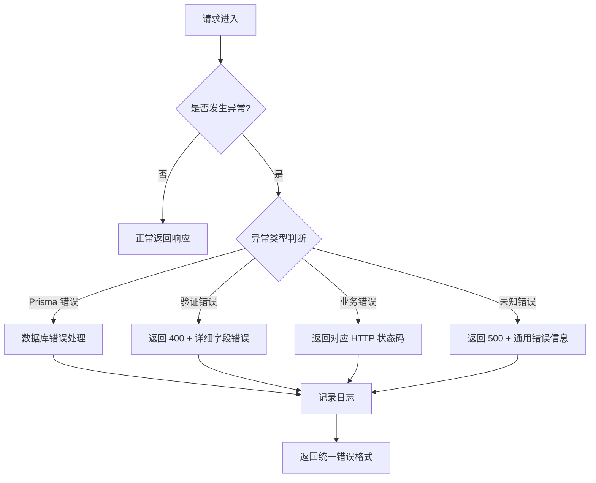

**处理逻辑**：

1. Prisma 唯一约束冲突（P2002） → 409 DUPLICATE_SLUG
2. Prisma 记录不存在（P2025） → 404 NOT_FOUND
3. 参数验证失败 → 400 VALIDATION_ERROR
4. 其他异常 → 500 INTERNAL_ERROR，隐藏敏感信息

#### 参数验证中间件

使用验证库（如 Joi 或 express-validator）在控制器执行前验证请求参数：

**验证规则示例**：

| 字段 | 验证规则 |
|------|---------|
| slug | 必填，字符串，正则匹配 `^[a-z0-9-]+$`，唯一性（数据库查询） |
| title | 必填，字符串，长度 1-200 |
| content | 必填，字符串，不为空 |
| tags | 可选，数组，元素为字符串 |
| readingTime | 可选，整数，最小值 1 |

#### 日志中间件

记录每个请求的关键信息：

- 请求时间
- HTTP 方法和路径
- 请求参数（脱敏处理）
- 响应状态码
- 执行耗时
- 错误堆栈（如有）

### 数据库操作模式

#### Prisma Client 初始化

创建单例 Prisma Client 实例，避免多次连接：

**初始化流程**：

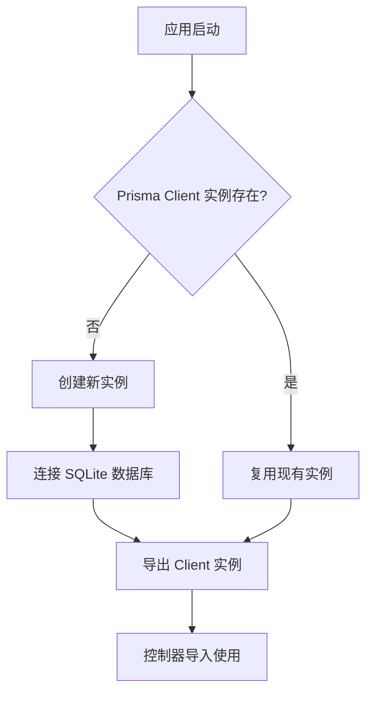

#### 常用查询模式

**文章列表查询**（支持过滤、分页、排序）：

- 条件构建：根据查询参数动态添加 where 条件
- 排序：按 publishedAt 降序
- 分页：使用 skip 和 take 参数
- 字段选择：列表接口排除 content 字段减少数据传输

**文章详情查询**（根据 slug）：

- 使用 findUnique 查询唯一索引字段
- 包含所有字段
- 不存在时返回 null，控制器转换为 404 错误

**创建文章**：

- 使用 create 方法
- 自动生成 id、createdAt、updatedAt
- 捕获唯一约束冲突异常

**更新文章**：

- 使用 update 方法，通过 id 定位
- 仅更新提供的字段（Prisma 自动处理）
- 自动更新 updatedAt 字段

**删除文章**：

- 软删除：update 方法将 status 改为 'archived'
- 永久删除：delete 方法（需谨慎）

#### 事务处理

对于复杂操作（如批量更新标签），使用 Prisma 事务确保数据一致性：

**事务场景示例**：

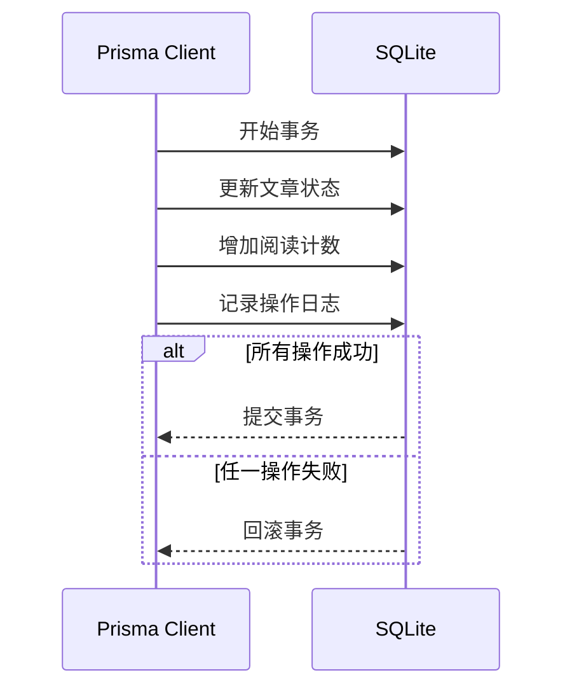

## 前端集成方案

### API 客户端封装

在 Next.js 项目中创建统一的 API 调用层，处理网络请求和错误。

#### 目录结构

```
app/
├── lib/
│   ├── api/
│   │   ├── client.js        # 基础 fetch 封装
│   │   ├── posts.js         # 博客文章 API 方法
│   │   └── projects.js      # 项目 API 方法
│   ├── posts.js             # 旧文件，待删除
│   └── ...
```

#### API 客户端基础配置

**环境变量配置**：

| 变量名 | 说明 | 示例值 |
|--------|------|--------|
| NEXT_PUBLIC_API_BASE_URL | 后端 API 基础 URL | http://localhost:3001 或 https://api.example.com |

**客户端功能**：

- 自动添加基础 URL
- 统一设置请求头（Content-Type: application/json）
- 统一错误处理（网络错误、HTTP 错误、业务错误）
- 自动解析 JSON 响应
- 支持请求拦截器（未来添加认证 Token）

**错误处理策略**：

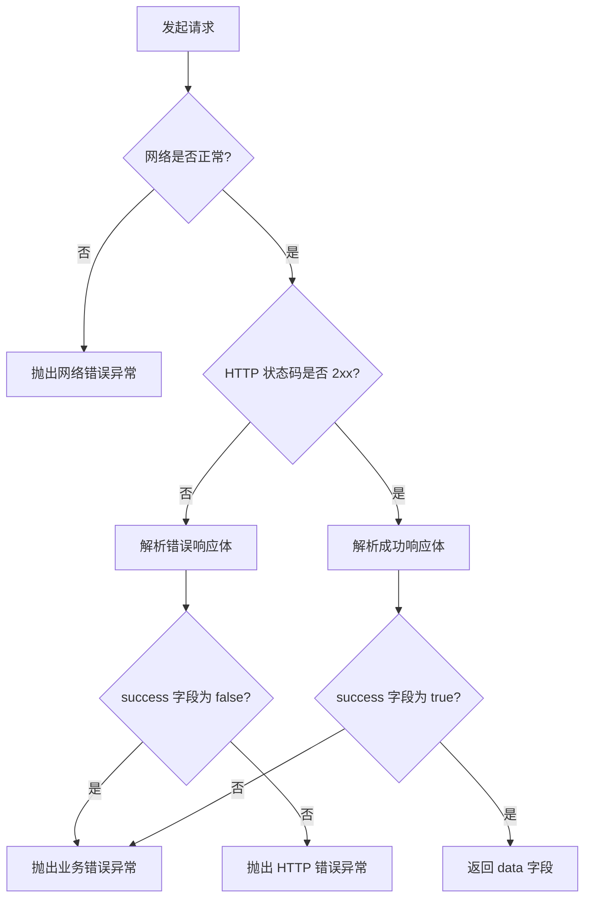

### 数据获取模式

#### 服务端组件数据获取（推荐）

利用 Next.js 15 的服务端组件特性，在服务器端调用 API：

**优势**：

- SEO 友好，内容直接渲染在 HTML 中
- 减少客户端 JavaScript 体积
- 更快的首屏加载速度
- 无需处理加载状态（数据获取在渲染前完成）

**适用场景**：

- 博客列表页
- 文章详情页
- 项目展示页

**数据流**：

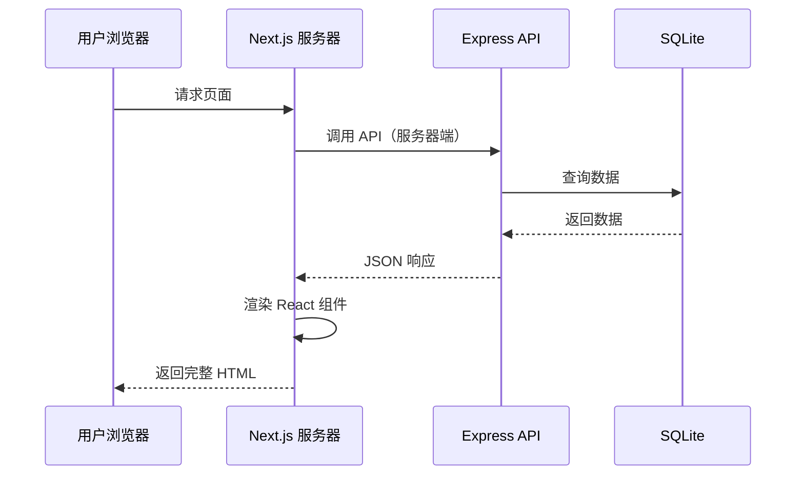

#### 客户端数据获取

对于需要交互的场景（如搜索、筛选、分页），使用客户端组件：

**适用场景**：

- 博客文章搜索
- 标签过滤
- 分页加载
- 阅读量增加（用户行为触发）

**状态管理**：

- 使用 React useState 管理数据和加载状态
- 使用 useEffect 在组件挂载时获取数据
- 可选：使用 SWR 或 React Query 优化数据获取（缓存、自动重试）

### 页面改造方案

#### 博客列表页改造

**改造目标**：将硬编码数据替换为 API 调用

**改造步骤**：

1. 保持现有文件 `app/blog/page.js`
2. 引入 API 客户端：`import { getAllPosts } from '../lib/api/posts'`
3. 替换数据源：`const posts = await getAllPosts()` 替换原有的 `import { getAllPosts } from '../lib/posts'`
4. 组件渲染逻辑保持不变
5. 添加错误边界处理（无数据或 API 失败时的提示）

**兼容性保证**：

API 响应的文章对象结构与现有硬编码数据一致，确保现有组件无需修改：

| 现有字段 | API 返回字段 | 兼容性 |
|---------|-------------|--------|
| slug | slug | ✓ 完全一致 |
| title | title | ✓ 完全一致 |
| excerpt | excerpt | ✓ 完全一致 |
| date | publishedAt | 需转换格式（ISO → YYYY-MM-DD） |
| image | coverImage | 字段名不同，需映射 |
| tags | tags | ✓ 完全一致 |
| readingTime | readingTime | ✓ 完全一致 |
| featured | featured | ✓ 完全一致 |

**数据映射逻辑**：

在 API 客户端封装层进行字段转换，保持前端组件不变：

- `publishedAt` → `date`（提取日期部分）
- `coverImage` → `image`
- 其他字段直接透传

#### 文章详情页改造

**改造目标**：根据 slug 从 API 获取文章完整内容

**改造步骤**：

1. 保持现有文件 `app/blog/[slug]/page.js`
2. 引入 API 客户端：`import { getPostBySlug } from '../../lib/api/posts'`
3. 替换数据源
4. 保持现有组件渲染逻辑
5. 添加增加阅读量的调用（在 BlogPost 组件挂载时触发）

**阅读量统计流程**：

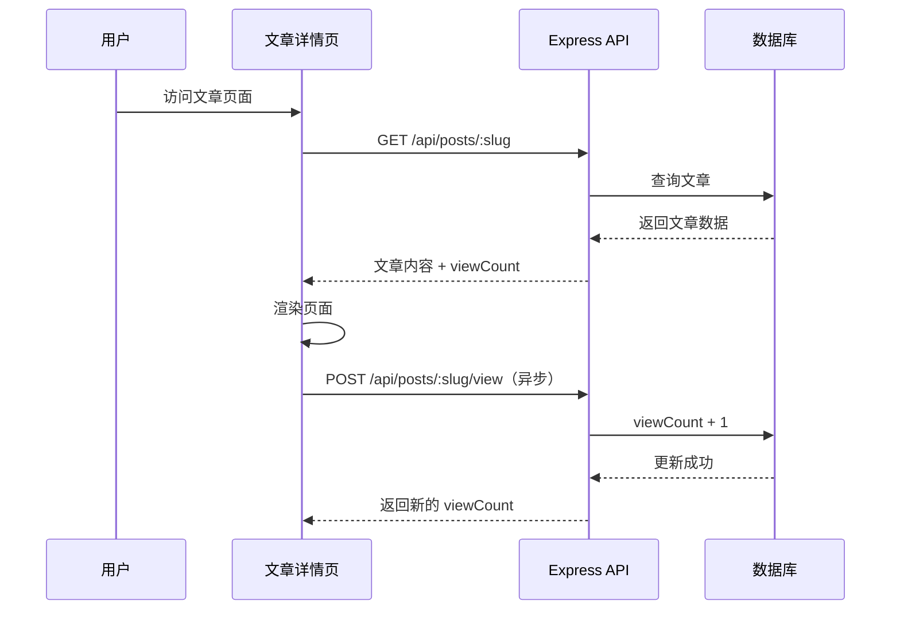

#### 项目页改造

**改造目标**：将项目数据从组件内迁移到 API

**改造步骤**：

1. 修改 `app/projects/page.tsx`，从客户端组件改为服务端组件（去掉 `'use client'`）
2. 引入 API 客户端：`import { getAllProjects } from '../lib/api/projects'`
3. 在组件顶层调用 API：`const projects = await getAllProjects()`
4. 移除硬编码的 projects 数组
5. ProjectCard 组件保持不变

**字段映射**：

| 现有字段 | API 返回字段 | 兼容性 |
|---------|-------------|--------|
| id | id | ✓ 完全一致 |
| title | title | ✓ 完全一致 |
| description | description | ✓ 完全一致 |
| technologies | technologies | ✓ 完全一致 |
| image | coverImage | 字段名不同，需映射 |
| githubUrl | githubUrl | ✓ 完全一致 |
| demoUrl | demoUrl | ✓ 完全一致 |

### 错误处理与用户体验

#### 错误场景覆盖

| 场景 | 前端处理方式 |
|------|-------------|
| API 服务器不可达 | 显示"服务暂时不可用，请稍后再试"，保留页面布局 |
| 文章/项目不存在 | 显示 404 页面或友好提示"内容未找到" |
| 网络超时 | 显示加载失败提示，提供"重试"按钮 |
| 数据为空 | 显示"暂无内容"占位符 |
| 参数验证错误 | 在表单提交时显示字段级错误提示（未来管理后台） |

#### 加载状态设计

对于客户端数据获取场景，提供视觉反馈：

- **骨架屏**：在文章列表加载时显示灰色占位块
- **加载指示器**：在数据获取中显示旋转图标
- **渐进式渲染**：已加载的内容先展示，新内容追加

#### 缓存策略

利用 Next.js 的缓存机制优化性能：

| 页面类型 | 缓存策略 | 说明 |
|---------|---------|------|
| 博客列表页 | 增量静态再生成（ISR），revalidate: 60 秒 | 每分钟最多重新生成一次 |
| 文章详情页 | 静态生成（SSG） + ISR | 构建时预生成，发布新文章后增量更新 |
| 项目页 | 静态生成（SSG） | 项目变更频率低，构建时生成 |

**缓存更新触发**：

- 手动触发：通过 Next.js 的 On-Demand Revalidation API
- 自动触发：基于 revalidate 时间间隔

## 部署方案

### 部署架构

采用前后端分离部署模式，充分利用各平台优势：

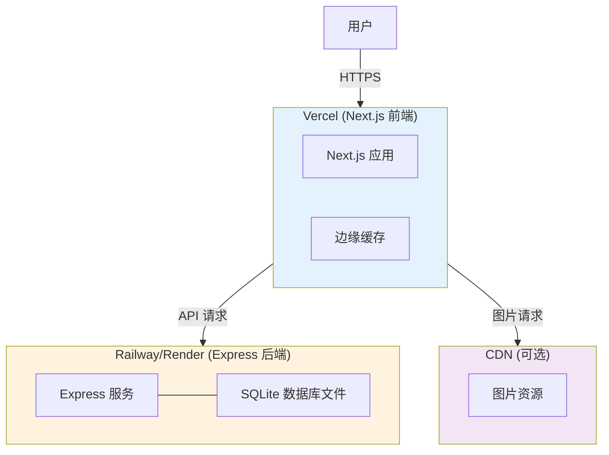

### 前端部署（Vercel）

**部署配置**：

| 配置项 | 值 | 说明 |
|--------|-----|------|
| Framework Preset | Next.js | 自动检测 |
| Build Command | npm run build | 生产构建 |
| Output Directory | .next | Next.js 默认输出 |
| Install Command | npm install | 安装依赖 |
| Node Version | 20.x | 兼容 Next.js 15 |

**环境变量**：

| 变量名 | 值示例 | 说明 |
|--------|--------|------|
| NEXT_PUBLIC_API_BASE_URL | https://api.yourdomain.com | 后端 API 地址 |

**性能优化**：

- 启用 Vercel 的边缘缓存
- 配置图片优化（next/image）
- 启用 Gzip/Brotli 压缩
- 配置 CDN 加速静态资源

### 后端部署（Railway/Render）

#### Railway 部署方案（推荐）

**优势**：

- 支持从 GitHub 仓库自动部署
- 内置 SQLite 持久化存储（挂载卷）
- 提供免费额度（每月 $5 免费使用）
- 自动 HTTPS 证书

**部署步骤**：

1. 创建 Railway 项目，关联 GitHub 仓库
2. 检测到 Node.js 项目，自动识别 package.json
3. 配置构建命令：`npm install && npx prisma migrate deploy`
4. 配置启动命令：`node src/app.js`
5. 添加环境变量（见下表）
6. 配置持久化卷：挂载路径 `/app/prisma`（存储 SQLite 文件）
7. 部署成功后获得公开 URL（如 https://your-app.railway.app）

**环境变量配置**：

| 变量名 | 值示例 | 说明 |
|--------|--------|------|
| NODE_ENV | production | 生产环境标识 |
| PORT | 3001 | 服务端口（Railway 自动分配时可省略） |
| DATABASE_URL | file:/app/prisma/posts.db | SQLite 数据库文件路径 |
| ALLOWED_ORIGINS | https://yourdomain.com | CORS 允许的前端域名 |

#### Render 部署方案（备选）

**优势**：

- 免费套餐（有使用限制）
- 支持持久化磁盘
- 自动 SSL 证书

**部署步骤**：

1. 创建 Web Service，关联 GitHub 仓库
2. 配置 Build Command：`npm install && npx prisma migrate deploy`
3. 配置 Start Command：`node src/app.js`
4. 添加环境变量（同 Railway）
5. 添加持久化磁盘（Disk），挂载路径 `/opt/render/project/src/prisma`

**注意事项**：

- 免费套餐服务会在无请求时休眠，首次请求响应较慢
- 磁盘存储有大小限制（免费套餐 1GB）

### 数据库管理

#### 数据库初始化

在首次部署后，需执行 Prisma 迁移：

**迁移命令**：

```
npx prisma migrate deploy
```

**执行时机**：

- 部署脚本中自动执行（已包含在构建命令中）
- 本地开发环境初始化

#### 数据库迁移流程

当数据模型发生变化时：

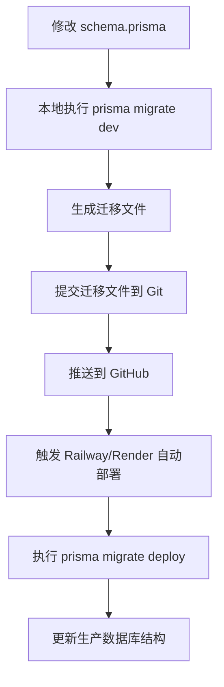

**迁移文件管理**：

- 迁移文件位于 `prisma/migrations/` 目录
- 每个迁移包含 SQL 语句和元数据
- 版本控制追踪所有迁移历史

#### 数据备份策略

SQLite 文件备份方案：

| 备份类型 | 频率 | 方式 | 保留周期 |
|---------|------|------|---------|
| 自动备份 | 每天 | 定时任务复制数据库文件到云存储 | 30 天 |
| 手动备份 | 部署前 | 下载数据库文件到本地 | 永久 |
| 快照备份 | 每周 | Railway/Render 提供的磁盘快照 | 4 周 |

**备份脚本示例流程**：

1. 连接到部署服务器（通过 SSH 或 CLI）
2. 复制 SQLite 文件：`cp /app/prisma/posts.db /tmp/backup-$(date +%Y%m%d).db`
3. 上传到云存储（如 AWS S3、阿里云 OSS）
4. 删除过期备份

### 域名与 HTTPS

#### 域名配置

| 组件 | 域名示例 | 配置方式 |
|------|---------|---------|
| 前端 | www.yourdomain.com | Vercel 项目设置中添加自定义域名 |
| 后端 | api.yourdomain.com | Railway/Render 设置中添加自定义域名 |

#### HTTPS 证书

- Vercel 和 Railway/Render 均自动提供免费 SSL 证书（Let's Encrypt）
- 自定义域名添加后自动签发
- 证书自动续期

### 环境隔离

建议配置三个环境：

| 环境 | 前端 | 后端 | 数据库 | 用途 |
|------|------|------|--------|------|
| 开发环境 | 本地 localhost:3000 | 本地 localhost:3001 | 本地 SQLite 文件 | 日常开发 |
| 预发布环境 | Vercel Preview | Railway Staging | 独立 SQLite 文件 | 测试验证 |
| 生产环境 | Vercel Production | Railway Production | 生产 SQLite 文件 | 线上服务 |

**环境切换**：

- 通过 NEXT_PUBLIC_API_BASE_URL 环境变量控制前端调用的后端地址
- Vercel 的 Preview 部署自动使用 Preview 环境变量

## 数据迁移

### 现有数据迁移到数据库

将 `app/lib/posts.js` 中的硬编码数据导入到 SQLite：

**迁移流程**：

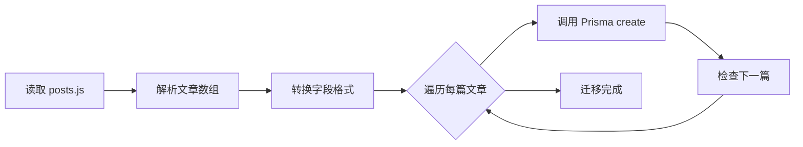

**迁移脚本逻辑**：

1. 创建迁移脚本 `scripts/migrate-posts.js`
2. 导入现有 posts 数组
3. 遍历数组，对每篇文章调用 Prisma Client 的 create 方法
4. 字段映射：
   - `date` → `publishedAt`（转换为 DateTime）
   - `image` → `coverImage`
   - 添加默认值：`status: 'published'`、`viewCount: 0`
5. 处理异常（如 slug 重复）
6. 输出迁移日志

**执行方式**：

```
node scripts/migrate-posts.js
```

**项目数据迁移**：

同理创建 `scripts/migrate-projects.js`，从 `app/projects/page.tsx` 中提取项目数组并导入。

### 数据同步策略（可选）

未来如果需要在多个环境间同步数据：

- **导出数据**：编写脚本将 SQLite 数据导出为 JSON
- **导入数据**：在目标环境读取 JSON 并插入数据库
- **版本控制**：使用迁移文件管理结构变更，数据单独管理

## 扩展功能预留

### 身份认证与授权

当前设计 API 端点未实现认证，为未来管理后台预留扩展点：

**认证方案**：

- 使用 JWT（JSON Web Token）进行无状态认证
- 登录接口：POST /api/auth/login，返回 token
- 受保护接口（创建、更新、删除）需在 Header 中携带：`Authorization: Bearer <token>`

**中间件架构**：

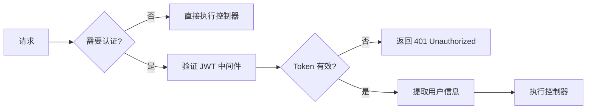

**角色权限扩展**：

未来可引入角色表（Role）和权限表（Permission），支持多用户协作管理。

### 图片上传服务

当前设计要求提供图片 URL，未来可集成图片上传：

**上传方案**：

| 方案 | 说明 | 适用场景 |
|------|------|---------|
| 本地存储 | 上传到 Express 服务器，存储在文件系统 | 测试环境 |
| 云存储（推荐） | 上传到 AWS S3、阿里云 OSS、腾讯云 COS | 生产环境 |
| 图床服务 | 集成 Cloudinary、七牛云图床 | 快速上线 |

**上传接口设计**：

- POST /api/upload/image
- 请求类型：multipart/form-data
- 返回：图片 URL

**前端集成**：

- 在管理后台的文章编辑器中集成图片上传组件
- 上传成功后将 URL 填充到 coverImage 字段

### 搜索功能

为博客文章添加全文搜索能力：

**搜索方案**：

| 方案 | 技术 | 优势 | 适用场景 |
|------|------|------|---------|
| SQLite LIKE 查询 | SQL LIKE '%keyword%' | 简单，无需额外依赖 | 文章数量 < 1000 |
| SQLite FTS5 | 全文索引扩展 | 性能好，支持中文分词（需配置） | 文章数量 < 5000 |
| Elasticsearch | 独立搜索引擎 | 功能强大，支持复杂查询 | 大规模数据 |

**搜索接口设计**：

- GET /api/posts/search?q=关键词
- 搜索范围：标题、摘要、内容、标签
- 返回：匹配的文章列表，高亮关键词

### 评论系统

为文章添加评论功能：

**数据模型扩展**：

新增 Comment 实体：

| 字段 | 类型 | 说明 |
|------|------|------|
| id | Integer | 主键 |
| postId | Integer | 关联文章 ID |
| author | String | 评论者名称 |
| email | String | 评论者邮箱 |
| content | Text | 评论内容 |
| parentId | Integer | 父评论 ID（支持嵌套回复） |
| status | Enum | 状态：pending/approved/rejected |
| createdAt | DateTime | 创建时间 |

**关系定义**：

- Comment 多对一关联 Post
- Comment 自关联（父子评论）

**API 端点**：

- GET /api/posts/:slug/comments - 获取文章评论
- POST /api/comments - 提交评论
- DELETE /api/comments/:id - 删除评论（需认证）

### 分析统计

收集和展示博客数据：

**统计维度**：

- 文章总阅读量
- 最受欢迎文章（按阅读量排序）
- 标签热度分布
- 发布时间线

**实现方式**：

- 基础统计：直接使用 Prisma 聚合查询（count、sum、groupBy）
- 高级分析：引入 Google Analytics 或自建埋点系统

**API 端点**：

- GET /api/stats/overview - 总体数据
- GET /api/stats/popular - 热门文章

## 测试策略

### 后端单元测试

使用测试框架验证业务逻辑正确性：

**测试框架选择**：

- Jest（JavaScript 生态标准）
- Supertest（HTTP 接口测试）

**测试覆盖范围**：

| 测试类型 | 测试对象 | 测试内容 |
|---------|---------|---------|
| 单元测试 | Service 层 | 业务逻辑函数，如数据转换、验证规则 |
| 集成测试 | API 端点 | 完整请求-响应流程，包括数据库操作 |
| 数据库测试 | Prisma 查询 | 查询结果正确性，事务一致性 |

**测试用例示例**：

**文章创建测试**：

- 正常创建：提供完整参数，验证返回对象包含 id
- 缺少必填字段：验证返回 400 错误和详细字段提示
- slug 重复：验证返回 409 错误
- 无效数据类型：验证参数验证中间件生效

**文章查询测试**：

- 列表查询：验证返回数组和分页信息
- 按 featured 过滤：验证只返回 featured 为 true 的文章
- 不存在的 slug：验证返回 404

**测试数据库隔离**：

- 使用独立的测试数据库（SQLite 内存模式或临时文件）
- 每个测试用例前重置数据库（清空表或重新迁移）
- 测试完成后清理资源

### 前端测试（可选）

**测试重点**：

- 组件渲染：验证文章列表正确显示
- API 调用：Mock API 响应，验证数据正确传递给组件
- 错误处理：模拟 API 失败，验证错误提示显示

**测试工具**：

- React Testing Library（组件测试）
- MSW（Mock Service Worker，拦截 API 请求）
