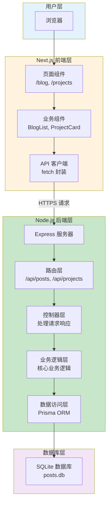
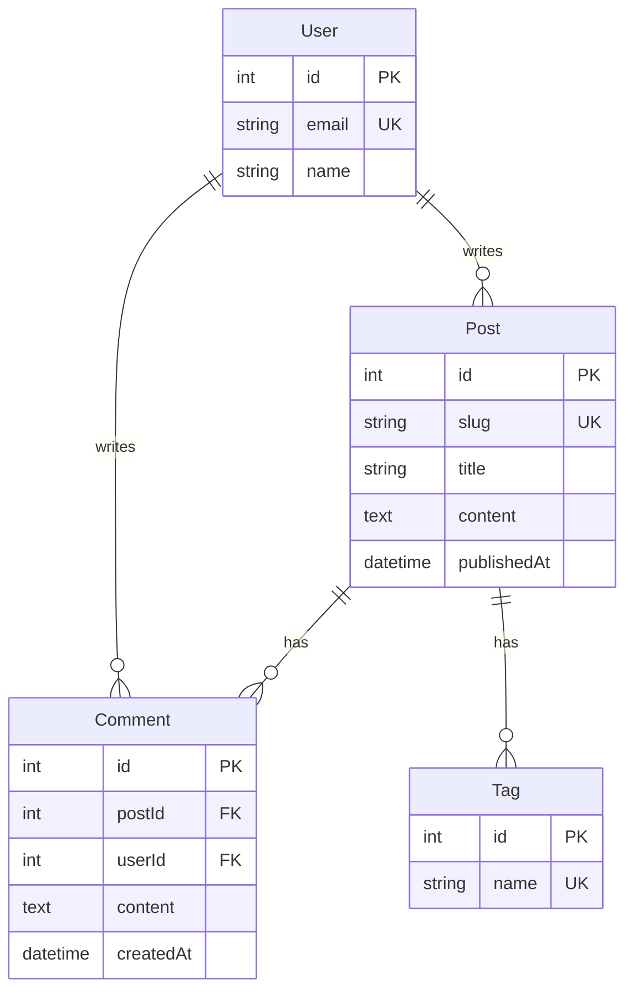
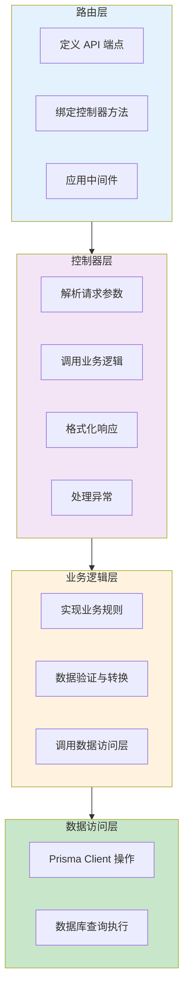
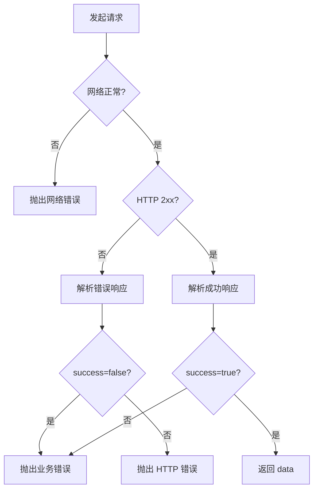
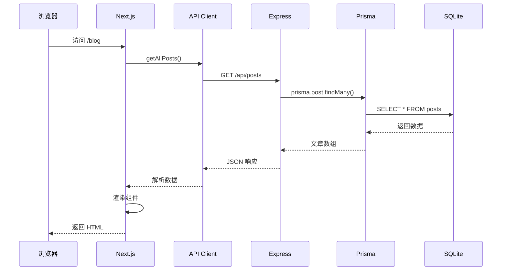
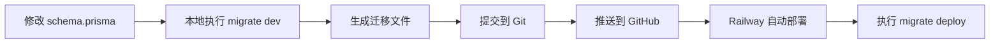

# 个人网站全栈开发学习方案设计

## 项目愿景

本项目旨在帮助一名有三年前端经验的开发者，通过构建个人网站全栈项目，系统学习后端开发技术，为职业发展打下坚实基础。

### 学习目标

- **后端技术入门**: 掌握 Node.js 后端开发基础
- **数据库实践**: 理解数据持久化与数据库设计
- **API 设计**: 学习 RESTful API 设计规范
- **全栈思维**: 建立前后端协同开发思维
- **实战经验**: 通过真实项目积累全栈开发经验

### 项目定位

- **项目类型**: 个人技术博客与项目展示全栈网站
- **开发模式**: 前后端分离架构
- **部署模式**: 前端 Vercel + 后端云平台
- **技术栈**: Next.js 15 + Node.js + Express + SQLite
- **学习重点**: 后端开发、数据库设计、API 构建

## 整体架构设计

本项目采用 **前后端分离架构**，前端使用 Next.js 15，后端使用 Node.js + Express，通过 RESTful API 进行通信。



### 架构优势

| 特性        | 说明                           | 学习价值 |
| ----------- | ------------------------------ | -------- |
| 前后端分离  | 清晰的职责划分，便于学习和维护 | ★★★★★    |
| 分层设计    | 标准的 MVC 模式，符合工业规范  | ★★★★★    |
| RESTful API | 学习行业标准的 API 设计        | ★★★★★    |
| 数据持久化  | 掌握数据库操作基础             | ★★★★★    |
| 渐进式学习  | 从简单到复杂，逐步探索         | ★★★★★    |

### 技术选型理由

#### 为什么选择 Express？

| 理由     | 说明                        |
| -------- | --------------------------- |
| 简单易学 | 最适合初学者的 Node.js 框架 |
| 生态成熟 | 丰富的中间件和教程资源      |
| 灵活性高 | 自由组织项目结构            |
| 行业主流 | 大量公司使用，就业价值高    |

#### 为什么选择 SQLite？

| 理由       | 说明                              |
| ---------- | --------------------------------- |
| 零配置     | 无需安装数据库服务器              |
| 文件形式   | 单个文件，易于备份和移植          |
| 学习成本低 | 与 MySQL/PostgreSQL 语法相似      |
| 适合场景   | 个人网站数据量小，性能足够        |
| 易于迁移   | 未来可轻松升级到 MySQL/PostgreSQL |

#### 为什么选择 Prisma？

| 理由            | 说明                           |
| --------------- | ------------------------------ |
| 现代化 ORM      | 新一代 ORM，代替传统 Sequelize |
| TypeScript 支持 | 自动生成类型，类型安全         |
| 开发体验好      | 直观的 Schema 定义和查询 API   |
| 迁移管理        | 内置数据库迁移工具             |
| 行业趋势        | 越来越多公司采用               |

## 后端技术栈详解

### 核心技术

| 技术    | 版本    | 用途              | 学习难度 |
| ------- | ------- | ----------------- | -------- |
| Node.js | 20.x    | JavaScript 运行时 | ★★☆☆☆    |
| Express | ^4.18.0 | Web 框架          | ★★☆☆☆    |
| Prisma  | ^5.0.0  | ORM 工具          | ★★★☆☆    |
| SQLite  | 3.x     | 数据库            | ★★☆☆☆    |

### 推荐依赖包

| 包名              | 用途          | 学习价值 |
| ----------------- | ------------- | -------- |
| cors              | 处理跨域请求  | ★★★☆☆    |
| dotenv            | 环境变量管理  | ★★★★☆    |
| express-validator | 请求参数验证  | ★★★★☆    |
| morgan            | HTTP 请求日志 | ★★★☆☆    |
| helmet            | 安全头设置    | ★★★☆☆    |
| compression       | Gzip 压缩     | ★★☆☆☆    |

### 开发工具

| 工具               | 用途                |
| ------------------ | ------------------- |
| nodemon            | 自动重启服务器      |
| Postman / Insomnia | API 测试工具        |
| Prisma Studio      | 可视化数据库管理    |
| VS Code 插件       | Prisma、REST Client |

## 数据库设计

### 数据表结构

#### Posts 表（博客文章）

| 字段名      | 类型     | 必填 | 默认值 | 说明                  |
| ----------- | -------- | ---- | ------ | --------------------- |
| id          | Int      | 是   | 自增   | 主键                  |
| slug        | String   | 是   | -      | URL 唯一标识          |
| title       | String   | 是   | -      | 文章标题              |
| excerpt     | String   | 是   | -      | 摘要 (500 字内)       |
| content     | Text     | 是   | -      | 正文内容 (Markdown)   |
| coverImage  | String   | 否   | null   | 封面图片 URL          |
| publishedAt | DateTime | 否   | now    | 发布时间              |
| readingTime | Int      | 否   | null   | 阅读时长(分钟)        |
| featured    | Boolean  | 否   | false  | 是否精选              |
| viewCount   | Int      | 否   | 0      | 阅读量                |
| status      | Enum     | 否   | draft  | 状态: draft/published |
| tags        | String[] | 否   | []     | 标签数组              |
| createdAt   | DateTime | 是   | now    | 创建时间              |
| updatedAt   | DateTime | 是   | now    | 更新时间              |

**索引设计**:

- 主键索引: `id`
- 唯一索引: `slug`
- 普通索引: `status`, `publishedAt`, `featured`

#### Projects 表（项目展示）

| 字段名       | 类型     | 必填 | 默认值 | 说明                  |
| ------------ | -------- | ---- | ------ | --------------------- |
| id           | Int      | 是   | 自增   | 主键                  |
| title        | String   | 是   | -      | 项目名称              |
| description  | Text     | 是   | -      | 项目描述              |
| technologies | String[] | 否   | []     | 技术栈数组            |
| coverImage   | String   | 否   | null   | 项目封面              |
| githubUrl    | String   | 否   | null   | GitHub 地址           |
| demoUrl      | String   | 否   | null   | 在线演示地址          |
| featured     | Boolean  | 否   | false  | 是否精选              |
| order        | Int      | 否   | 999    | 显示顺序              |
| status       | Enum     | 否   | active | 状态: active/archived |
| createdAt    | DateTime | 是   | now    | 创建时间              |
| updatedAt    | DateTime | 是   | now    | 更新时间              |

**索引设计**:

- 主键索引: `id`
- 普通索引: `status`, `featured`, `order`

### Prisma Schema 设计

**核心模型定义思路**:

```
数据源配置 → 数据库连接
  ↓
模型定义 → 表结构
  ↓
字段定义 → 列属性
  ↓
关系定义 → 表关联（未来扩展）
  ↓
索引定义 → 查询优化
```

**枚举类型定义**:

| 枚举名        | 值                         | 说明     |
| ------------- | -------------------------- | -------- |
| PostStatus    | DRAFT, PUBLISHED, ARCHIVED | 文章状态 |
| ProjectStatus | ACTIVE, ARCHIVED           | 项目状态 |

### 数据关系设计（未来扩展）



**扩展说明**:

- 初期仅实现 Post 和 Project 表
- 后续可添加评论、标签、用户认证等功能

## 后端 API 设计

### API 规范

#### 统一响应格式

**成功响应**:

| 字段    | 类型         | 说明        |
| ------- | ------------ | ----------- |
| success | Boolean      | 固定为 true |
| data    | Object/Array | 返回的数据  |

**错误响应**:

| 字段          | 类型    | 说明             |
| ------------- | ------- | ---------------- |
| success       | Boolean | 固定为 false     |
| error         | Object  | 错误信息对象     |
| error.code    | String  | 错误代码         |
| error.message | String  | 错误描述         |
| error.details | Array   | 详细错误（可选） |

#### HTTP 状态码使用规范

| 状态码 | 场景         | 示例                   |
| ------ | ------------ | ---------------------- |
| 200    | 成功         | 查询、更新、删除成功   |
| 201    | 创建成功     | 新建文章、项目         |
| 400    | 请求参数错误 | 缺少必填字段、格式错误 |
| 404    | 资源不存在   | 文章、项目未找到       |
| 409    | 冲突         | slug 重复              |
| 500    | 服务器错误   | 数据库异常、未知错误   |

### 博客 API 端点

#### 获取文章列表

| 项目     | 内容       |
| -------- | ---------- |
| 请求方法 | GET        |
| 请求路径 | /api/posts |
| 认证要求 | 无         |

**查询参数**:

| 参数名   | 类型    | 必填 | 说明              | 示例      |
| -------- | ------- | ---- | ----------------- | --------- |
| page     | Integer | 否   | 页码，默认 1      | 1         |
| limit    | Integer | 否   | 每页数量，默认 10 | 10        |
| status   | String  | 否   | 状态筛选          | published |
| featured | Boolean | 否   | 仅精选文章        | true      |
| tag      | String  | 否   | 按标签筛选        | Next.js   |

**响应示例**:

```json
{
  "success": true,
  "data": {
    "posts": [
      {
        "id": 1,
        "slug": "nextjs-tutorial",
        "title": "Next.js 教程",
        "excerpt": "学习 Next.js...",
        "coverImage": "https://...",
        "publishedAt": "2024-03-27T00:00:00Z",
        "readingTime": 8,
        "featured": true,
        "tags": ["Next.js", "React"],
        "viewCount": 125
      }
    ],
    "pagination": {
      "total": 15,
      "page": 1,
      "limit": 10,
      "totalPages": 2
    }
  }
}
```

#### 获取文章详情

| 项目     | 内容             |
| -------- | ---------------- |
| 请求方法 | GET              |
| 请求路径 | /api/posts/:slug |
| 认证要求 | 无               |

**路径参数**:

| 参数名 | 类型   | 说明          |
| ------ | ------ | ------------- |
| slug   | String | 文章 URL 标识 |

**响应示例**:

```json
{
  "success": true,
  "data": {
    "id": 1,
    "slug": "nextjs-tutorial",
    "title": "Next.js 教程",
    "excerpt": "学习 Next.js...",
    "content": "# 完整 Markdown 内容...",
    "coverImage": "https://...",
    "publishedAt": "2024-03-27T00:00:00Z",
    "readingTime": 8,
    "featured": true,
    "tags": ["Next.js", "React"],
    "viewCount": 126
  }
}
```

#### 创建文章

| 项目         | 内容             |
| ------------ | ---------------- |
| 请求方法     | POST             |
| 请求路径     | /api/posts       |
| 认证要求     | 需要（未来实现） |
| Content-Type | application/json |

**请求体参数**:

| 字段名      | 类型    | 必填 | 验证规则                 |
| ----------- | ------- | ---- | ------------------------ |
| slug        | String  | 是   | 唯一，仅字母数字和连字符 |
| title       | String  | 是   | 1-200 字符               |
| excerpt     | String  | 是   | 1-500 字符               |
| content     | String  | 是   | 不为空                   |
| coverImage  | String  | 否   | 有效 URL                 |
| readingTime | Integer | 否   | 大于 0                   |
| featured    | Boolean | 否   | -                        |
| tags        | Array   | 否   | 字符串数组               |
| status      | String  | 否   | draft/published          |

**请求示例**:

```json
{
  "slug": "react-hooks",
  "title": "React Hooks 指南",
  "excerpt": "深入理解 Hooks...",
  "content": "# React Hooks\n\n...",
  "featured": false,
  "tags": ["React", "Hooks"],
  "status": "published"
}
```

#### 更新文章

| 项目     | 内容           |
| -------- | -------------- |
| 请求方法 | PUT            |
| 请求路径 | /api/posts/:id |
| 认证要求 | 需要           |

**路径参数**: id (文章 ID)

**请求体**: 所有字段均为可选，仅更新提供的字段

#### 删除文章

| 项目     | 内容           |
| -------- | -------------- |
| 请求方法 | DELETE         |
| 请求路径 | /api/posts/:id |
| 认证要求 | 需要           |

**查询参数**:

| 参数名    | 类型    | 说明                               |
| --------- | ------- | ---------------------------------- |
| permanent | Boolean | 是否永久删除，默认 false（软删除） |

#### 增加阅读量

| 项目     | 内容                  |
| -------- | --------------------- |
| 请求方法 | POST                  |
| 请求路径 | /api/posts/:slug/view |
| 认证要求 | 无                    |

### 项目 API 端点

#### 获取项目列表

| 项目     | 内容          |
| -------- | ------------- |
| 请求方法 | GET           |
| 请求路径 | /api/projects |
| 认证要求 | 无            |

**查询参数**:

| 参数名   | 类型    | 说明            |
| -------- | ------- | --------------- |
| featured | Boolean | 仅精选项目      |
| status   | String  | active/archived |

**响应示例**:

```json
{
  "success": true,
  "data": [
    {
      "id": 1,
      "title": "电商网站",
      "description": "全栈电商平台...",
      "technologies": ["React", "Node.js"],
      "coverImage": "https://...",
      "githubUrl": "https://github.com/...",
      "demoUrl": "https://demo.com",
      "featured": true,
      "order": 1
    }
  ]
}
```

#### 创建、更新、删除项目

与博客 API 类似，遵循相同规范。

## 后端项目结构

### 目录组织

```
backend/
├── src/
│   ├── config/              # 配置文件
│   │   ├── database.js      # 数据库连接
│   │   └── server.js        # 服务器配置
│   ├── controllers/         # 控制器层
│   │   ├── postController.js
│   │   └── projectController.js
│   ├── services/            # 业务逻辑层
│   │   ├── postService.js
│   │   └── projectService.js
│   ├── middlewares/         # 中间件
│   │   ├── errorHandler.js  # 错误处理
│   │   ├── validator.js     # 参数验证
│   │   └── logger.js        # 日志记录
│   ├── routes/              # 路由定义
│   │   ├── index.js
│   │   ├── posts.js
│   │   └── projects.js
│   ├── prisma/              # Prisma 配置
│   │   ├── schema.prisma    # 数据模型
│   │   ├── migrations/      # 迁移文件
│   │   └── seed.js          # 种子数据
│   ├── utils/               # 工具函数
│   │   └── helpers.js
│   └── app.js               # 应用入口
├── .env                     # 环境变量
├── .env.example             # 环境变量示例
├── package.json
└── README.md
```

### 分层职责



**职责说明**:

| 层级     | 主要职责                               | 禁止行为         |
| -------- | -------------------------------------- | ---------------- |
| 路由层   | 定义 URL，绑定控制器，应用验证中间件   | 不包含业务逻辑   |
| 控制器层 | 解析参数，调用服务，构造响应，捕获异常 | 不直接操作数据库 |
| 业务层   | 实现业务规则，数据转换，事务控制       | 不关心 HTTP 细节 |
| 数据层   | 封装 Prisma 查询，执行数据库操作       | 不包含业务判断   |

## 前端集成方案

### API 客户端封装

**目录结构**:

```
app/
└── lib/
    ├── api/
    │   ├── client.js        # 基础 fetch 封装
    │   ├── posts.js         # 博客 API 方法
    │   └── projects.js      # 项目 API 方法
    └── utils/
        └── errorHandler.js  # 错误处理
```

### 基础 Client 封装

**核心功能**:

| 功能              | 说明                           |
| ----------------- | ------------------------------ |
| 自动添加 BASE_URL | 从环境变量读取                 |
| 统一请求头        | Content-Type: application/json |
| 统一错误处理      | 网络错误、HTTP 错误、业务错误  |
| 自动 JSON 解析    | 自动处理响应体                 |
| 请求拦截器        | 未来添加认证 Token             |

### 错误处理策略



### 页面改造方案

#### 博客列表页

**改造步骤**:

1. 引入 API 客户端: `import { getAllPosts } from '@/lib/api/posts'`
2. 替换数据源: `const posts = await getAllPosts()`
3. 组件保持不变（数据结构兼容）
4. 添加错误边界

**数据字段映射**:

| API 字段    | 组件字段 | 转换                |
| ----------- | -------- | ------------------- |
| publishedAt | date     | 格式化为 YYYY-MM-DD |
| coverImage  | image    | 直接映射            |
| 其他字段    | -        | 直接透传            |

#### 文章详情页

**改造步骤**:

1. 引入 API: `import { getPostBySlug, incrementView } from '@/lib/api/posts'`
2. 获取文章: `const post = await getPostBySlug(params.slug)`
3. Markdown 渲染: 使用 remark 转换为 HTML
4. 增加阅读量: `useEffect(() => incrementView(slug), [])`

#### 项目展示页

**改造步骤**:

1. 改为服务端组件（删除 `'use client'`）
2. 引入 API: `import { getAllProjects } from '@/lib/api/projects'`
3. 获取数据: `const projects = await getAllProjects()`
4. 删除组件内硬编码数据

### 环境变量配置

**前端 (.env.local)**:

```
NEXT_PUBLIC_API_BASE_URL=http://localhost:3001
```

**后端 (.env)**:

```
DATABASE_URL="file:./dev.db"
PORT=3001
NODE_ENV=development
ALLOWED_ORIGINS=http://localhost:3000
```

## 开发流程

### 本地开发环境搭建

#### 后端启动步骤

```
1. 进入后端目录
   cd backend

2. 安装依赖
   npm install

3. 初始化 Prisma
   npx prisma generate
   npx prisma migrate dev

4. 启动开发服务器
   npm run dev
```

#### 前端启动步骤

```
1. 进入前端目录（项目根目录）
   cd ..

2. 配置环境变量
   创建 .env.local 文件

3. 启动开发服务器
   npm run dev
```

### 数据流转示例

**完整请求链路**:



### 学习路径建议

#### 第一阶段：基础搭建（1-2 周）

**学习重点**:

- Express 基础：路由、中间件、请求响应
- Prisma 基础：Schema 定义、CRUD 操作
- SQLite 基础：数据表设计、SQL 查询

**任务清单**:

- [ ] 搭建 Express 项目，实现 Hello World
- [ ] 配置 Prisma，创建 Post 模型
- [ ] 实现博客文章的增删改查 API
- [ ] 使用 Postman 测试 API
- [ ] 前端集成 API，实现博客列表展示

#### 第二阶段：功能完善（2-3 周）

**学习重点**:

- 参数验证：express-validator 使用
- 错误处理：统一错误处理中间件
- 日志记录：Morgan 日志中间件
- 分页查询：Prisma 分页查询

**任务清单**:

- [ ] 添加请求参数验证
- [ ] 实现统一错误处理
- [ ] 添加日志记录功能
- [ ] 实现文章分页查询
- [ ] 实现项目展示 CRUD
- [ ] 前端完整集成所有 API

#### 第三阶段：优化提升（2-3 周）

**学习重点**:

- 性能优化：数据库索引、查询优化
- 安全加固：Helmet、CORS 配置
- 部署实践：Railway/Render 部署
- 监控日志：错误追踪、性能监控

**任务清单**:

- [ ] 优化数据库查询性能
- [ ] 添加安全中间件
- [ ] 部署后端到云平台
- [ ] 前端连接生产环境 API
- [ ] 添加阅读量统计
- [ ] 实现文章搜索功能

#### 第四阶段：高级特性（选学）

**学习重点**:

- 用户认证：JWT、Session
- 文件上传：图片上传服务
- 缓存机制：Redis 缓存
- 评论系统：用户交互功能

**任务清单**:

- [ ] 实现用户登录认证
- [ ] 添加管理后台（受保护路由）
- [ ] 实现图片上传功能
- [ ] 添加文章评论功能
- [ ] 集成 Redis 缓存
- [ ] 部署优化与监控

## 部署方案

### 前端部署（Vercel）

**部署配置**:

| 配置项                | 值                       |
| --------------------- | ------------------------ |
| Framework             | Next.js                  |
| Build Command         | npm run build            |
| Output Directory      | .next                    |
| Environment Variables | NEXT_PUBLIC_API_BASE_URL |

**环境变量**:

```
# 开发环境
NEXT_PUBLIC_API_BASE_URL=http://localhost:3001

# 生产环境
NEXT_PUBLIC_API_BASE_URL=https://your-api.railway.app
```

### 后端部署（Railway 推荐）

#### 为什么选择 Railway？

| 优势       | 说明                   |
| ---------- | ---------------------- |
| 免费额度   | 每月 $5 免费使用       |
| 简单易用   | 从 GitHub 自动部署     |
| 持久化存储 | 支持 SQLite 文件持久化 |
| 自动 HTTPS | 免费 SSL 证书          |
| 新手友好   | 无需 Docker 知识       |

#### 部署步骤

```
1. 创建 Railway 项目
   - 关联 GitHub 仓库
   - 选择 backend 目录

2. 配置环境变量
   DATABASE_URL=file:/app/data/posts.db
   NODE_ENV=production
   ALLOWED_ORIGINS=https://yourdomain.com

3. 配置持久化卷
   挂载路径: /app/data
   存储 SQLite 文件

4. 部署
   Railway 自动构建并部署
   获得公开 URL
```

### 备选方案：Render

**部署步骤**:

```
1. 创建 Web Service
2. 关联 GitHub 仓库
3. 配置 Build Command: npm install && npx prisma migrate deploy
4. 配置 Start Command: npm start
5. 添加持久化磁盘
6. 配置环境变量
```

### 数据库管理

#### 初始化数据库

```bash
# 本地环境
npx prisma migrate dev

# 生产环境
npx prisma migrate deploy
```

#### 数据迁移流程



#### 备份策略

| 备份类型 | 频率   | 方式                 |
| -------- | ------ | -------------------- |
| 自动备份 | 每天   | 定时任务复制 DB 文件 |
| 手动备份 | 部署前 | 下载 DB 文件到本地   |
| 快照备份 | 每周   | Railway 磁盘快照     |

## 学习资源推荐

### 官方文档

| 技术    | 文档链接                         |
| ------- | -------------------------------- |
| Express | https://expressjs.com/           |
| Prisma  | https://www.prisma.io/docs       |
| SQLite  | https://www.sqlite.org/docs.html |

### 视频教程

| 平台    | 推荐内容                                |
| ------- | --------------------------------------- |
| YouTube | "Node.js Tutorial for Beginners"        |
| B 站    | "Express + Prisma 全栈开发"             |
| Udemy   | "The Complete Node.js Developer Course" |

### 实战项目

| 项目        | 学习价值               |
| ----------- | ---------------------- |
| 博客系统    | 本项目 ★★★★★           |
| RESTful API | Express 官方示例 ★★★★☆ |
| Prisma 示例 | 官方 GitHub 仓库 ★★★★☆ |

### 社区支持

| 平台           | 用途                |
| -------------- | ------------------- |
| Stack Overflow | 问题求助            |
| GitHub Issues  | 技术问题            |
| Discord        | Express/Prisma 社区 |
| 掘金/思否      | 中文技术社区        |

## 常见问题解答

### 为什么不用 Next.js API Routes？

| 原因     | 说明                                   |
| -------- | -------------------------------------- |
| 学习目的 | 专门学习后端开发，独立后端项目         |
| 职业发展 | 大部分公司前后端分离，需要独立后端经验 |
| 技术深度 | Express 生态更丰富，学习深度更大       |
| 灵活性   | 可独立部署、独立扩展                   |

### SQLite 生产环境够用吗？

| 场景     | 是否适用           |
| -------- | ------------------ |
| 个人博客 | ✅ 完全够用        |
| 小型网站 | ✅ 适合            |
| 中等流量 | ⚠️ 需评估          |
| 大型应用 | ❌ 建议 PostgreSQL |

**迁移策略**: Prisma 支持无缝切换数据库，未来可轻松升级到 PostgreSQL。

### 如何保证 API 安全？

**初期方案**:

- CORS 限制来源域名
- Helmet 设置安全响应头
- 参数验证防止注入攻击
- 限流防止 DDoS

**进阶方案**（第四阶段）:

- JWT 认证保护敏感接口
- API 访问频率限制
- 输入数据清洗
- HTTPS 强制加密

### 开发中遇到问题怎么办？

**调试步骤**:

1. **查看日志**: 使用 morgan 记录请求日志
2. **断点调试**: VS Code 调试器
3. **测试 API**: Postman 隔离测试
4. **查询文档**: 先查官方文档
5. **搜索问题**: Google、Stack Overflow
6. **社区求助**: GitHub Issues、Discord

## 成功标准

### 学习成果

完成本项目后，您将掌握：

- ✅ Node.js 后端开发基础
- ✅ Express 框架核心概念
- ✅ 数据库设计与 ORM 使用
- ✅ RESTful API 设计规范
- ✅ 前后端协同开发流程
- ✅ 项目部署与运维基础

### 项目成果

- ✅ 一个功能完整的全栈个人网站
- ✅ 可展示的真实项目经验
- ✅ 可持续维护和扩展的代码库
- ✅ 清晰的技术文档和学习笔记

### 职业价值

- ✅ 简历上增加全栈项目经验
- ✅ 面试时可演示真实项目
- ✅ 理解前后端协作流程
- ✅ 为转型全栈开发打下基础
