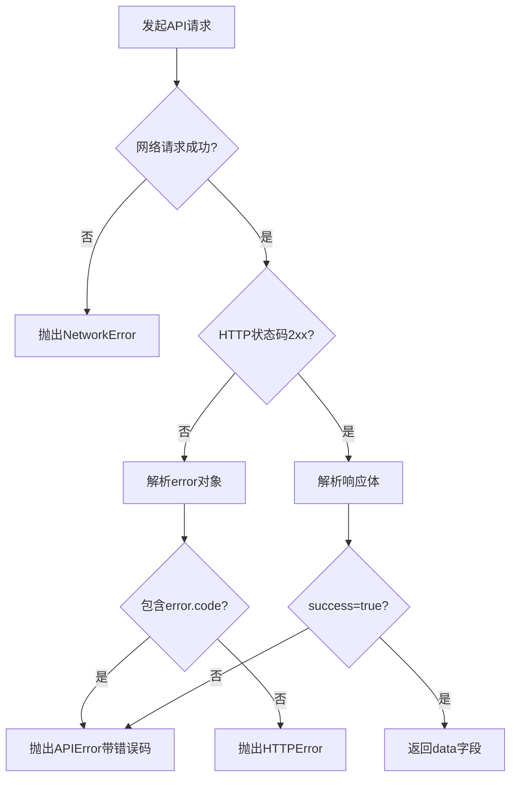

# 项目初始化设计文档

## 设计目标

基于现有Next.js前端项目，完成前后端分离架构的全栈个人网站初始化，建立标准化的后端开发环境、数据库架构和API服务体系，为后续功能开发奠定基础。

## 当前状态分析

### 已完成部分

**前端基础架构**
- Next.js 15.5.2 框架已搭建，采用App Router模式
- 国际化支持已集成（next-intl + i18next）
- 主题切换功能已实现（亮色/暗色模式）
- 基础UI组件已开发（Header、Footer、Hero等）
- 博客和项目展示页面结构已建立

**数据库模型定义**
- Prisma ORM已配置，数据源为SQLite
- Post模型已定义（包含slug、title、content、status等字段）
- Project模型已定义（包含title、description、technologies等字段）
- Category模型已定义并与Post建立关联
- 枚举类型PostStatus和ProjectStatus已定义

**后端基础框架**
- Express服务器基础架构已搭建（server/index.js）
- CORS和JSON解析中间件已配置
- 基础路由已定义（/api/posts、/api/projects）
- 健康检查端点已实现（/api/health）
- 基础错误处理中间件已配置

**API路由实现**
- Posts路由已实现CRUD操作和按slug查询
- Projects路由已实现CRUD操作
- 支持分页、筛选和排序功能

### 需要完善部分

**后端架构规范化**
- 缺少分层架构（Controller、Service、数据访问层未分离）
- 缺少统一响应格式封装
- 缺少请求参数验证机制
- 缺少日志记录系统
- 缺少安全加固措施

**数据库初始化**
- 数据库迁移未执行
- 测试数据未填充
- 数据库文件路径未配置

**前端API集成**
- 缺少API客户端封装
- 前端页面仍使用静态数据或文件系统
- 缺少前后端环境变量配置

**开发工具配置**
- 缺少开发环境启动脚本
- 缺少API测试工具配置
- 缺少开发文档

## 初始化任务清单

### 第一阶段：后端架构规范化

#### 任务1.1：重构后端目录结构

**目标**：建立标准分层架构，分离关注点

**新增目录结构**
```
server/
├── src/
│   ├── config/
│   │   ├── database.js          # Prisma客户端单例
│   │   └── server.js            # 服务器配置常量
│   ├── controllers/
│   │   ├── postController.js    # 文章控制器
│   │   └── projectController.js # 项目控制器
│   ├── services/
│   │   ├── postService.js       # 文章业务逻辑
│   │   └── projectService.js    # 项目业务逻辑
│   ├── middlewares/
│   │   ├── errorHandler.js      # 统一错误处理
│   │   ├── validator.js         # 请求参数验证
│   │   └── logger.js            # 请求日志记录
│   ├── utils/
│   │   ├── response.js          # 统一响应格式
│   │   └── helpers.js           # 工具函数
│   └── app.js                   # 应用入口
```

**职责划分**

| 层级 | 职责 | 示例 |
|------|------|------|
| Controller层 | 解析HTTP请求参数、调用Service、构造HTTP响应 | 从req.query获取分页参数，调用postService.getPosts() |
| Service层 | 实现业务逻辑、数据验证转换、调用Prisma | 验证文章状态、计算阅读时长、执行数据库查询 |
| Middleware层 | 请求预处理、错误拦截、日志记录 | 验证必填字段、捕获异常统一返回格式 |
| Config层 | 配置管理、外部依赖初始化 | Prisma客户端单例、端口号配置 |

#### 任务1.2：实现统一响应格式

**成功响应结构**

| 字段名 | 类型 | 说明 | 示例值 |
|--------|------|------|--------|
| success | Boolean | 固定为true | true |
| data | Object/Array | 业务数据 | {...} 或 [...] |
| pagination | Object | 分页信息（可选） | {page: 1, total: 50} |

**错误响应结构**

| 字段名 | 类型 | 说明 | 示例值 |
|--------|------|------|--------|
| success | Boolean | 固定为false | false |
| error | Object | 错误信息对象 | {...} |
| error.code | String | 错误代码 | "VALIDATION_ERROR" |
| error.message | String | 用户友好的错误描述 | "文章标题不能为空" |
| error.details | Array | 详细错误列表（可选） | [{field: "title", message: "..."}] |

**HTTP状态码映射规则**

| 业务场景 | HTTP状态码 | error.code | 示例 |
|----------|-----------|-----------|------|
| 请求成功 | 200 | - | 查询、更新、删除成功 |
| 创建成功 | 201 | - | 新建文章 |
| 参数错误 | 400 | VALIDATION_ERROR | 缺少title字段 |
| 资源不存在 | 404 | NOT_FOUND | 文章slug不存在 |
| 唯一性冲突 | 409 | CONFLICT | slug已存在 |
| 服务器错误 | 500 | INTERNAL_ERROR | 数据库连接失败 |

#### 任务1.3：集成请求参数验证

**验证规则定义方式**：使用express-validator库

**Posts API验证规则**

| 端点 | 字段 | 验证规则 |
|------|------|----------|
| POST /api/posts | title | 必填，1-200字符 |
| POST /api/posts | content | 必填，非空字符串 |
| POST /api/posts | excerpt | 必填，1-500字符 |
| POST /api/posts | slug | 可选，仅包含小写字母、数字、连字符 |
| POST /api/posts | tags | 可选，字符串数组 |
| POST /api/posts | coverImage | 可选，有效URL格式 |
| POST /api/posts | status | 可选，枚举值（DRAFT或PUBLISHED） |
| PUT /api/posts/:id | id | 必填，正整数 |
| GET /api/posts | page | 可选，正整数，默认1 |
| GET /api/posts | limit | 可选，1-100之间，默认10 |

**Projects API验证规则**

| 端点 | 字段 | 验证规则 |
|------|------|----------|
| POST /api/projects | title | 必填，1-200字符 |
| POST /api/projects | description | 必填，非空字符串 |
| POST /api/projects | technologies | 可选，字符串数组 |
| POST /api/projects | order | 可选，正整数 |

**验证失败响应示例**
```
HTTP 400
{
  "success": false,
  "error": {
    "code": "VALIDATION_ERROR",
    "message": "请求参数验证失败",
    "details": [
      {
        "field": "title",
        "message": "文章标题不能为空"
      },
      {
        "field": "excerpt",
        "message": "摘要长度不能超过500字符"
      }
    ]
  }
}
```

#### 任务1.4：添加日志和安全中间件

**日志记录策略**

| 日志类型 | 使用工具 | 记录内容 | 输出格式 |
|----------|----------|----------|----------|
| HTTP请求日志 | morgan | 请求方法、URL、状态码、响应时间 | :method :url :status :response-time ms |
| 应用日志 | console | 服务器启动、数据库连接、错误堆栈 | 时间戳 + 日志级别 + 消息 |

**安全中间件配置**

| 中间件 | 用途 | 配置要点 |
|--------|------|----------|
| helmet | 设置安全HTTP响应头 | 默认配置即可 |
| cors | 限制跨域请求来源 | origin设置为前端域名（开发环境：localhost:3000） |
| express.json | 限制请求体大小 | limit设置为10mb |

### 第二阶段：数据库初始化

#### 任务2.1：完善Prisma Schema

**需要调整的字段**

| 模型 | 字段 | 当前类型 | 调整方案 | 理由 |
|------|------|----------|----------|------|
| Post | tags | String | 保持不变 | SQLite不支持数组，使用逗号分隔字符串存储 |
| Post | readingTime | Int? | 添加自动计算逻辑 | 根据content字数自动计算 |
| Project | technologies | String | 保持不变 | 同tags，使用逗号分隔存储 |

**索引优化确认**

| 模型 | 索引字段 | 索引类型 | 查询场景 |
|------|----------|----------|----------|
| Post | slug | unique | 根据URL路径查询文章 |
| Post | status | index | 筛选已发布文章 |
| Post | publishedAt | index | 按发布时间排序 |
| Post | featured | index | 查询精选文章 |
| Project | status | index | 筛选活跃项目 |
| Project | order | index | 按顺序展示项目 |

#### 任务2.2：执行数据库迁移

**迁移执行流程**

```
步骤1：生成Prisma Client
操作：执行命令 npx prisma generate
结果：在node_modules/.prisma/client生成类型安全的数据库客户端

步骤2：创建数据库文件
操作：执行命令 npx prisma migrate dev --name init
结果：在prisma/目录下创建dev.db文件和migrations目录

步骤3：验证数据库结构
操作：执行命令 npx prisma studio
结果：打开可视化界面查看表结构
```

**环境变量配置**

| 变量名 | 开发环境值 | 生产环境值 | 说明 |
|--------|-----------|-----------|------|
| DATABASE_URL | file:./prisma/dev.db | file:/app/data/posts.db | SQLite数据库文件路径 |

#### 任务2.3：创建种子数据

**种子数据设计原则**
- 包含3-5篇测试文章，覆盖不同状态（DRAFT、PUBLISHED）
- 包含2-3个测试项目，覆盖不同技术栈
- 文章关联分类，验证外键关系
- 包含中英文内容，验证国际化场景

**Category种子数据**

| name | slug | 用途 |
|------|------|------|
| 前端开发 | frontend | 测试前端相关文章 |
| 后端开发 | backend | 测试后端相关文章 |
| 全栈开发 | fullstack | 测试全栈相关文章 |

**Post种子数据字段覆盖**

| 测试场景 | 字段组合 | 预期结果 |
|----------|----------|----------|
| 已发布精选文章 | status=PUBLISHED, featured=true | 首页展示 |
| 草稿文章 | status=DRAFT | 不在列表显示 |
| 带标签文章 | tags="Next.js,React" | 标签筛选功能 |
| 带封面图文章 | coverImage="https://..." | 封面显示 |

**Project种子数据字段覆盖**

| 项目类型 | technologies示例 | order值 |
|----------|-----------------|---------|
| 全栈项目 | "React,Node.js,PostgreSQL" | 1 |
| 前端项目 | "Vue.js,TypeScript" | 2 |
| 开源工具 | "Python,CLI" | 3 |

### 第三阶段：前端API集成

#### 任务3.1：封装API客户端

**文件结构**
```
app/lib/api/
├── client.js          # 基础fetch封装
├── posts.js           # 文章API方法
└── projects.js        # 项目API方法
```

**基础Client功能设计**

| 功能 | 实现方式 | 用途 |
|------|----------|------|
| 自动拼接BASE_URL | 从环境变量NEXT_PUBLIC_API_BASE_URL读取 | 统一API地址管理 |
| 统一请求头 | Content-Type: application/json | 确保JSON格式传输 |
| 自动JSON解析 | response.json() | 简化调用代码 |
| 错误拦截 | try-catch包装 | 统一错误处理 |
| 响应格式验证 | 检查success字段 | 区分业务错误和HTTP错误 |

**错误处理流程**



**Posts API方法定义**

| 方法名 | HTTP方法 | 路径 | 参数 | 返回值 |
|--------|----------|------|------|--------|
| getAllPosts | GET | /api/posts | {page, limit, status, featured} | {posts: [], pagination: {}} |
| getPostBySlug | GET | /api/posts/slug/:slug | slug | Post对象 |
| createPost | POST | /api/posts | Post数据 | 新建的Post对象 |
| updatePost | PUT | /api/posts/:id | {id, ...更新字段} | 更新后的Post对象 |
| deletePost | DELETE | /api/posts/:id | id | {message: "..."} |
| incrementView | POST | /api/posts/:slug/view | slug | 更新后的viewCount |

**Projects API方法定义**

| 方法名 | HTTP方法 | 路径 | 参数 | 返回值 |
|--------|----------|------|------|--------|
| getAllProjects | GET | /api/projects | {featured, status} | {projects: [], pagination: {}} |
| getProjectById | GET | /api/projects/:id | id | Project对象 |
| createProject | POST | /api/projects | Project数据 | 新建的Project对象 |
| updateProject | PUT | /api/projects/:id | {id, ...更新字段} | 更新后的Project对象 |
| deleteProject | DELETE | /api/projects/:id | id | {message: "..."} |

#### 任务3.2：改造前端页面数据源

**博客列表页改造**（app/blog/page.js）

| 改造内容 | 原实现 | 新实现 |
|----------|--------|--------|
| 数据获取 | 从content/posts/读取Markdown文件 | 调用getAllPosts() |
| 分页逻辑 | 前端内存分页 | 后端API分页 |
| 筛选功能 | 前端数组filter | 传递查询参数给API |
| 标签解析 | 从Markdown front-matter解析 | 直接使用API返回的tags字段 |

**文章详情页改造**（app/blog/[slug]/page.js）

| 改造内容 | 原实现 | 新实现 |
|----------|--------|--------|
| 数据获取 | 从文件系统读取Markdown | 调用getPostBySlug(params.slug) |
| Markdown解析 | 使用remark库 | 后端已返回content，前端仍需remark转HTML |
| 阅读量统计 | 无 | 在useEffect中调用incrementView() |
| 错误处理 | 文件不存在返回404 | 捕获APIError返回notFound() |

**项目展示页改造**（app/projects/page.tsx）

| 改造内容 | 原实现 | 新实现 |
|----------|--------|--------|
| 组件类型 | 客户端组件（'use client'） | 改为服务端组件 |
| 数据获取 | 读取content/projects.json | 调用getAllProjects() |
| 技术栈展示 | 直接渲染数组 | 解析逗号分隔字符串为数组 |

**数据字段映射表**

| API字段 | 前端组件期望字段 | 转换逻辑 |
|---------|-----------------|----------|
| publishedAt | date | new Date(publishedAt).toLocaleDateString() |
| tags | tags | tags.split(',').filter(Boolean) |
| technologies | tech | technologies.split(',').filter(Boolean) |
| coverImage | image | 直接映射 |

#### 任务3.3：配置环境变量

**前端环境变量**（.env.local）

| 变量名 | 开发环境值 | 生产环境值 | 说明 |
|--------|-----------|-----------|------|
| NEXT_PUBLIC_API_BASE_URL | http://localhost:3001 | https://your-api.railway.app | 后端API基础URL |

**后端环境变量**（server/.env）

| 变量名 | 开发环境值 | 生产环境值 | 说明 |
|--------|-----------|-----------|------|
| DATABASE_URL | file:./prisma/dev.db | file:/app/data/posts.db | 数据库文件路径 |
| PORT | 3001 | 3001 | 服务器监听端口 |
| NODE_ENV | development | production | 运行环境 |
| ALLOWED_ORIGINS | http://localhost:3000 | https://yourdomain.com | CORS允许的来源 |

**环境变量示例文件**

创建server/.env.example文件，内容包含所有必需变量的说明，但不包含实际值，用于团队协作时指导配置。

### 第四阶段：开发工具和文档

#### 任务4.1：配置开发脚本

**package.json新增脚本**

| 脚本名 | 命令 | 用途 |
|--------|------|------|
| server:dev | cd server && nodemon src/app.js | 启动后端开发服务器（自动重启） |
| server:start | cd server && node src/app.js | 启动后端生产服务器 |
| db:migrate | npx prisma migrate dev | 执行数据库迁移 |
| db:seed | npx prisma db seed | 填充种子数据 |
| db:studio | npx prisma studio | 打开数据库可视化工具 |
| db:reset | npx prisma migrate reset | 重置数据库（删除所有数据） |

**安装nodemon开发依赖**
- 用途：监听文件变化自动重启服务器
- 安装命令：npm install --save-dev nodemon

**Prisma seed配置**（package.json）
```
"prisma": {
  "seed": "node prisma/seed.js"
}
```

#### 任务4.2：创建API测试集合

**Postman集合结构**

```
个人网站API测试
├── 健康检查
│   └── GET /api/health
├── 文章管理
│   ├── 获取文章列表
│   ├── 获取文章详情（按slug）
│   ├── 创建文章
│   ├── 更新文章
│   ├── 删除文章
│   └── 增加阅读量
└── 项目管理
    ├── 获取项目列表
    ├── 获取项目详情
    ├── 创建项目
    ├── 更新项目
    └── 删除项目
```

**环境变量配置**（Postman）

| 变量名 | 值 | 说明 |
|--------|-----|------|
| base_url | http://localhost:3001 | API基础地址 |
| post_id | 1 | 测试用文章ID（动态更新） |
| post_slug | test-post | 测试用slug |
| project_id | 1 | 测试用项目ID |

**预设请求示例**

创建文章请求体模板：
```
{
  "title": "测试文章标题",
  "content": "# 这是测试内容\n\n正文部分...",
  "excerpt": "这是文章摘要",
  "tags": "Next.js,React,测试",
  "status": "PUBLISHED",
  "featured": false
}
```

#### 任务4.3：编写开发文档

**README.md核心章节**

| 章节 | 内容要点 |
|------|----------|
| 项目简介 | 技术栈、功能概述、学习目标 |
| 快速开始 | 安装依赖、环境配置、启动命令 |
| 项目结构 | 目录树及说明 |
| 开发指南 | 如何添加新API、如何改造前端页面 |
| API文档 | 端点列表、请求响应示例 |
| 部署指南 | 本地部署、生产部署步骤 |
| 常见问题 | 常见错误及解决方案 |

**快速启动步骤**

```
步骤1：安装依赖
npm install

步骤2：配置环境变量
复制.env.example为.env
修改DATABASE_URL等变量

步骤3：初始化数据库
npm run db:migrate
npm run db:seed

步骤4：启动后端服务
npm run server:dev

步骤5：启动前端服务（新终端）
npm run dev

步骤6：验证服务
访问 http://localhost:3000 查看前端
访问 http://localhost:3001/api/health 验证后端
```

**API文档示例**（挑选核心端点）

端点：GET /api/posts

描述：获取文章列表，支持分页和筛选

查询参数：
- page: 页码（可选，默认1）
- limit: 每页数量（可选，默认10）
- status: 筛选状态（可选，DRAFT或PUBLISHED）
- featured: 是否精选（可选，true或false）

成功响应示例：
```
{
  "success": true,
  "data": {
    "posts": [...],
    "pagination": {
      "page": 1,
      "limit": 10,
      "total": 15,
      "totalPages": 2
    }
  }
}
```

## 验收标准

### 后端服务验收

| 验收项 | 验收标准 | 验证方式 |
|--------|----------|----------|
| 服务启动 | 执行npm run server:dev后无报错，控制台显示端口信息 | 查看终端输出 |
| 健康检查 | GET /api/health返回200状态码和JSON响应 | 浏览器或Postman测试 |
| 数据库连接 | Prisma能成功查询数据，无连接错误 | 执行npx prisma studio |
| 统一响应格式 | 所有API响应都包含success字段 | Postman测试多个端点 |
| 错误处理 | 请求不存在的资源返回404和标准错误格式 | 测试GET /api/posts/slug/not-exist |
| 参数验证 | 缺少必填字段返回400和详细错误信息 | 测试POST /api/posts空body |
| CORS配置 | 前端localhost:3000能成功调用API | 前端fetch测试 |

### 数据库验收

| 验收项 | 验收标准 | 验证方式 |
|--------|----------|----------|
| 表结构创建 | Post、Project、Category表均存在 | Prisma Studio查看 |
| 索引创建 | slug字段为唯一索引，status等为普通索引 | 查看schema.prisma和数据库 |
| 种子数据 | 至少3篇文章、2个项目、3个分类 | Prisma Studio查看数据 |
| 关联关系 | Post记录正确关联到Category | 查看category字段 |
| 枚举值 | status字段仅接受DRAFT和PUBLISHED | 尝试插入无效值验证报错 |

### 前端集成验收

| 验收项 | 验收标准 | 验证方式 |
|--------|----------|----------|
| API客户端 | client.js能正确发起请求并解析响应 | 单元测试或手动调用 |
| 博客列表 | /blog页面显示后端返回的文章列表 | 浏览器访问 |
| 文章详情 | /blog/[slug]页面显示后端返回的文章内容 | 点击文章进入详情 |
| 项目展示 | /projects页面显示后端返回的项目列表 | 浏览器访问 |
| 错误处理 | 访问不存在的文章显示404页面 | 访问/blog/invalid-slug |
| 阅读量统计 | 打开文章详情页后viewCount增加1 | 刷新页面验证数字变化 |

### 开发体验验收

| 验收项 | 验收标准 | 验证方式 |
|--------|----------|----------|
| 热重载 | 修改后端代码后服务自动重启 | 修改controller代码验证 |
| 日志记录 | 每个HTTP请求都在控制台输出日志 | 发起请求后查看终端 |
| 错误提示 | 报错信息清晰且包含堆栈跟踪 | 故意触发错误验证输出 |
| API测试 | Postman集合能成功测试所有端点 | 运行集合验证通过率 |
| 文档完整 | README包含完整的安装和启动步骤 | 新开发者能按文档启动项目 |

## 风险与注意事项

### 技术风险

| 风险项 | 影响 | 应对措施 |
|--------|------|----------|
| SQLite数组类型限制 | tags和technologies需用字符串存储 | 使用逗号分隔，前后端统一转换逻辑 |
| Prisma迁移冲突 | 多次修改schema可能导致迁移文件混乱 | 开发阶段可使用db:reset重置 |
| CORS跨域问题 | 前端调用API被浏览器拦截 | 确保CORS中间件正确配置origin |
| 端口冲突 | 3001端口可能被其他服务占用 | 启动前检查端口，或修改PORT环境变量 |

### 数据风险

| 风险项 | 影响 | 应对措施 |
|--------|------|----------|
| 数据库文件丢失 | 所有数据丢失 | 定期备份dev.db文件 |
| 种子数据覆盖 | db:seed可能覆盖已有数据 | 在seed.js中检查数据是否存在 |
| 迁移失败 | 数据库结构不一致 | 保留迁移日志，必要时手动修复 |

### 开发流程风险

| 风险项 | 影响 | 应对措施 |
|--------|------|----------|
| 环境变量未配置 | 服务启动失败 | 提供.env.example示例文件 |
| 依赖版本冲突 | 安装失败或运行报错 | 锁定package.json中的版本号 |
| 前后端联调失败 | 接口调用报错 | 先用Postman验证后端，再集成前端 |

## 后续扩展方向

### 短期优化（1-2周内）

| 优化项 | 价值 | 优先级 |
|--------|------|--------|
| 添加阅读时长自动计算 | 提升用户体验 | 中 |
| 实现文章搜索功能 | 增强内容发现能力 | 中 |
| 添加标签筛选端点 | 完善博客功能 | 低 |
| 实现分类管理API | 支持动态管理分类 | 低 |

### 中期功能（1-2月内）

| 功能 | 描述 | 技术要点 |
|------|------|----------|
| 用户认证系统 | JWT登录、受保护路由 | jsonwebtoken库、中间件验证 |
| 管理后台 | 可视化内容管理 | Next.js动态路由、受保护页面 |
| 图片上传 | 支持文章封面上传 | multer中间件、云存储集成 |
| 评论系统 | 用户交互功能 | 新增Comment模型、关联关系 |

### 长期规划（3月以上）

| 方向 | 描述 | 学习价值 |
|------|------|----------|
| 数据库升级 | 迁移到PostgreSQL | 学习关系型数据库高级特性 |
| 缓存层 | 引入Redis缓存 | 学习性能优化策略 |
| 搜索引擎 | 集成Elasticsearch | 学习全文搜索技术 |
| 部署优化 | Docker容器化、CI/CD | 学习DevOps流程 |
| 监控告警 | 错误追踪、性能监控 | 学习生产环境运维 |
| 监控告警 | 错误追踪、性能监控 | 学习生产环境运维 |
