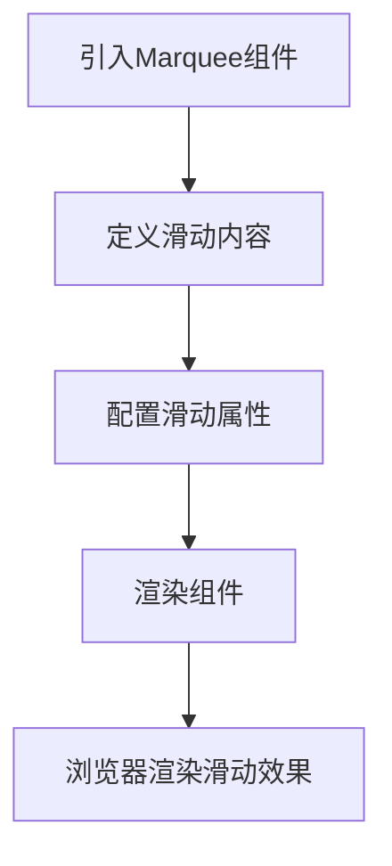

# UI组件库

<cite>
**Referenced Files in This Document**   
- [marquee.tsx](file://components/magicui/marquee.tsx)
- [utils.ts](file://lib/utils.ts)
- [Hero.js](file://app/components/Hero.js)
</cite>

## 目录
1. [简介](#简介)
2. [核心工具函数](#核心工具函数)
3. [滚动组件(Marquee)](#滚动组件marquee)
4. [集成与使用实践](#集成与使用实践)
5. [最佳实践与扩展](#最佳实践与扩展)

## 简介
本文档详细说明项目中使用的辅助UI组件和工具函数。重点介绍`magicui/marquee.tsx`第三方滚动组件的集成方式、使用场景及自定义属性，同时解析`lib/utils.ts`中提供的通用工具函数。这些基础组件和工具函数共同提升了开发效率和代码一致性。

## 核心工具函数

`lib/utils.ts`文件提供了项目中最基础且使用最广泛的工具函数`cn`，该函数是Tailwind CSS类名合并的核心工具。

`cn`函数通过组合`clsx`和`tailwind-merge`两个库的功能，实现了智能的类名合并。它不仅能够处理条件性类名，还能自动解决类名冲突，确保最终生成的CSS类名具有正确的优先级。

该工具函数的引入显著提升了代码的可读性和维护性，开发者无需手动处理复杂的类名拼接逻辑，降低了出错风险。

**Section sources**
- [utils.ts](file://lib/utils.ts#L3-L5)

## 滑动组件(Marquee)

`components/magicui/marquee.tsx`实现了一个可配置的滑动效果组件，用于创建水平或垂直的无限循环滑动效果。

该组件支持多种自定义属性：
- `reverse`: 控制滑动方向是否反转
- `pauseOnHover`: 鼠标悬停时是否暂停动画
- `vertical`: 是否启用垂直滑动模式
- `repeat`: 内容重复次数，影响滑动流畅度
- `children`: 要滑动显示的内容

组件通过CSS变量和Tailwind的动画类实现了高性能的滑动效果，利用`group-hover:[animation-play-state:paused]`等实用类实现了交互功能。

**Section sources**
- [marquee.tsx](file://components/magicui/marquee.tsx#L1-L73)

## 集成与使用实践

滑动组件在项目中的主要使用场景是展示技术栈标签，如在首页的`Hero`组件中展示Next.js、React等技术标签。

尽管当前`Hero.js`中的滑动组件使用被注释，但其设计意图清晰展示了该组件的典型应用场景：通过简单的JSX结构即可创建动态的技术栈展示效果。

组件的集成方式遵循React的最佳实践，通过解构赋值接收属性，并使用`...props`传递额外的HTML属性，保证了组件的灵活性和可扩展性。

**Diagram sources**
- [marquee.tsx](file://components/magicui/marquee.tsx#L1-L73)
- [Hero.js](file://app/components/Hero.js#L1-L40)

**Section sources**
- [Hero.js](file://app/components/Hero.js#L1-L40)

## 最佳实践与扩展

### 工具函数使用最佳实践
1. 在所有需要条件性类名的组件中统一使用`cn`函数
2. 将复杂的类名逻辑分解为多个条件对象，提高可读性
3. 避免直接字符串拼接类名，始终使用`cn`函数

### 滑动组件扩展建议
1. 可通过修改CSS变量`[--duration]`调整滑动速度
2. 可通过调整`repeat`属性优化不同内容长度下的滑动效果
3. 可扩展支持更多动画效果，如淡入淡出等

这些基础组件和工具函数的合理使用，不仅提升了开发效率，还确保了整个项目UI的一致性和可维护性。

**Section sources**
- [marquee.tsx](file://components/magicui/marquee.tsx#L1-L73)
- [utils.ts](file://lib/utils.ts#L3-L5)