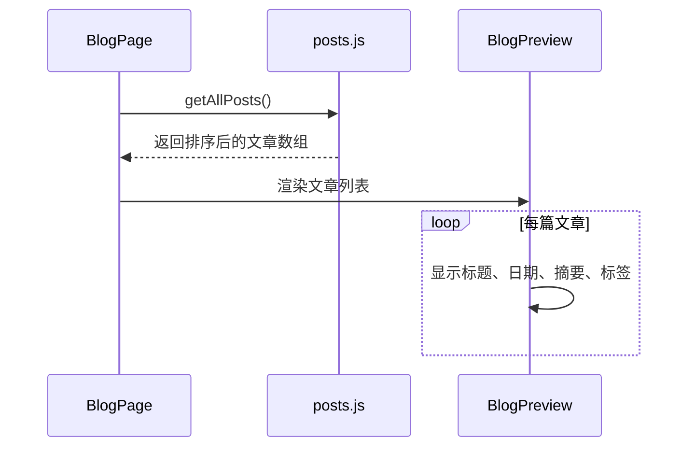
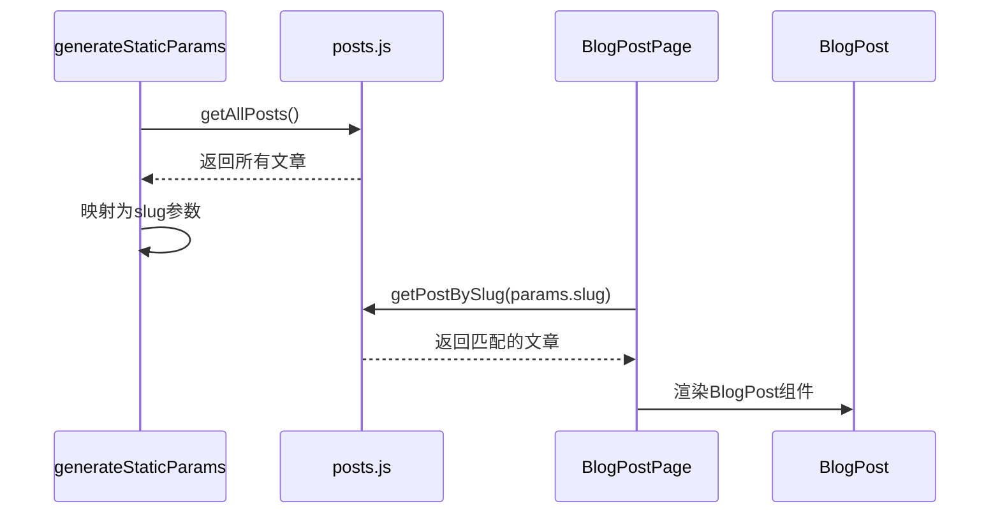

# 博客功能模块

<cite>
**本文档引用的文件**
- [posts.js](file://app/lib/posts.js)
- [BlogPreview.js](file://app/components/BlogPreview.js)
- [BlogList.js](file://app/components/BlogList.js)
- [blog/page.js](file://app/blog/page.js)
- [blog/[slug]/page.js](file://app/blog/[slug]/page.js)
- [BlogPost.js](file://app/components/BlogPost.js)
</cite>

## 目录
1. [项目结构](#项目结构)
2. [核心数据管理](#核心数据管理)
3. [文章列表渲染组件](#文章列表渲染组件)
4. [博客索引页实现](#博客索引页实现)
5. [单篇博文展示逻辑](#单篇博文展示逻辑)
6. [内容组织与SEO策略](#内容组织与seo策略)
7. [内容创作者指南](#内容创作者指南)

## 项目结构

博客功能模块采用Next.js App Router架构，主要文件分布在`app/blog`目录下，数据逻辑与UI组件分离。核心结构如下：

```mermaid
graph TB
subgraph "博客功能模块"
BlogIndex[blog/page.js<br>博客索引页]
BlogDetail[blog/[slug]/page.js<br>动态详情页]
PostsLib[lib/posts.js<br>数据管理]
BlogPreview[components/BlogPreview.js<br>文章预览组件]
BlogList[components/BlogList.js<br>文章列表组件]
BlogPost[components/BlogPost.js<br>文章详情组件]
end
BlogIndex --> PostsLib
BlogDetail --> PostsLib
BlogIndex --> BlogPreview
BlogList --> BlogPreview
BlogDetail --> BlogPost
```

**Diagram sources**
- [app/blog/page.js](file://app/blog/page.js)
- [app/lib/posts.js](file://app/lib/posts.js)
- [app/components/BlogPreview.js](file://app/components/BlogPreview.js)

**Section sources**
- [app/blog/page.js](file://app/blog/page.js)
- [app/lib/posts.js](file://app/lib/posts.js)

## 核心数据管理

`app/lib/posts.js` 文件负责博客文章的数据存储与访问逻辑，采用模拟数据方式，便于后续扩展为文件系统或CMS集成。

### 数据结构
每篇博客文章包含以下元数据字段：
- `slug`: URL唯一标识符
- `title`: 文章标题
- `excerpt`: 摘要内容
- `content`: 正文内容（HTML格式）
- `date`: 发布日期
- `image`: 封面图片URL
- `tags`: 标签数组
- `readingTime`: 阅读时长（分钟）
- `featured`: 是否为推荐文章

### 数据访问方法
```mermaid
classDiagram
class posts {
+getAllPosts() Promise~Post[]~
+getFeaturedPosts() Promise~Post[]~
+getPostBySlug(slug : string) Promise~Post | null~
}
note right of posts
数据访问服务
- getAllPosts : 获取所有文章并按日期倒序
- getFeaturedPosts : 获取推荐文章
- getPostBySlug : 根据slug获取单篇文章
end note
```

**Diagram sources**
- [app/lib/posts.js](file://app/lib/posts.js#L41-L54)

**Section sources**
- [app/lib/posts.js](file://app/lib/posts.js#L1-L54)

## 文章列表渲染组件

系统提供两种文章列表渲染组件，适用于不同场景。

### BlogPreview 组件
用于首页或侧边栏的简洁文章预览，采用垂直列表布局，强调可读性和交互反馈。

```mermaid
flowchart TD
A[BlogPreview组件] --> B[接收posts数组]
B --> C{遍历每篇文章}
C --> D[显示日期和标签]
D --> E[显示标题链接]
E --> F[显示摘要]
F --> G[显示"阅读更多"链接]
```

**Diagram sources**
- [app/components/BlogPreview.js](file://app/components/BlogPreview.js)

### BlogList 组件
用于网格布局的文章展示，支持响应式设计，在不同屏幕尺寸下显示1-3列。

```mermaid
flowchart TD
A[BlogList组件] --> B[接收posts数组]
B --> C[创建网格容器]
C --> D{遍历每篇文章}
D --> E[显示封面图片]
E --> F[显示日期]
F --> G[显示标题链接]
G --> H[显示摘要截断]
H --> I[显示标签]
I --> J[显示"阅读更多"链接]
```

**Diagram sources**
- [app/components/BlogList.js](file://app/components/BlogList.js)

**Section sources**
- [app/components/BlogPreview.js](file://app/components/BlogPreview.js)
- [app/components/BlogList.js](file://app/components/BlogList.js)

## 博客索引页实现

`app/blog/page.js` 是博客的主索引页面，负责展示所有文章的列表。

### 实现逻辑


页面首先通过 `getAllPosts()` 获取所有文章并按发布日期倒序排列，然后渲染为列表形式，每篇文章包含标题、发布日期、阅读时长、摘要和标签等信息。

**Section sources**
- [app/blog/page.js](file://app/blog/page.js)

## 单篇博文展示逻辑

`app/blog/[slug]/page.js` 实现了基于动态路由的单篇文章展示功能。

### 动态路由实现


#### 关键功能点：
1. **静态生成参数**：`generateStaticParams` 函数预生成所有文章的slug，支持静态站点生成（SSG）
2. **文章获取**：根据URL中的slug参数调用 `getPostBySlug` 获取对应文章
3. **组件渲染**：将文章数据传递给 `BlogPost` 组件进行展示

**Section sources**
- [app/blog/[slug]/page.js](file://app/blog/[slug]/page.js)
- [app/components/BlogPost.js](file://app/components/BlogPost.js)

## 内容组织与SEO策略

### 内容组织方式
当前系统采用内联数据方式组织文章内容，所有文章数据直接定义在 `posts.js` 文件中。`content` 字段使用HTML字符串格式，未来可扩展为Markdown解析。

### SEO优化策略
虽然当前 `generateMetadata` 函数被注释，但已预留SEO优化接口：
- 可根据文章标题和摘要动态生成页面标题和描述
- 支持Open Graph和Twitter Card等社交分享元数据
- 语义化HTML结构有利于搜索引擎抓取

### 潜在扩展
- **分页功能**：可通过修改 `getAllPosts` 添加分页参数
- **无限滚动**：前端可通过Intersection Observer实现
- **搜索功能**：可基于标签和标题实现客户端搜索

**Section sources**
- [app/blog/[slug]/page.js](file://app/blog/[slug]/page.js#L15-L25)
- [app/lib/posts.js](file://app/lib/posts.js)

## 内容创作者指南

### 添加新文章的标准化流程
1. **编辑数据文件**：打开 `app/lib/posts.js`
2. **添加文章对象**：在 `posts` 数组中添加新的文章对象，确保包含所有必要字段：
```javascript
{
  slug: 'unique-url-identifier',
  title: '文章标题',
  excerpt: '文章摘要，简要描述内容',
  content: '<p>文章正文内容，可包含HTML标签</p>',
  date: 'YYYY-MM-DD',
  image: 'https://example.com/image.jpg',
  tags: ['标签1', '标签2'],
  readingTime: 5,
  featured: false
}
```
3. **验证数据完整性**：确保slug唯一，日期格式正确，必填字段完整
4. **测试页面**：启动开发服务器，访问 `/blog/your-slug` 验证文章正常显示

### 最佳实践
- **Slug命名**：使用小写字母、数字和连字符，避免特殊字符
- **内容格式**：`content` 字段支持HTML，建议使用语义化标签
- **图片优化**：使用外部CDN或优化后的图片URL
- **SEO友好**：撰写有意义的标题和摘要，合理使用标签

**Section sources**
- [app/lib/posts.js](file://app/lib/posts.js)