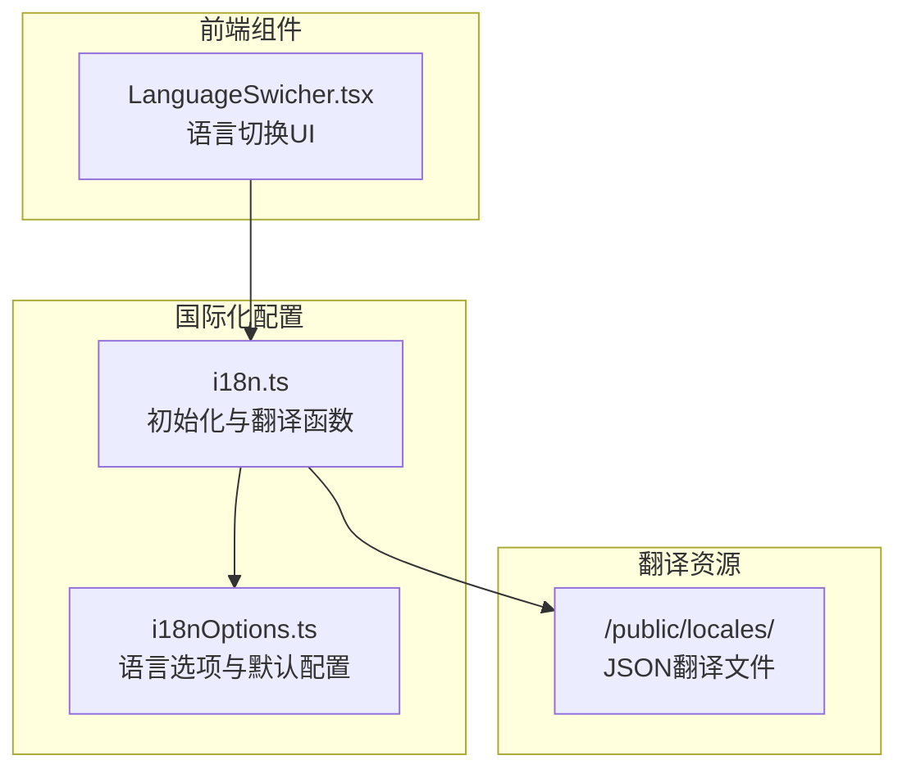
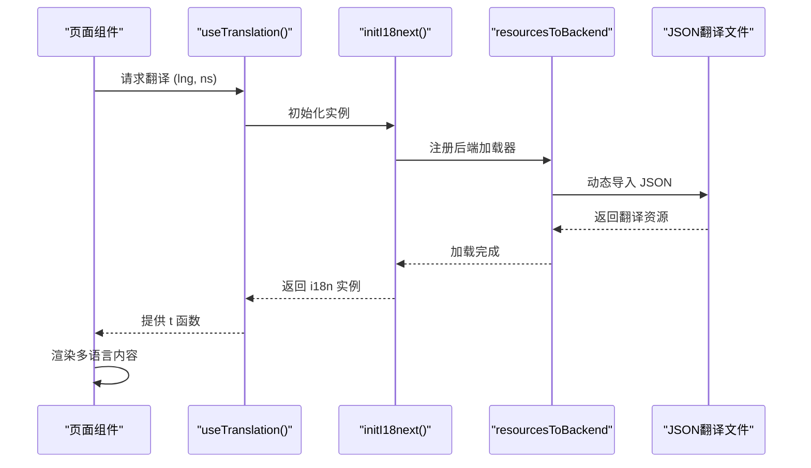
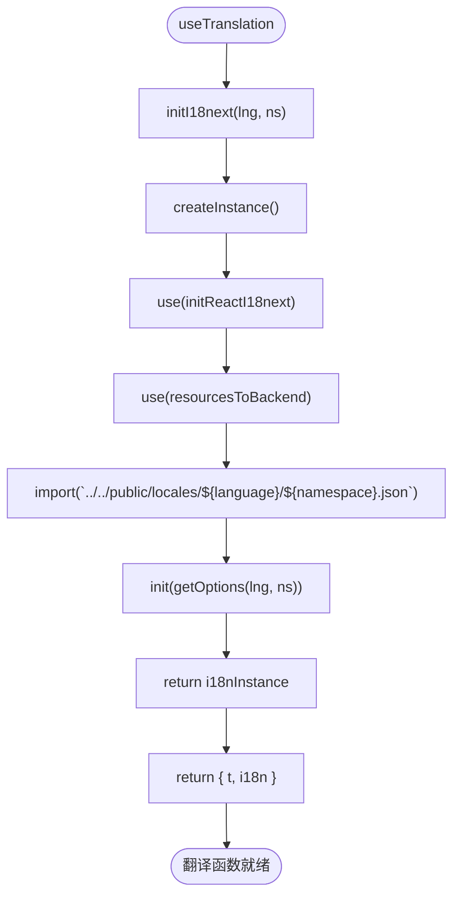
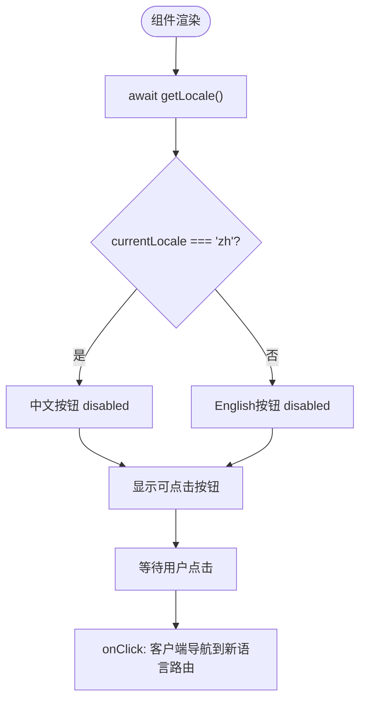

# 国际化与多语言

<cite>
**本文档引用文件**  
- [i18n.ts](file://app/lib/i18n.ts)
- [i18nOptions.ts](file://app/lib/i18nOptions.ts)
- [LanguageSwicher.tsx](file://app/components/LanguageSwicher.tsx)
- [commen.json](file://public/locales/zh/commen.json)
- [home.json](file://public/locales/en/home.json)
</cite>

## 目录
1. [简介](#简介)
2. [项目结构与国际化布局](#项目结构与国际化布局)
3. [核心组件分析](#核心组件分析)
4. [架构概览](#架构概览)
5. [详细组件分析](#详细组件分析)
6. [依赖关系分析](#依赖关系分析)
7. [性能考量](#性能考量)
8. [故障排查指南](#故障排查指南)
9. [结论](#结论)

## 简介
本文档系统性地文档化基于 `next-intl` 库实现的国际化（i18n）架构。涵盖语言配置、中间件设置、服务端翻译函数获取流程、语言切换机制、翻译文件组织结构以及新增语言和管理翻译键的工作流。同时讨论静态生成（SSG）与 i18n 集成的挑战及解决方案。

## 项目结构与国际化布局
项目采用 Next.js App Router 架构，国际化资源集中存放在 `/public/locales` 目录下，按语言代码（如 `zh`, `en`）分目录管理，每个目录包含多个命名空间 JSON 文件（如 `common.json`, `home.json`）。核心配置逻辑位于 `app/lib/` 下的 `i18n.ts` 和 `i18nOptions.ts`，语言切换组件为客户端组件 `LanguageSwicher.tsx`。



**Diagram sources**
- [i18nOptions.ts](file://app/lib/i18nOptions.ts#L1-L11)
- [i18n.ts](file://app/lib/i18n.ts#L1-L22)
- [LanguageSwicher.tsx](file://app/components/LanguageSwicher.tsx#L1-L28)
- [public/locales](file://public/locales)

**Section sources**
- [i18n.ts](file://app/lib/i18n.ts#L1-L22)
- [i18nOptions.ts](file://app/lib/i18nOptions.ts#L1-L11)
- [LanguageSwicher.tsx](file://app/components/LanguageSwicher.tsx#L1-L28)

## 核心组件分析
本节分析实现国际化功能的核心模块，包括配置初始化、翻译服务获取和用户界面交互。

**Section sources**
- [i18n.ts](file://app/lib/i18n.ts#L1-L22)
- [i18nOptions.ts](file://app/lib/i18nOptions.ts#L1-L11)
- [LanguageSwicher.tsx](file://app/components/LanguageSwicher.tsx#L1-L28)

## 架构概览
系统通过 `next-intl` 与 `i18next` 生态集成，实现服务端渲染（SSR）和客户端动态切换的多语言支持。`getOptions` 提供基础配置，`useTranslation` 在服务端初始化 i18n 实例并加载对应语言资源，组件通过异步获取翻译函数进行内容渲染。



**Diagram sources**
- [i18n.ts](file://app/lib/i18n.ts#L1-L22)
- [i18nOptions.ts](file://app/lib/i18nOptions.ts#L1-L11)

## 详细组件分析

### i18nOptions.ts 配置分析
该模块定义了 `getOptions` 函数，返回 i18next 所需的配置对象，包括支持的语言列表、回退语言、默认命名空间等。

```mermaid
classDiagram
class getOptions {
+getOptions(lng : string, ns : string|string[]) : Object
}
getOptions : supportedLngs : string[]
getOptions : fallbackLng : string
getOptions : lng : string
getOptions : fallbackNS : string
getOptions : defaultNS : string
getOptions : ns : string|string[]
```

**Diagram sources**
- [i18nOptions.ts](file://app/lib/i18nOptions.ts#L1-L11)

**Section sources**
- [i18nOptions.ts](file://app/lib/i18nOptions.ts#L1-L11)

### i18n.ts 服务端翻译流程
`useTranslation` 函数是服务端获取翻译能力的核心。它创建独立的 i18n 实例，使用 `resourcesToBackend` 动态加载指定语言和命名空间的 JSON 文件，并根据 `getOptions` 进行初始化。



**Diagram sources**
- [i18n.ts](file://app/lib/i18n.ts#L1-L22)

**Section sources**
- [i18n.ts](file://app/lib/i18n.ts#L1-L22)

### LanguageSwicher.tsx 语言切换机制
该客户端组件使用 `next/navigation` 的 `useRouter` 和 `next-intl/server` 的 `getLocale` 来获取当前语言并提供切换按钮。当前实现中按钮的 `onClick` 逻辑为空，需补充客户端导航逻辑以实现语言切换。



**Diagram sources**
- [LanguageSwicher.tsx](file://app/components/LanguageSwicher.tsx#L1-L28)

**Section sources**
- [LanguageSwicher.tsx](file://app/components/LanguageSwicher.tsx#L1-L28)

## 依赖关系分析
系统依赖 `i18next` 作为核心国际化引擎，`react-i18next` 提供 React 集成，`i18next-resources-to-backend` 实现动态资源加载，`next-intl` 提供 Next.js 深度集成（如中间件、服务端辅助函数）。

```mermaid
dependencyDiagram
next-intl --> i18next
react-i18next --> i18next
i18next-resources-to-backend --> i18next
LanguageSwicher --> next-intl
useTranslation --> i18next-resources-to-backend
useTranslation --> i18nOptions
```

**Diagram sources**
- [package.json](file://package.json#L10-L15)
- [i18n.ts](file://app/lib/i18n.ts#L1-L22)
- [i18nOptions.ts](file://app/lib/i18nOptions.ts#L1-L11)

**Section sources**
- [package.json](file://package.json#L10-L15)

## 性能考量
- **按需加载**：通过 `resourcesToBackend` 和动态 `import()`，仅加载当前页面所需语言和命名空间的资源，减少初始加载体积。
- **服务端渲染**：在服务端完成翻译，提升首屏渲染性能和 SEO。
- **缓存策略**：建议在生产环境中对 `/public/locales` 目录的 JSON 文件配置适当的 HTTP 缓存头。
- **客户端切换**：当前 `LanguageSwicher` 组件缺少导航逻辑，完整实现应使用 `useRouter` 的 `push` 或 `replace` 方法跳转至对应语言的路由。

## 故障排查指南
- **翻译文本未更新**：检查 JSON 文件路径是否正确，命名空间（namespace）是否匹配 `useTranslation` 调用。
- **语言切换无效**：确认 `LanguageSwicher` 的 `onClick` 是否正确实现了路由跳转，且目标路由能正确解析语言参数。
- **SSG 构建失败**：若使用静态生成，需确保所有支持的语言和命名空间的 JSON 文件在构建时存在，避免动态导入失败。
- **回退语言不生效**：检查 `i18nOptions.ts` 中 `fallbackLng` 配置，并确认回退语言的 JSON 文件完整。

## 结论
该项目通过 `next-intl` 和 `i18next` 生态构建了一个可扩展的多语言架构。`i18nOptions.ts` 和 `i18n.ts` 提供了灵活的服务端翻译初始化机制，`/public/locales` 的目录结构便于翻译资源管理。`LanguageSwicher.tsx` 组件为语言切换提供了 UI 基础，但需补充客户端导航逻辑以完成闭环。整体架构清晰，易于维护和扩展新语言。