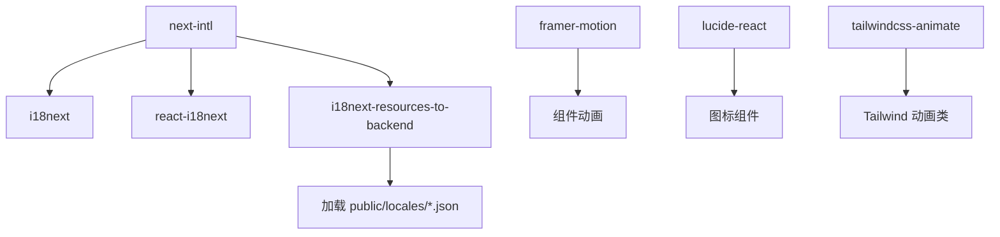

# 技术栈与依赖

<cite>
**本文档引用的文件**  
- [package.json](file://package.json)
- [next.config.ts](file://next.config.ts)
- [tailwind.config.js](file://tailwind.config.js)
- [tsconfig.json](file://tsconfig.json)
- [app/globals.css](file://app/globals.css)
- [app/components/ThemeToggle.tsx](file://app/components/ThemeToggle.tsx)
- [app/lib/theme.ts](file://app/lib/theme.ts)
- [app/lib/i18n.ts](file://app/lib/i18n.ts)
- [app/components/LanguageSwicher.tsx](file://app/components/LanguageSwicher.tsx)
- [lib/utils.ts](file://lib/utils.ts)
</cite>

## 目录
1. [技术栈概览](#技术栈概览)
2. [Next.js 与 React 协同机制](#nextjs-与-react-协同机制)
3. [Tailwind CSS 样式策略与暗色模式集成](#tailwind-css-样式策略与暗色模式集成)
4. [TypeScript 类型定义实践](#typescript-类型定义实践)
5. [关键依赖功能与集成](#关键依赖功能与集成)
6. [配置文件解析](#配置文件解析)
7. [环境搭建与版本兼容性指导](#环境搭建与版本兼容性指导)

## 技术栈概览

本项目采用现代化的前端技术栈，以 Next.js 15.5.2 为核心框架，结合 React 19.1.0 提供强大的组件化能力。通过 App Router 架构实现基于文件系统的路由机制，利用 TypeScript 提供静态类型检查，Tailwind CSS 实现高效样式开发，并集成国际化、动画与图标库等关键功能模块，构建高性能、可维护的现代化网站应用。

## Next.js 与 React 协同机制

项目基于 Next.js 15.5.2 的 App Router 架构，利用文件系统自动生成路由。React 19.1.0 提供全新的并发渲染能力与组件模型，与 Next.js 服务端渲染（SSR）和静态生成（SSG）无缝集成。客户端组件通过 `'use client'` 标识，实现交互逻辑与状态管理，服务端组件则负责数据获取与初始渲染，优化性能与首屏加载速度。

**Section sources**  
- [app/components/ThemeToggle.tsx](file://app/components/ThemeToggle.tsx#L1-L54)
- [app/components/LanguageSwicher.tsx](file://app/components/LanguageSwicher.tsx#L1-L28)

## Tailwind CSS 样式策略与暗色模式集成

项目采用 Tailwind CSS 作为核心样式框架，通过 `tailwind.config.js` 配置主题扩展，定义亮色与暗色模式下的自定义颜色变量。在 `globals.css` 中通过 CSS 变量与 `@layer` 指令实现主题切换，结合 `darkMode: ['class']` 配置，利用 `dark:` 前缀类动态应用暗色样式。样式合并工具 `clsx` 与 `tailwind-merge` 在 `lib/utils.ts` 中封装为 `cn` 函数，提升类名组合的灵活性与可维护性。

```mermaid
flowchart TD
A[Tailwind CSS] --> B[tailwind.config.js]
B --> C[自定义颜色变量]
B --> D[背景与文本色]
A --> E[app/globals.css]
E --> F[CSS 变量 --background, --foreground]
E --> G[@layer base 应用变量]
E --> H[dark: 前缀类]
I[ThemeToggle 组件] --> J[切换 html 元素 .dark 类]
J --> H
K[lib/utils.ts] --> L[cn 函数封装]
L --> M[合并 Tailwind 类名]
```

**Diagram sources**  
- [tailwind.config.js](file://tailwind.config.js#L1-L26)
- [app/globals.css](file://app/globals.css#L1-L74)
- [app/components/ThemeToggle.tsx](file://app/components/ThemeToggle.tsx#L1-L54)
- [lib/utils.ts](file://lib/utils.ts#L1-L6)

**Section sources**  
- [tailwind.config.js](file://tailwind.config.js#L1-L26)
- [app/globals.css](file://app/globals.css#L1-L74)
- [app/components/ThemeToggle.tsx](file://app/components/ThemeToggle.tsx#L1-L54)
- [app/lib/theme.ts](file://app/lib/theme.ts#L1-L14)
- [lib/utils.ts](file://lib/utils.ts#L1-L6)

## TypeScript 类型定义实践

TypeScript 在项目中广泛应用于组件与工具函数的类型定义。`lib/utils.ts` 中使用 `ClassValue` 类型定义 `cn` 函数参数，确保类名合并的类型安全。组件如 `ThemeToggle` 使用布尔类型 `boolean` 明确状态变量类型。`app/lib/theme.ts` 中通过 `'light' | 'dark'` 字符串字面量类型约束主题值，提升代码可读性与错误预防能力。

**Section sources**  
- [lib/utils.ts](file://lib/utils.ts#L1-L6)
- [app/components/ThemeToggle.tsx](file://app/components/ThemeToggle.tsx#L1-L54)
- [app/lib/theme.ts](file://app/lib/theme.ts#L6-L9)

## 关键依赖功能与集成

项目依赖多个关键库以实现完整功能：
- **next-intl**: 用于国际化支持，通过 `i18next` 和 `react-i18next` 实现多语言切换，`i18next-resources-to-backend` 动态加载 `public/locales` 目录下的 JSON 语言包。
- **framer-motion**: 提供高级动画能力，用于组件过渡与交互反馈。
- **lucide-react**: 提供一致且可定制的图标集，作为 React 组件直接导入使用。
- **tailwindcss-animate**: 基于 Tailwind 的动画插件，简化常见动画效果的实现。



**Diagram sources**  
- [package.json](file://package.json#L1-L37)
- [app/lib/i18n.ts](file://app/lib/i18n.ts#L1-L22)
- [app/components/LanguageSwicher.tsx](file://app/components/LanguageSwicher.tsx#L1-L28)

**Section sources**  
- [package.json](file://package.json#L1-L37)
- [app/lib/i18n.ts](file://app/lib/i18n.ts#L1-L22)
- [app/components/LanguageSwicher.tsx](file://app/components/LanguageSwicher.tsx#L1-L28)

## 配置文件解析

### next.config.ts
配置文件中通过 `images.domains` 列表声明允许加载外部图片的域名（如 `www.baidu.com`），确保资源安全加载。App Router 的国际化配置通过中间件实现，而非在此文件中直接配置。

### tsconfig.json
TypeScript 配置启用严格模式，模块解析为 `bundler`，支持 JSX 保留。通过 `paths` 配置 `@/*` 别名指向项目根目录，简化模块导入路径。

### tailwind.config.js
Tailwind 配置启用 `class` 模式的暗色模式，`content` 字段扫描 `app/`、`components/` 等目录下的文件以生成工具类。`theme.extend.colors` 定义了项目自定义的亮色与暗色主题颜色。

**Section sources**  
- [next.config.ts](file://next.config.ts#L1-L17)
- [tsconfig.json](file://tsconfig.json#L1-L27)
- [tailwind.config.js](file://tailwind.config.js#L1-L26)

## 环境搭建与版本兼容性指导

开发者应确保 Node.js 版本兼容 Next.js 15 要求。通过 `npm install` 安装依赖，使用 `npm run dev` 启动开发服务器。项目使用 Turbopack 作为实验性构建工具。Next.js 15.5.2 与 React 19.1.0 完全兼容，TypeScript 版本需为 5.x 以支持最新类型特性。所有依赖版本已在 `package.json` 中锁定，确保开发环境一致性。

**Section sources**  
- [package.json](file://package.json#L1-L37)
- [next.config.ts](file://next.config.ts#L1-L17)
- [tsconfig.json](file://tsconfig.json#L1-L27)