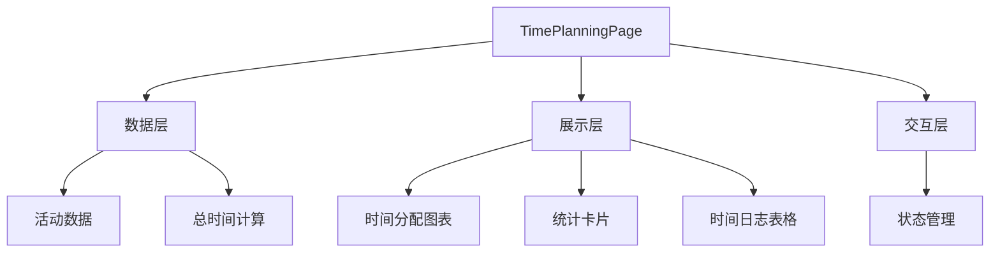
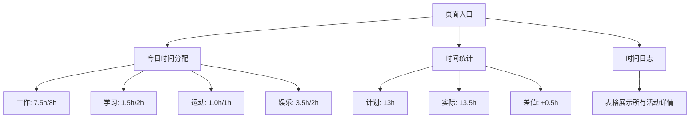
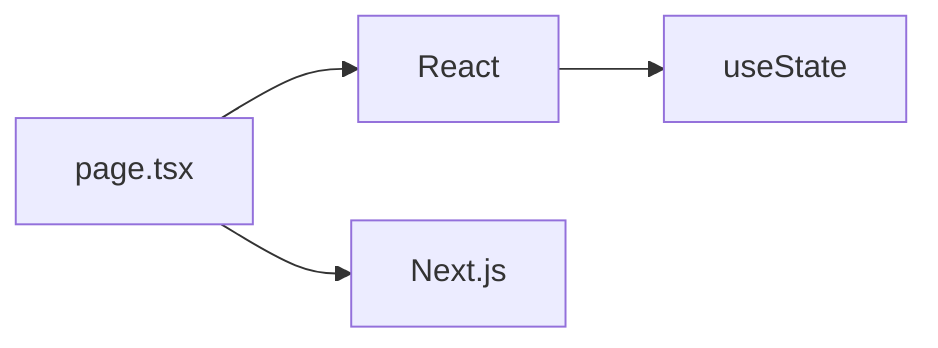

# 时间规划模块

<cite>
**Referenced Files in This Document**   
- [page.tsx](file://app/time-planning/page.tsx)
- [README.md](file://README.md)
</cite>

## 目录
1. [简介](#简介)
2. [项目结构](#项目结构)
3. [核心组件](#核心组件)
4. [架构概述](#架构概述)
5. [详细组件分析](#详细组件分析)
6. [依赖分析](#依赖分析)
7. [性能考虑](#性能考虑)
8. [故障排除指南](#故障排除指南)
9. [结论](#结论)

## 简介
时间规划模块是本项目的核心功能之一，旨在帮助用户更好地管理和分析时间使用情况。该模块提供了一个完整的界面，用于记录和分析每日时间分配，优化时间利用效率。通过可视化的时间分配图表、详细的统计信息和时间日志表格，用户可以清晰地了解自己的时间使用模式，识别时间流失点，并据此调整日常规划。

## 项目结构
时间规划模块位于 `app/time-planning/` 目录下，其核心实现文件为 `page.tsx`。该模块作为 Next.js 应用的一个独立页面，通过 `/time-planning` 路由访问。模块的设计遵循了 Next.js App Router 架构，利用服务端组件和客户端交互特性，提供了一个响应式的用户界面。

**Section sources**
- [page.tsx](file://app/time-planning/page.tsx#L1-L155)

## 核心组件
时间规划页面（`TimePlanningPage`）是该模块的唯一核心组件，采用内联方式实现了所有功能。该组件使用 React 的 `useState` Hook 来管理活动数据的状态，包括活动名称、计划时间、实际时间和颜色编码。页面结构分为三个主要部分：今日时间分配、时间统计和时间日志。

**Section sources**
- [page.tsx](file://app/time-planning/page.tsx#L4-L155)

## 架构概述
该模块采用简洁的单文件架构，所有逻辑和UI均在 `page.tsx` 中实现。架构分为数据层、展示层和交互层。数据层定义了活动数组和总时间计算；展示层通过多个卡片组件呈现数据；交互层虽然当前没有复杂的用户输入，但状态管理为未来的交互功能（如编辑时间）奠定了基础。



**Diagram sources**
- [page.tsx](file://app/time-planning/page.tsx#L4-L155)

## 详细组件分析
### 时间规划页面分析
`TimePlanningPage` 组件实现了完整的时间管理功能，包括数据展示和可视化。

#### 数据结构
组件内部定义了一个 `activities` 数组，每个活动对象包含 `id`、`name`、`plannedTime`、`actualTime` 和 `color` 属性。通过 `reduce` 方法计算总计划时间和总实际时间，用于统计分析。

```mermaid
classDiagram
class Activity {
+id : number
+name : string
+plannedTime : number
+actualTime : number
+color : string
}
class TimePlanningPage {
-activities : Activity[]
-totalTime : {planned : number, actual : number}
+render() : JSX.Element
}
```

**Diagram sources**
- [page.tsx](file://app/time-planning/page.tsx#L6-L22)

#### UI结构
页面采用响应式网格布局，包含三个主要区域：
1. **今日时间分配**：使用进度条可视化每个活动的实际时间与计划时间的对比。
2. **时间统计**：展示总计划时间、总实际时间和时间差，并通过颜色区分超时或节省。
3. **时间日志**：以表格形式列出所有活动的详细信息，包括效率百分比和状态备注。



**Diagram sources**
- [page.tsx](file://app/time-planning/page.tsx#L50-L155)

## 依赖分析
该模块的依赖关系非常简单，仅依赖于 React 的 `useState` Hook 和 Next.js 的客户端渲染能力。没有外部服务或复杂的状态管理库，所有数据均为静态内联定义。



**Diagram sources**
- [page.tsx](file://app/time-planning/page.tsx#L1-L3)

**Section sources**
- [page.tsx](file://app/time-planning/page.tsx#L1-L155)

## 性能考虑
由于数据量小且为静态定义，当前实现具有良好的性能表现。所有计算（如总时间）在渲染时同步完成，对于当前数据规模不会造成性能瓶颈。UI 使用了 Tailwind CSS 进行高效样式渲染，确保了快速的页面加载和响应。

## 故障排除指南
当前模块为只读展示，无用户输入或外部数据源，因此潜在问题较少。若页面无法显示，应检查：
1. 路由配置是否正确
2. React 客户端组件是否正确导入
3. 数据结构是否符合预期

**Section sources**
- [page.tsx](file://app/time-planning/page.tsx#L1-L155)

## 结论
时间规划模块是一个简洁高效的时间管理工具，通过内联实现提供了完整的数据展示功能。未来可扩展的方向包括：集成日历API以获取真实时间数据、添加表单输入以允许用户编辑活动、实现数据持久化以保存用户记录、以及添加可视化图表（如饼图或折线图）以增强数据分析能力。这些增强将使模块从一个静态展示页面转变为一个功能完整的个人时间管理系统。