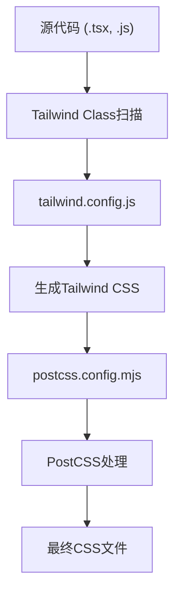

# 构建与部署

<cite>
**Referenced Files in This Document**   
- [package.json](file://package.json)
- [next.config.ts](file://next.config.ts)
- [postcss.config.mjs](file://postcss.config.mjs)
- [tailwind.config.js](file://tailwind.config.js)
- [eslint.config.mjs](file://eslint.config.mjs)
- [app/layout.tsx](file://app/layout.tsx)
- [app/page.tsx](file://app/page.tsx)
- [app/lib/i18n.ts](file://app/lib/i18n.ts)
- [app/components/LanguageSwicher.tsx](file://app/components/LanguageSwicher.tsx)
</cite>

## 目录
1. [项目构建流程](#项目构建流程)
2. [部署配置详解](#部署配置详解)
3. [CSS处理管道](#css处理管道)
4. [代码质量保障](#代码质量保障)
5. [部署与CI/CD建议](#部署与cicd建议)
6. [性能优化策略](#性能优化策略)

## 项目构建流程

本项目采用Next.js框架，其构建流程由`package.json`中的scripts脚本驱动。`dev`脚本使用`next dev --turbopack`启动开发服务器，利用Turbopack的增量编译能力提供快速的热重载体验。`build`脚本执行`next build --turbopack`，通过Turbopack进行生产环境的代码打包，生成优化后的静态文件和服务器端代码。`start`脚本用于启动生产环境服务器，运行`next start`命令来服务已构建的应用。`lint`脚本则调用ESLint进行代码质量检查。

**Section sources**
- [package.json](file://package.json#L5-L13)

## 部署配置详解

`next.config.ts`文件是Next.js应用的核心配置文件。在本项目中，`images`配置项的`domains`数组列出了允许加载外部图片资源的域名（如`www.baidu.com`），这对于防止因加载外部图片而产生的安全错误至关重要。此配置确保了应用可以安全地引用和优化来自这些域名的图片。虽然注释中提到了`i18n`配置，但该项目实际使用`next-intl`库和中间件来处理国际化，而非Next.js内置的i18n路由。

**Section sources**
- [next.config.ts](file://next.config.ts#L7-L13)
- [app/lib/i18n.ts](file://app/lib/i18n.ts#L1-L22)
- [app/components/LanguageSwicher.tsx](file://app/components/LanguageSwicher.tsx#L1-L28)

## CSS处理管道

项目的CSS处理管道由PostCSS和Tailwind CSS协同工作。`postcss.config.mjs`文件配置了PostCSS插件，其中`@tailwindcss/postcss`是核心插件，负责将Tailwind的指令（如`@tailwind base`）编译成实际的CSS规则。`tailwind.config.js`文件定义了Tailwind的配置，其`content`数组指定了需要扫描以生成最终CSS的文件路径，确保了只有在`app`、`components`等目录中实际使用的Tailwind类才会被包含在最终的CSS文件中，从而实现高效的代码分割和体积优化。`theme.extend.colors`中定义了自定义的亮色和暗色主题颜色，用于支持应用的深色模式。

**Diagram sources**
- [tailwind.config.js](file://tailwind.config.js#L4-L26)
- [postcss.config.mjs](file://postcss.config.mjs#L1-L5)

**Section sources**
- [tailwind.config.js](file://tailwind.config.js#L4-L26)
- [postcss.config.mjs](file://postcss.config.mjs#L1-L5)

## 代码质量保障

`eslint.config.mjs`文件定义了项目的ESLint配置。它使用`@eslint/eslintrc`库的`FlatCompat`来兼容传统的ESLint扩展配置。通过`...compat.extends("next/core-web-vitals", "next/typescript")`，项目继承了`eslint-config-next`提供的核心Web Vitals和TypeScript最佳实践规则，确保代码符合性能、可访问性和最佳实践标准。`ignores`数组指定了需要忽略检查的目录，如`node_modules`、`.next`和`out`，这些是构建过程中的生成文件，无需进行代码检查。

**Section sources**
- [eslint.config.mjs](file://eslint.config.mjs#L1-L25)

## 部署与CI/CD建议

### 部署步骤
1.  **构建**: 在部署前，运行`npm run build`命令。这将执行`next build`，生成生产环境的优化代码，并输出到`.next`目录。
2.  **环境变量**: 将所有敏感或环境特定的配置（如API密钥、数据库连接字符串）设置为环境变量。在Vercel等平台上，可以在项目设置中配置环境变量。项目中未发现`.env`文件，表明环境变量可能通过平台直接注入。
3.  **平台部署**: 对于Vercel，只需将代码推送到Git仓库，Vercel会自动检测到Next.js项目并执行构建和部署流程。对于其他平台，需确保服务器上安装了Node.js，并运行`npm run start`来启动应用。

### CI/CD配置建议
一个典型的CI/CD流水线应包含以下步骤：
1.  **代码拉取**: 从Git仓库拉取最新代码。
2.  **依赖安装**: 运行`npm install`安装所有依赖。
3.  **代码检查**: 运行`npm run lint`执行ESLint检查，确保代码风格和质量。
4.  **构建验证**: 运行`npm run build`，验证构建过程无错误。
5.  **部署**: 如果以上步骤均成功，则将构建产物部署到目标环境（如预发布或生产环境）。

## 性能优化策略

本项目通过多种方式实现性能优化：
-   **代码分割**: Next.js的App Router和`content`配置自动实现了代码分割，确保用户只加载当前页面所需的代码。
-   **图片优化**: `next.config.ts`中的`images`配置启用了Next.js内置的图片优化功能，可以自动调整图片大小、格式和懒加载。
-   **预加载**: Next.js会自动为链接的页面进行代码预加载，提升页面切换速度。
-   **主题切换**: `app/layout.tsx`中的`getTheme()`函数在服务端获取初始主题，避免了客户端渲染时的闪烁问题，提升了首屏加载体验。

**Section sources**
- [app/layout.tsx](file://app/layout.tsx#L15-L17)
- [next.config.ts](file://next.config.ts#L7-L13)
- [tailwind.config.js](file://tailwind.config.js#L4-L26)