# 样式策略

<cite>
**Referenced Files in This Document**   
- [tailwind.config.js](file://tailwind.config.js)
- [globals.css](file://app/globals.css)
- [ThemeToggle.tsx](file://app/components/ThemeToggle.tsx)
- [Header.js](file://app/components/Header.js)
- [layout.tsx](file://app/layout.tsx)
- [theme.ts](file://app/lib/theme.ts)
- [marquee.tsx](file://components/magicui/marquee.tsx)
</cite>

## Table of Contents
1. [项目样式架构概览](#项目样式架构概览)
2. [Tailwind CSS 配置详解](#tailwind-css-配置详解)
3. [全局样式与基础重置](#全局样式与基础重置)
4. [暗色模式实现机制](#暗色模式实现机制)
5. [响应式设计与动画](#响应式设计与动画)
6. [样式封装与最佳实践](#样式封装与最佳实践)

## 项目样式架构概览

本项目采用Tailwind CSS作为核心样式解决方案，遵循实用优先（utility-first）的设计哲学。样式系统由`tailwind.config.js`配置文件驱动，通过JIT（即时编译）模式动态生成所需的CSS类。项目结构中，`app/globals.css`作为全局样式入口，集成了Tailwind的base、components和utilities三层架构。组件层面，通过`@apply`指令将常用类组合封装，实现了样式复用与维护性平衡。整体架构支持响应式设计、暗色模式切换和自定义动画，为用户提供一致且现代化的视觉体验。

**Section sources**
- [tailwind.config.js](file://tailwind.config.js#L1-L27)
- [globals.css](file://app/globals.css#L1-L75)

## Tailwind CSS 配置详解

项目的`tailwind.config.js`文件定义了样式系统的核心配置。`darkMode`选项设置为`["class"]`，表明暗色模式通过在HTML元素上添加`dark`类来激活，而非依赖媒体查询。`content`数组指定了需要扫描的文件路径，确保所有JSX/TSX文件中的Tailwind类都能被正确识别和生成。在`theme.extend`中，项目扩展了颜色调色板，定义了`background-light`、`text-light`、`background-dark`和`text-dark`等自定义颜色变量，这些变量直接映射到应用的亮色和暗色主题。此外，还配置了径向和圆锥渐变的背景图像，为组件提供丰富的视觉效果。当前配置未使用插件，保持了构建的简洁性。

**Diagram sources**
- [tailwind.config.js](file://tailwind.config.js#L1-L27)

**Section sources**
- [tailwind.config.js](file://tailwind.config.js#L1-L27)

## 全局样式与基础重置

`app/globals.css`文件是全局样式的中心枢纽。文件首先通过`@import "tailwindcss"`引入Tailwind的核心功能。随后，通过CSS自定义属性（CSS Variables）定义了`:root`和`.dark:root`两个作用域的变量，分别对应亮色和暗色模式下的背景色（`--background`）和前景色（`--foreground`）。这些变量在`body`标签的样式中被引用，确保了主题切换时的平滑过渡。文件通过`@tailwind`指令注入Tailwind的三层次（base, components, utilities）CSS。特别地，在`@layer base`中，`body`样式使用`@apply`指令应用了`bg-[var(--background)]`和`text-[var(--foreground)]`，并设置了`transition-colors`以实现颜色变化的动画效果。这种设计将Tailwind的实用性与CSS变量的灵活性相结合，为全局主题管理奠定了基础。

**Diagram sources**
- [globals.css](file://app/globals.css#L1-L75)

**Section sources**
- [globals.css](file://app/globals.css#L1-L75)

## 暗色模式实现机制

项目的暗色模式实现是一个客户端驱动的、持久化的解决方案。其核心逻辑位于`app/lib/theme.ts`和`app/components/ThemeToggle.tsx`中。`theme.ts`文件导出了`getTheme`和`setTheme`函数，用于从`localStorage`读取和保存用户的主题偏好。`ThemeToggle.tsx`组件在`useEffect`钩子中初始化主题：优先读取`localStorage`中的保存值，若无则回退到系统偏好（通过`window.matchMedia('(prefers-color-scheme: dark)')`检测）。用户点击切换按钮时，`toggleTheme`函数会更新`document.documentElement`的`classList`，添加或移除`dark`类，从而触发Tailwind的暗色模式变体。同时，新的主题状态会被保存到`localStorage`，确保刷新后设置依然有效。`layout.tsx`在服务端渲染时通过`getTheme()`获取初始主题并设置`data-theme`属性，实现了服务端与客户端的主题同步，避免了内容闪烁（FOUC）。

```mermaid
sequenceDiagram
participant Client as "客户端"
participant ThemeToggle as "ThemeToggle组件"
participant ThemeLib as "theme.ts"
participant DOM as "DOM"
participant Storage as "localStorage"
Client->>ThemeToggle : 页面加载
ThemeToggle->>ThemeLib : getTheme()
ThemeLib->>Storage : getItem('theme')
Storage-->>ThemeLib : 返回主题值
alt 有保存值
ThemeLib-->>ThemeToggle : 返回保存的主题
else 无保存值
ThemeLib->>Client : matchMedia('(prefers-color-scheme : dark)')
Client-->>ThemeLib : 返回系统偏好
ThemeLib-->>ThemeToggle : 返回系统主题
end
ThemeToggle->>DOM : 设置 html 元素的 class
ThemeToggle->>ThemeToggle : 更新 isDark 状态
ThemeToggle->>Client : 显示当前主题图标
Client->>ThemeToggle : 点击切换按钮
ThemeToggle->>ThemeToggle : 执行 toggleTheme
ThemeToggle->>DOM : toggle 'dark' class
ThemeToggle->>ThemeToggle : 更新 isDark 状态
ThemeToggle->>Storage : setItem('theme', newTheme)
```

**Diagram sources**
- [ThemeToggle.tsx](file://app/components/ThemeToggle.tsx#L6-L54)
- [theme.ts](file://app/lib/theme.ts#L1-L15)
- [layout.tsx](file://app/layout.tsx#L1-L30)

**Section sources**
- [ThemeToggle.tsx](file://app/components/ThemeToggle.tsx#L6-L54)
- [theme.ts](file://app/lib/theme.ts#L1-L15)
- [layout.tsx](file://app/layout.tsx#L1-L30)

## 响应式设计与动画

项目利用Tailwind的断点系统实现响应式布局。例如，在`Header.js`组件中，导航菜单使用`hidden md:flex`类，实现了在移动设备上隐藏、在中等及以上屏幕显示的响应式行为。对于动画效果，项目采用了两种方式。一是直接使用Tailwind的过渡类，如`transition-colors duration-300`，为背景和文字颜色变化添加平滑过渡。二是通过`@keyframes`在`globals.css`中定义自定义动画（`marquee`和`marquee-vertical`），然后在`components/magicui/marquee.tsx`组件中通过`@apply`指令应用`animate-marquee`类来实现跑马灯效果。`marquee.tsx`组件设计灵活，支持水平/垂直滚动、反向播放、悬停暂停等特性，其样式通过`cn`工具函数（结合`clsx`和`tailwind-merge`）动态组合，确保了样式的可复用性和条件渲染的简洁性。

**Section sources**
- [Header.js](file://app/components/Header.js#L1-L82)
- [globals.css](file://app/globals.css#L1-L75)
- [marquee.tsx](file://components/magicui/marquee.tsx#L1-L74)
- [utils.ts](file://lib/utils.ts#L1-L7)

## 样式封装与最佳实践

本项目遵循了Tailwind CSS的最佳实践。首先，避免了在组件中直接编写长串的Tailwind类名，而是通过`@apply`在CSS文件中将常用组合封装成语义化的类（尽管在当前代码中未显式定义，但`@layer`语法为此提供了支持）。其次，通过CSS变量和`@apply`指令的结合，实现了主题的集中管理，使得修改全局配色只需更改变量值。再者，利用`data-theme`属性和`localStorage`，实现了用户偏好的持久化存储。最后，项目通过`tailwind-merge`库的`cn`函数来安全地合并动态类名，解决了条件样式覆盖的问题。开发者在扩展样式时，应优先考虑在`tailwind.config.js`中扩展主题，或在`globals.css`中使用`@layer components`定义新组件类，以保持样式系统的一致性和可维护性。

**Section sources**
- [tailwind.config.js](file://tailwind.config.js#L1-L27)
- [globals.css](file://app/globals.css#L1-L75)
- [utils.ts](file://lib/utils.ts#L1-L7)