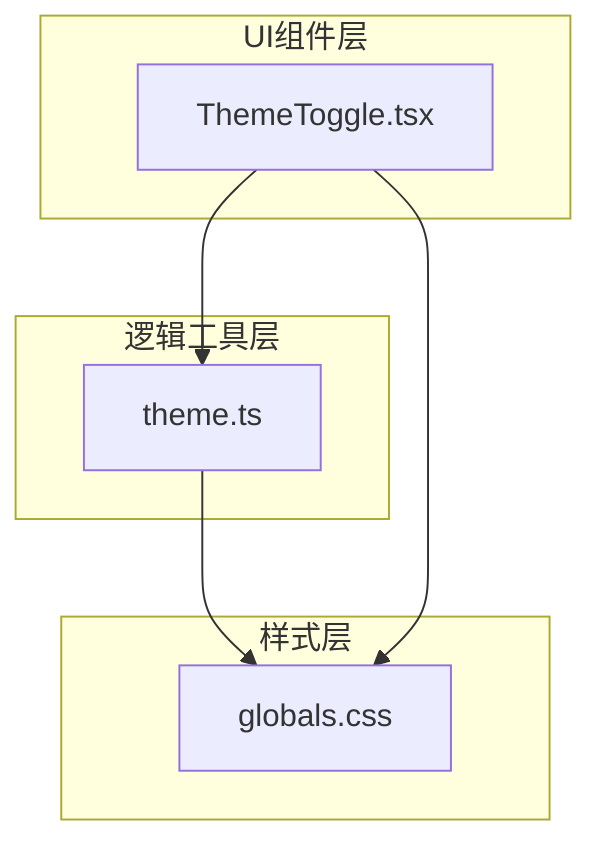
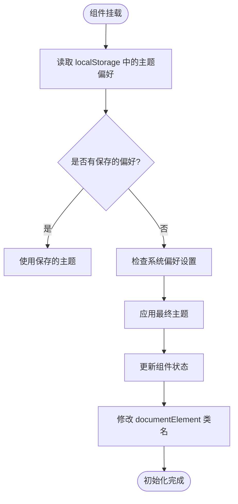
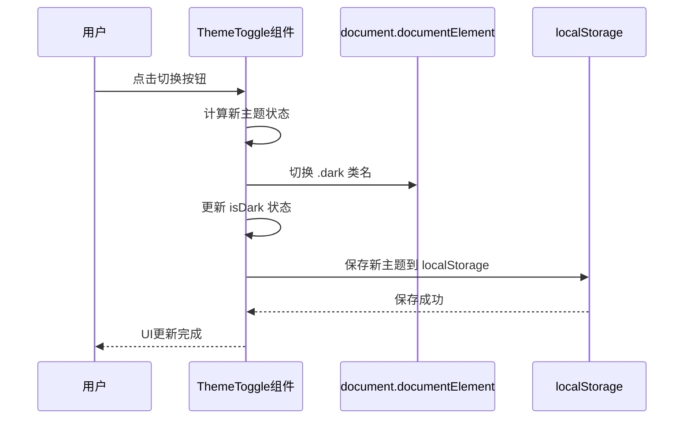
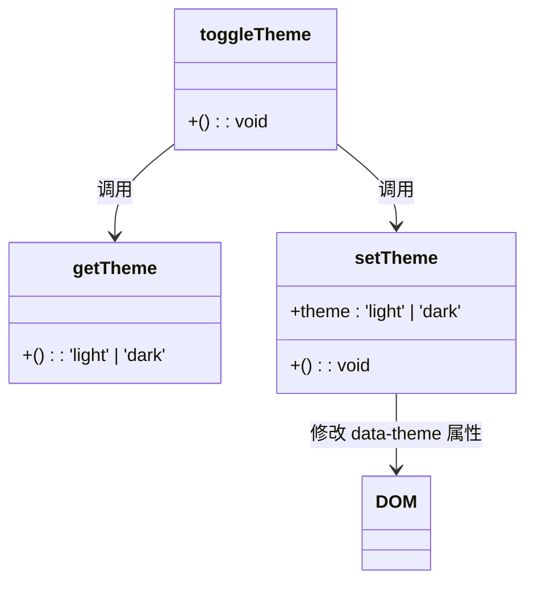
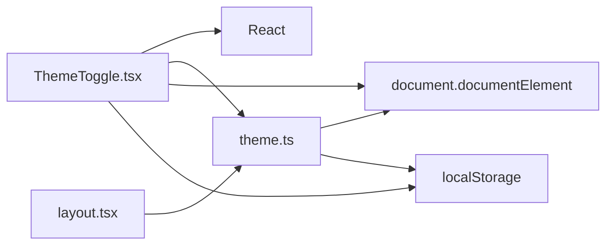

# 状态管理

<cite>
**Referenced Files in This Document**   
- [ThemeToggle.tsx](file://app/components/ThemeToggle.tsx)
- [theme.ts](file://app/lib/theme.ts)
- [layout.tsx](file://app/layout.tsx)
- [globals.css](file://app/globals.css)
</cite>

## 目录
1. [简介](#简介)
2. [核心组件分析](#核心组件分析)
3. [架构概览](#架构概览)
4. [详细组件分析](#详细组件分析)
5. [依赖分析](#依赖分析)
6. [性能考虑](#性能考虑)
7. [故障排除指南](#故障排除指南)
8. [结论](#结论)

## 简介
本文档深入分析了基于Next.js的应用程序中客户端状态管理的实现，重点关注主题切换功能。文档详细探讨了`ThemeToggle.tsx`组件如何利用React的`useState`和`useEffect`钩子管理本地状态，并与浏览器的`localStorage`进行持久化同步。同时，文档分析了`app/lib/theme.ts`中的主题相关工具函数及其与全局CSS主题的集成机制。通过全面的技术分析，本文档旨在为开发者提供一个清晰的状态管理模式理解，并为处理类似全局UI状态（如语言、模态框）提供扩展建议。

## 核心组件分析
本文档的核心是`ThemeToggle.tsx`组件和`theme.ts`工具库。`ThemeToggle.tsx`作为用户交互的入口点，负责管理主题切换的UI逻辑和状态更新。`theme.ts`则提供了可复用的主题管理函数，实现了状态的读取、设置和切换。这两个组件共同构成了一个完整的主题管理系统，展示了客户端状态管理的最佳实践。

**Section sources**
- [ThemeToggle.tsx](file://app/components/ThemeToggle.tsx#L1-L55)
- [theme.ts](file://app/lib/theme.ts#L1-L15)

## 架构概览
该主题管理系统的架构分为三个主要层次：UI组件层、逻辑工具层和样式层。UI组件层由`ThemeToggle.tsx`构成，负责用户交互和状态展示。逻辑工具层由`theme.ts`提供，封装了与主题相关的业务逻辑和持久化操作。样式层则通过`globals.css`中的CSS变量和类名来实现视觉效果的切换。这种分层架构确保了代码的可维护性和可扩展性。

**Diagram sources**
- [ThemeToggle.tsx](file://app/components/ThemeToggle.tsx#L1-L55)
- [theme.ts](file://app/lib/theme.ts#L1-L15)
- [globals.css](file://app/globals.css#L1-L75)

**Section sources**
- [ThemeToggle.tsx](file://app/components/ThemeToggle.tsx#L1-L55)
- [theme.ts](file://app/lib/theme.ts#L1-L15)
- [globals.css](file://app/globals.css#L1-L75)

## 详细组件分析
本节将深入分析`ThemeToggle.tsx`和`theme.ts`两个核心组件的实现细节。

### ThemeToggle组件分析
`ThemeToggle`组件是主题切换功能的用户界面入口。它使用`useState`钩子来管理当前是否为暗色模式的状态，并通过`useEffect`钩子在组件挂载时初始化该状态。

#### 状态初始化流程

**Diagram sources**
- [ThemeToggle.tsx](file://app/components/ThemeToggle.tsx#L10-L28)

**Section sources**
- [ThemeToggle.tsx](file://app/components/ThemeToggle.tsx#L1-L55)

#### 主题切换方法

**Diagram sources**
- [ThemeToggle.tsx](file://app/components/ThemeToggle.tsx#L33-L43)

### theme.ts工具库分析
`theme.ts`文件提供了三个核心函数：`getTheme`、`setTheme`和`toggleTheme`，它们构成了主题管理的公共API。

#### 工具函数关系

**Diagram sources**
- [theme.ts](file://app/lib/theme.ts#L1-L15)

**Section sources**
- [theme.ts](file://app/lib/theme.ts#L1-L15)

## 依赖分析
该主题管理系统涉及多个文件之间的依赖关系。`ThemeToggle.tsx`直接依赖于React的`useState`和`useEffect`钩子，以及`theme.ts`中的工具函数。`layout.tsx`在服务端渲染时调用`getTheme`函数来确定初始主题，确保了首屏渲染的一致性。

**Diagram sources**
- [ThemeToggle.tsx](file://app/components/ThemeToggle.tsx#L1-L55)
- [theme.ts](file://app/lib/theme.ts#L1-L15)
- [layout.tsx](file://app/layout.tsx#L1-L31)

**Section sources**
- [ThemeToggle.tsx](file://app/components/ThemeToggle.tsx#L1-L55)
- [theme.ts](file://app/lib/theme.ts#L1-L15)
- [layout.tsx](file://app/layout.tsx#L1-L31)

## 性能考虑
该状态管理模式在性能方面表现良好。通过使用`transition-colors`和`duration-300`等CSS类，主题切换具有平滑的过渡动画，提升了用户体验。然而，直接操作`document.documentElement`可能会导致不必要的重排，建议在复杂应用中考虑使用CSS变量来替代类名切换。

**Section sources**
- [globals.css](file://app/globals.css#L1-L75)
- [ThemeToggle.tsx](file://app/components/ThemeToggle.tsx#L1-L55)

## 故障排除指南
当主题切换功能出现问题时，可以按照以下步骤进行排查：

1. 检查`localStorage`中是否正确保存了主题偏好
2. 验证`document.documentElement`上是否正确添加了`.dark`类名
3. 确认`globals.css`中的CSS规则是否正确应用
4. 检查服务端渲染时`getTheme`函数的返回值是否正确

**Section sources**
- [ThemeToggle.tsx](file://app/components/ThemeToggle.tsx#L1-L55)
- [theme.ts](file://app/lib/theme.ts#L1-L15)
- [globals.css](file://app/globals.css#L1-L75)

## 结论
本文档详细分析了基于Next.js的应用程序中主题切换功能的实现。通过`useState`和`useEffect`钩子，`ThemeToggle.tsx`组件有效地管理了本地状态，并与`localStorage`进行持久化同步。`theme.ts`工具库提供了可复用的主题管理函数，增强了代码的可维护性。该状态管理模式简单有效，适用于大多数需要全局UI状态管理的场景。对于更复杂的状态管理需求，建议考虑使用React Context或状态管理库。