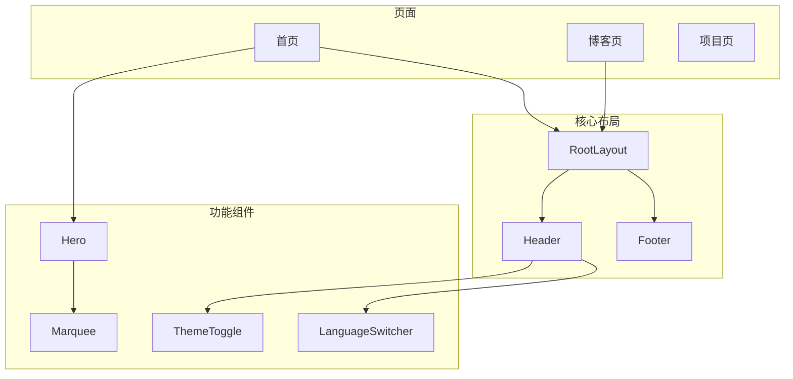
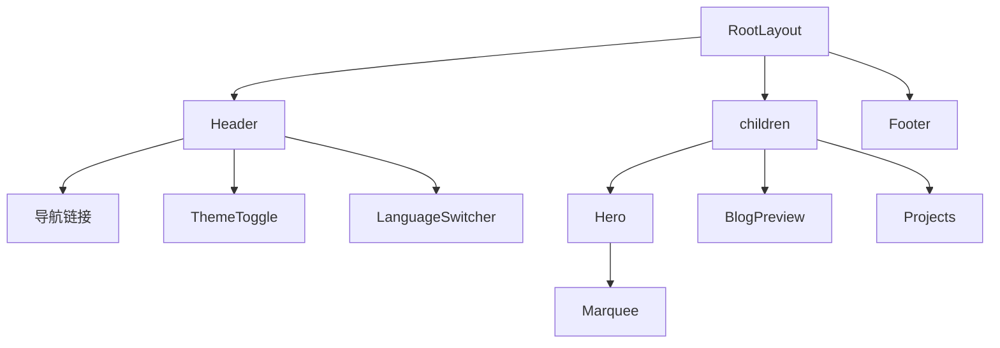
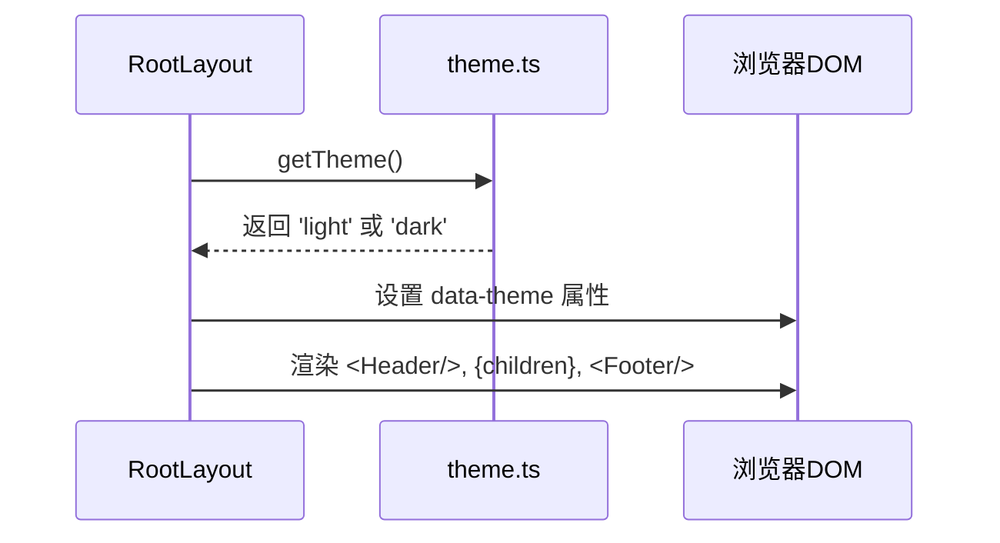
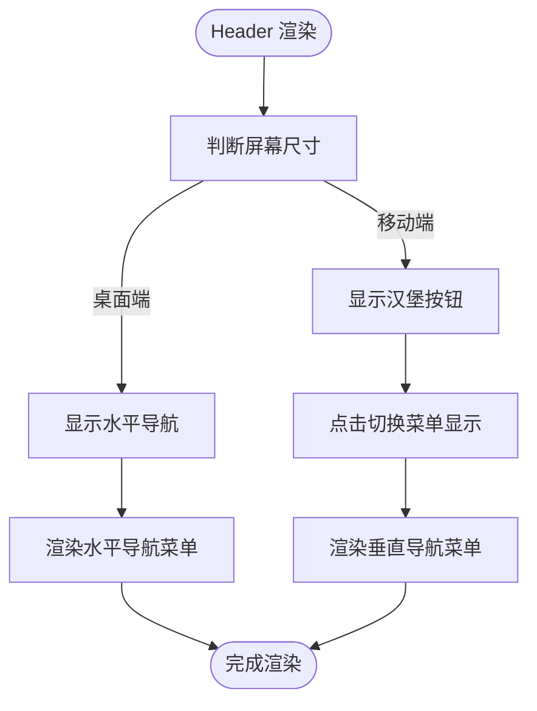
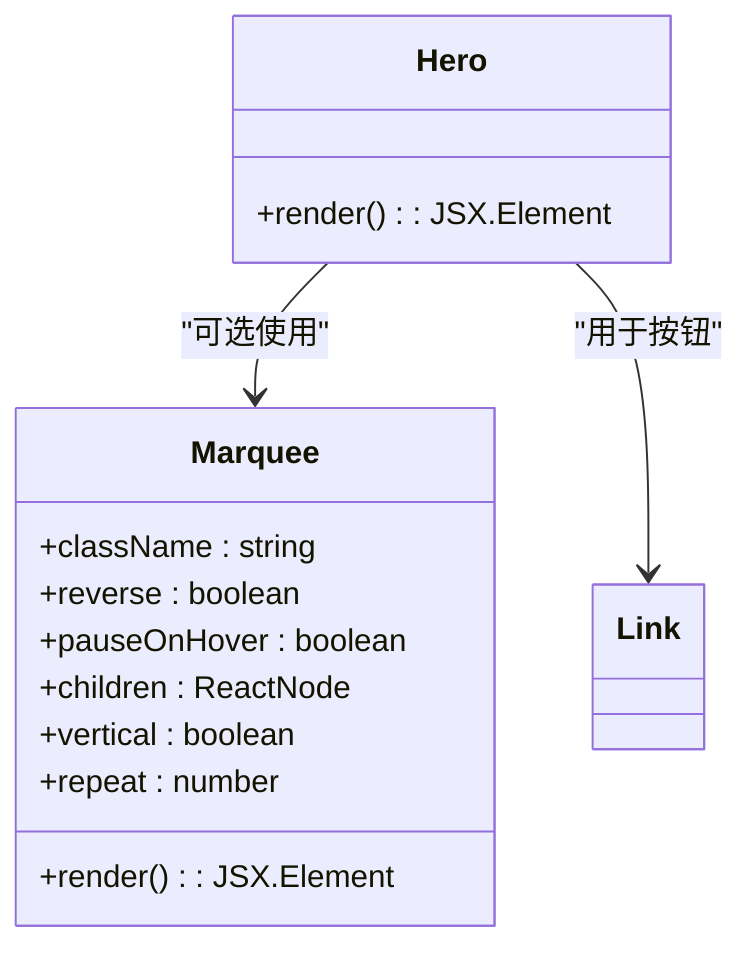
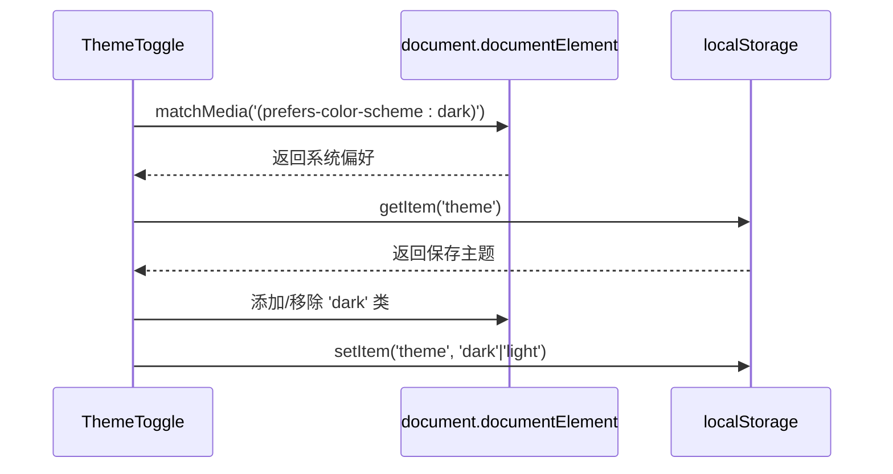
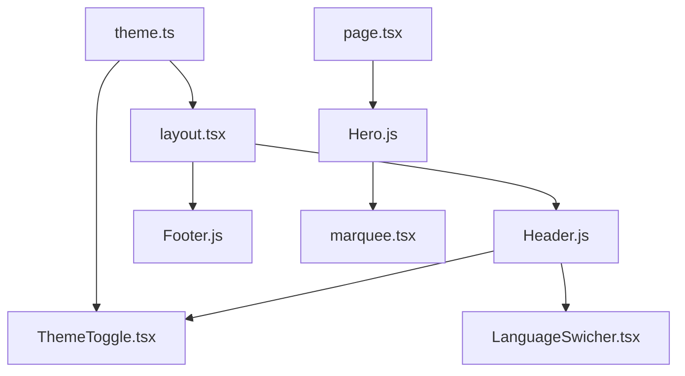

# 组件架构

<cite>
**本文档中引用的文件**  
- [layout.tsx](file://app/layout.tsx)
- [Header.js](file://app/components/Header.js)
- [Footer.js](file://app/components/Footer.js)
- [Hero.js](file://app/components/Hero.js)
- [ThemeToggle.tsx](file://app/components/ThemeToggle.tsx)
- [LanguageSwicher.tsx](file://app/components/LanguageSwicher.tsx)
- [theme.ts](file://app/lib/theme.ts)
- [marquee.tsx](file://components/magicui/marquee.tsx)
- [page.tsx](file://app/page.tsx)
- [blog/page.js](file://app/blog/page.js)
</cite>

## 目录
1. [简介](#简介)
2. [项目结构](#项目结构)
3. [核心组件](#核心组件)
4. [架构概览](#架构概览)
5. [详细组件分析](#详细组件分析)
6. [依赖关系分析](#依赖关系分析)
7. [性能考虑](#性能考虑)
8. [可访问性与响应式设计](#可访问性与响应式设计)
9. [最佳实践与复用机制](#最佳实践与复用机制)
10. [结论](#结论)

## 简介
本文档深入分析基于Next.js的个人网站UI组件架构，重点解析`RootLayout`作为全局布局容器的核心作用，以及其如何集成`Header`和`Footer`实现一致的页面结构。文档详细阐述导航组件、主题切换、语言切换、首页展示区域等关键UI模块的设计与交互逻辑，并探讨组件间状态传递、响应式断点处理及可访问性实践。

## 项目结构
项目采用Next.js App Router架构，组件按功能组织在`app/components/`目录下，全局布局由`app/layout.tsx`定义。页面内容通过`children`注入布局组件，实现结构复用。国际化资源存放在`public/locales`，主题逻辑封装在`lib/theme.ts`中。

**图示来源**  
- [layout.tsx](file://app/layout.tsx#L14-L29)
- [Header.js](file://app/components/Header.js#L1-L81)
- [Footer.js](file://app/components/Footer.js#L1-L71)
- [Hero.js](file://app/components/Hero.js#L1-L40)

**本节来源**  
- [app/layout.tsx](file://app/layout.tsx#L1-L30)
- [app/components/Header.js](file://app/components/Header.js#L1-L81)
- [app/components/Footer.js](file://app/components/Footer.js#L1-L71)

## 核心组件
系统核心由`RootLayout`、`Header`、`Footer`和`Hero`构成。`RootLayout`作为最外层容器，负责注入HTML文档结构、主题属性和全局组件。`Header`提供导航与主题切换，`Footer`包含站点信息与联系链接，`Hero`作为首页首屏展示区域，集成动态效果与行动号召按钮。

**本节来源**  
- [layout.tsx](file://app/layout.tsx#L14-L29)
- [Header.js](file://app/components/Header.js#L1-L81)
- [Footer.js](file://app/components/Footer.js#L1-L71)
- [Hero.js](file://app/components/Hero.js#L1-L40)

## 架构概览
整个UI架构遵循分层设计原则，`RootLayout`处于最顶层，统一管理页面结构与主题状态。各页面（如`page.tsx`、`blog/page.js`）作为内容层，通过`children`嵌入布局。功能组件（如`ThemeToggle`、`LanguageSwitcher`）在`Header`中集成，确保全局一致性。

**图示来源**  
- [layout.tsx](file://app/layout.tsx#L14-L29)
- [page.tsx](file://app/page.tsx#L1-L61)
- [blog/page.js](file://app/blog/page.js#L1-L59)

## 详细组件分析

### RootLayout 分析
`RootLayout`是应用的根布局组件，负责定义HTML文档结构、语言属性和主题模式。它通过`getTheme()`从本地存储或系统偏好中读取初始主题，并将其设置为`data-theme`属性，实现主题持久化。

**图示来源**  
- [layout.tsx](file://app/layout.tsx#L14-L29)
- [theme.ts](file://app/lib/theme.ts#L1-L4)

**本节来源**  
- [layout.tsx](file://app/layout.tsx#L14-L29)
- [theme.ts](file://app/lib/theme.ts#L1-L14)

### Header 与 Footer 分析
`Header`组件实现响应式导航，桌面端显示水平菜单，移动端通过汉堡按钮切换垂直菜单。`Footer`采用三栏网格布局，分别展示站点信息、快速链接和联系方式。两者均使用Tailwind CSS的响应式断点（`md:`）实现自适应。

**图示来源**  
- [Header.js](file://app/components/Header.js#L1-L81)
- [Footer.js](file://app/components/Footer.js#L1-L71)

**本节来源**  
- [Header.js](file://app/components/Header.js#L1-L81)
- [Footer.js](file://app/components/Footer.js#L1-L71)

### Hero 组件分析
`Hero`组件作为首页核心展示区域，包含标题、描述和行动号召按钮。其设计强调视觉层次与用户引导，虽当前代码中`Marquee`被注释，但结构已预留滚动技术标签的动画区域。

**图示来源**  
- [Hero.js](file://app/components/Hero.js#L1-L40)
- [marquee.tsx](file://components/magicui/marquee.tsx#L1-L73)

**本节来源**  
- [Hero.js](file://app/components/Hero.js#L1-L40)
- [marquee.tsx](file://components/magicui/marquee.tsx#L1-L73)

### 主题与语言切换分析
`ThemeToggle`组件通过`useEffect`在客户端初始化主题状态，监听本地存储和系统偏好。点击按钮时，切换`documentElement`的`dark`类并更新`localStorage`。`LanguageSwitcher`虽未完全实现，但结构已支持多语言切换。

**图示来源**  
- [ThemeToggle.tsx](file://app/components/ThemeToggle.tsx#L33-L54)
- [theme.ts](file://app/lib/theme.ts#L6-L9)

**本节来源**  
- [ThemeToggle.tsx](file://app/components/ThemeToggle.tsx#L1-L54)
- [LanguageSwicher.tsx](file://app/components/LanguageSwicher.tsx#L1-L28)

## 依赖关系分析
组件间依赖清晰：`RootLayout`依赖`Header`和`Footer`；`Header`依赖`ThemeToggle`和`LanguageSwitcher`；`Hero`可选依赖`Marquee`。主题逻辑由`lib/theme.ts`统一管理，避免重复代码。

**图示来源**  
- [layout.tsx](file://app/layout.tsx#L5-L6)
- [Header.js](file://app/components/Header.js#L3-L4)
- [ThemeToggle.tsx](file://app/components/ThemeToggle.tsx#L1-L2)
- [Hero.js](file://app/components/Hero.js#L2-L3)

**本节来源**  
- [layout.tsx](file://app/layout.tsx#L1-L30)
- [Header.js](file://app/components/Header.js#L1-L81)
- [ThemeToggle.tsx](file://app/components/ThemeToggle.tsx#L1-L54)

## 性能考虑
- **客户端组件优化**：`ThemeToggle`和`Header`标记为`'use client'`，仅在需要交互时启用React客户端功能。
- **服务端渲染**：`RootLayout`和页面组件在服务端渲染，提升首屏加载速度。
- **懒加载**：`Marquee`组件可结合`LazyMotion`实现动画库的懒加载，减少初始包体积。

**本节来源**  
- [layout.tsx](file://app/layout.tsx#L1-L30)
- [ThemeToggle.tsx](file://app/components/ThemeToggle.tsx#L1-L2)

## 可访问性与响应式设计
- **可访问性**：`Header`中的导航链接使用语义化`<nav>`标签，`ThemeToggle`提供`aria-label`描述。
- **响应式设计**：通过Tailwind的`md:hidden`、`sm:flex`等类实现移动优先的响应式布局。
- **键盘导航**：`ThemeToggle`按钮支持键盘焦点与操作，符合WCAG标准。

**本节来源**  
- [Header.js](file://app/components/Header.js#L1-L81)
- [Footer.js](file://app/components/Footer.js#L1-L71)
- [Hero.js](file://app/components/Hero.js#L1-L40)

## 最佳实践与复用机制
- **布局复用**：所有页面共享`RootLayout`，确保一致的页眉页脚与主题支持。
- **组件组合**：`Hero`可独立用于任何需要首屏展示的页面。
- **状态管理**：主题状态通过DOM类名和`localStorage`管理，避免复杂状态库。
- **国际化准备**：`LanguageSwitcher`结构已就绪，便于未来集成`next-intl`。

**本节来源**  
- [layout.tsx](file://app/layout.tsx#L14-L29)
- [page.tsx](file://app/page.tsx#L1-L61)
- [blog/page.js](file://app/blog/page.js#L1-L59)

## 结论
该Next.js应用的UI架构设计清晰，通过`RootLayout`统一管理全局结构与主题，`Header`和`Footer`提供一致的导航体验，`Hero`组件实现首页核心展示。响应式设计与可访问性得到良好支持，组件复用机制健全，为站点扩展与维护提供了坚实基础。