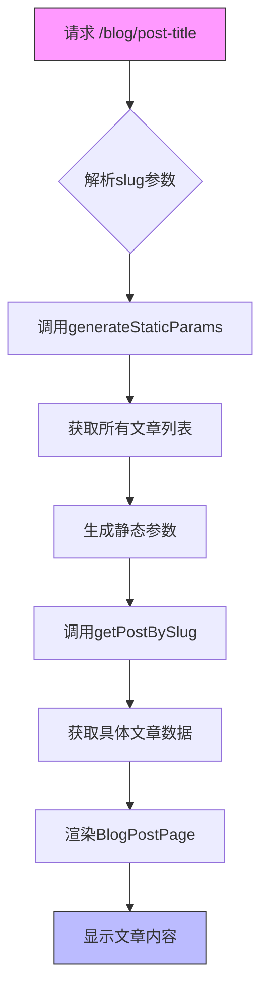
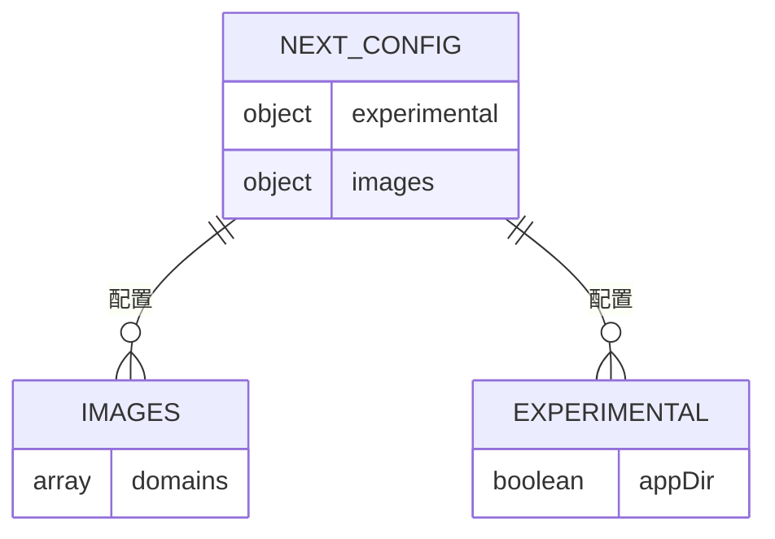
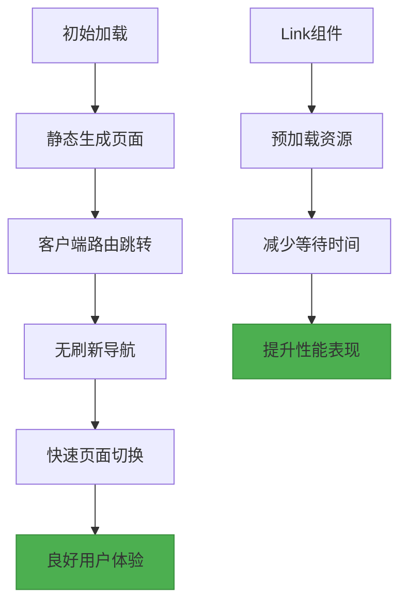
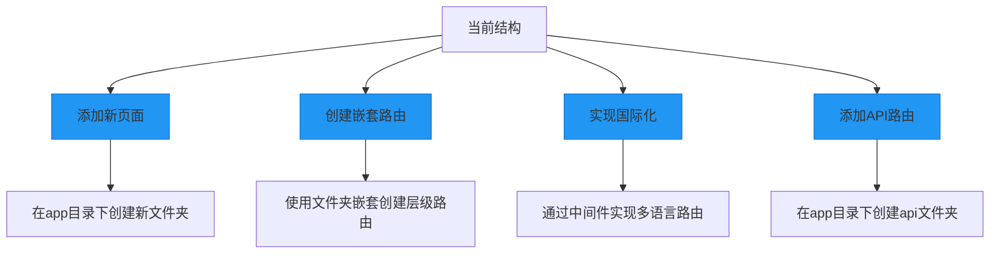

# 路由与导航

<cite>
**本文档引用的文件**
- [app/page.tsx](file://app/page.tsx)
- [app/layout.tsx](file://app/layout.tsx)
- [app/blog/page.js](file://app/blog/page.js)
- [app/projects/page.tsx](file://app/projects/page.tsx)
- [app/time-planning/page.tsx](file://app/time-planning/page.tsx)
- [app/blog/[slug]/page.js](file://app/blog/[slug]/page.js)
- [next.config.ts](file://next.config.ts)
- [app/components/Header.js](file://app/components/Header.js)
</cite>

## 目录
1. [简介](#简介)
2. [项目结构与路由映射](#项目结构与路由映射)
3. [核心路由机制](#核心路由机制)
4. [布局继承与嵌套](#布局继承与嵌套)
5. [页面导航实现方式](#页面导航实现方式)
6. [动态路由应用](#动态路由应用)
7. [自定义路由配置](#自定义路由配置)
8. [用户体验与性能分析](#用户体验与性能分析)
9. [扩展建议](#扩展建议)

## 简介
本文档全面记录基于Next.js App Router的文件系统路由机制。详细说明`app`目录下各`page.tsx`/`page.js`文件如何映射到具体URL路径，包括根路径、/blog、/projects、/time-planning等。解释`layout.tsx`在路由层级中的布局继承与嵌套作用，描述页面间的导航实现方式，并分析路由切换时的用户体验与性能表现。

## 项目结构与路由映射

```mermaid
graph TB
A[根路径 /] --> B[博客 /blog]
A --> C[项目 /projects]
A --> D[时间规划 /time-planning]
B --> E[博客详情 /blog/[slug]]
style A fill:#4CAF50,stroke:#388E3C
style B fill:#2196F3,stroke:#1976D2
style C fill:#FF9800,stroke:#F57C00
style D fill:#9C27B0,stroke:#7B1FA2
style E fill:#607D8B,stroke:#455A64
```

**图示来源**
- [app/page.tsx](file://app/page.tsx#L1-L61)
- [app/blog/page.js](file://app/blog/page.js#L1-L59)
- [app/projects/page.tsx](file://app/projects/page.tsx#L1-L59)
- [app/time-planning/page.tsx](file://app/time-planning/page.tsx#L1-L155)

**本节来源**
- [app/page.tsx](file://app/page.tsx#L1-L61)
- [app/blog/page.js](file://app/blog/page.js#L1-L59)
- [app/projects/page.tsx](file://app/projects/page.tsx#L1-L59)
- [app/time-planning/page.tsx](file://app/time-planning/page.tsx#L1-L155)

## 核心路由机制

Next.js App Router基于文件系统的约定式路由机制，将`app`目录下的文件结构直接映射为应用的URL路径。每个`page.tsx`或`page.js`文件对应一个具体的路由路径。

- 根路径 `/` 由 `app/page.tsx` 文件定义
- `/blog` 路径由 `app/blog/page.js` 文件定义
- `/projects` 路径由 `app/projects/page.tsx` 文件定义
- `/time-planning` 路径由 `app/time-planning/page.tsx` 文件定义

这种基于文件系统的路由机制无需手动配置路由表，降低了维护成本并提高了开发效率。

**本节来源**
- [app/page.tsx](file://app/page.tsx#L1-L61)
- [app/blog/page.js](file://app/blog/page.js#L1-L59)
- [app/projects/page.tsx](file://app/projects/page.tsx#L1-L59)
- [app/time-planning/page.tsx](file://app/time-planning/page.tsx#L1-L155)

## 布局继承与嵌套

```mermaid
classDiagram
class RootLayout {
+metadata : object
+children : ReactNode
+getTheme() : string
}
class BlogLayout {
// 博客特定布局
}
class ProjectsLayout {
// 项目页面布局
}
RootLayout <|-- BlogLayout : 继承
RootLayout <|-- ProjectsLayout : 继承
RootLayout --> Header : 包含
RootLayout --> Footer : 包含
RootLayout --> children : 渲染
note right of RootLayout
全局布局组件，包含
头部、尾部和主题设置
end note
```

**图示来源**
- [app/layout.tsx](file://app/layout.tsx#L1-L30)
- [app/components/Header.js](file://app/components/Header.js#L1-L81)

**本节来源**
- [app/layout.tsx](file://app/layout.tsx#L1-L30)

`app/layout.tsx` 文件定义了全局布局组件，通过`{children}`插槽实现布局继承。该布局包含`Header`和`Footer`组件，并在HTML标签上设置数据主题属性，实现了跨页面的统一外观和主题管理。

## 页面导航实现方式

```mermaid
sequenceDiagram
participant 用户
participant Header as Header.js
participant 页面 as page.js
participant Link as Next/Link
用户->>Header : 点击导航链接
Header->>Link : 调用Link组件
Link->>页面 : 客户端路由跳转
页面-->>用户 : 显示目标页面内容
用户->>首页 : 点击"查看所有文章"
首页->>Link : 调用Link组件
Link->>/blog : 路由跳转
/blog-->>用户 : 显示博客列表
```

**图示来源**
- [app/components/Header.js](file://app/components/Header.js#L1-L81)
- [app/page.tsx](file://app/page.tsx#L1-L61)

**本节来源**
- [app/components/Header.js](file://app/components/Header.js#L1-L81)
- [app/page.tsx](file://app/page.tsx#L1-L61)

页面导航主要通过Next.js提供的`Link`组件实现。在`Header.js`中，导航菜单使用`Link`组件进行页面跳转，避免了完整的页面刷新，提升了用户体验。同时，在首页的"查看所有文章"按钮也使用了`Link`组件实现平滑的客户端路由切换。

## 动态路由应用



**图示来源**
- [app/blog/[slug]/page.js](file://app/blog/[slug]/page.js#L1-L34)

**本节来源**
- [app/blog/[slug]/page.js](file://app/blog/[slug]/page.js#L1-L34)

动态路由`[slug]`用于博客详情页，实现了基于文章标题的动态URL。`generateStaticParams`函数在构建时预生成所有可能的slug参数，确保静态生成的页面能够正确响应不同的文章请求。通过`params.slug`获取动态参数，并调用`getPostBySlug`函数获取对应的文章数据。

## 自定义路由配置



**图示来源**
- [next.config.ts](file://next.config.ts#L1-L17)

**本节来源**
- [next.config.ts](file://next.config.ts#L1-L17)

`next.config.ts`文件提供了自定义路由和应用配置的能力。当前配置中包含了图片域名白名单，允许从指定域名加载图片资源。虽然注释掉了i18n配置，但提示了在App Router中需要通过中间件实现国际化路由。

## 用户体验与性能分析



**图示来源**
- [app/components/Header.js](file://app/components/Header.js#L1-L81)
- [app/page.tsx](file://app/page.tsx#L1-L61)

**本节来源**
- [app/components/Header.js](file://app/components/Header.js#L1-L81)
- [app/page.tsx](file://app/page.tsx#L1-L61)

基于App Router的路由机制提供了优秀的用户体验和性能表现。静态生成确保了快速的首屏加载，而`Link`组件的预加载功能使得页面间跳转几乎无延迟。客户端路由避免了完整的页面刷新，保持了应用状态的连续性。

## 扩展建议



**图示来源**
- [app/page.tsx](file://app/page.tsx#L1-L61)
- [app/blog/page.js](file://app/blog/page.js#L1-L59)

**本节来源**
- [app/page.tsx](file://app/page.tsx#L1-L61)
- [app/blog/page.js](file://app/blog/page.js#L1-L59)

未来扩展建议包括：
1. 添加新页面：在`app`目录下创建新的文件夹并添加`page.tsx`文件
2. 创建嵌套路由：通过文件夹嵌套实现更复杂的路由层级
3. 实现国际化：通过中间件配置多语言路由支持
4. 添加API路由：在`app`目录下创建`api`文件夹以支持API端点

这些扩展方式保持了与现有架构的一致性，便于维护和团队协作。