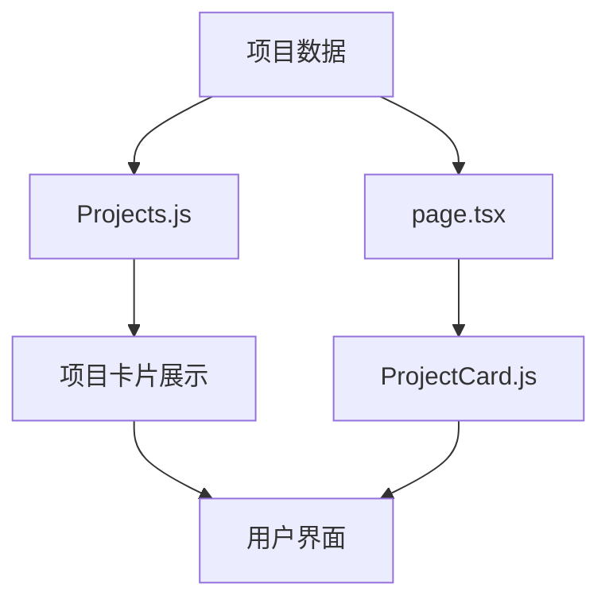
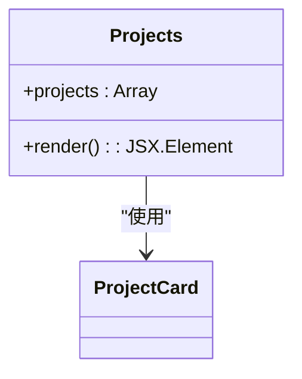
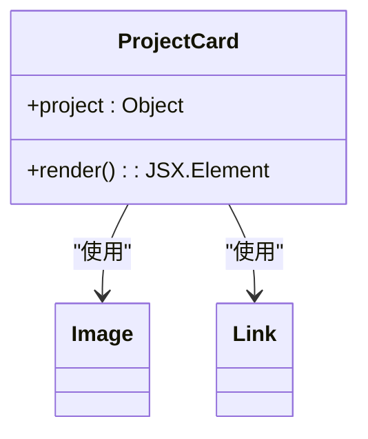
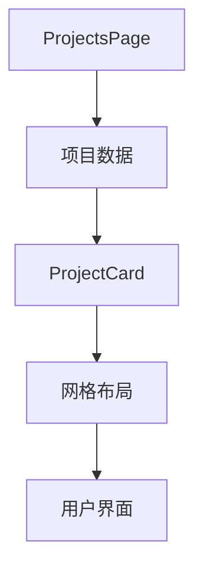
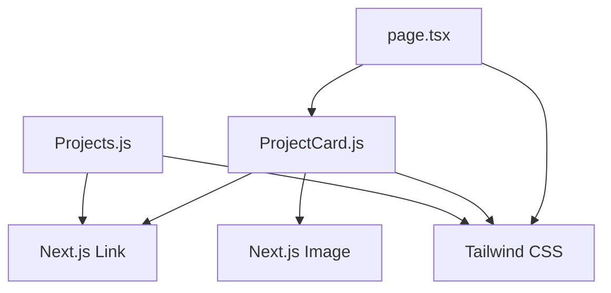

# 项目展示模块

<cite>
**本文档引用的文件**
- [Projects.js](file://app/components/Projects.js)
- [ProjectCard.js](file://app/components/ProjectCard.js)
- [page.tsx](file://app/projects/page.tsx)
- [posts.js](file://app/lib/posts.js)
- [BlogList.js](file://app/components/BlogList.js)
- [BlogPreview.js](file://app/components/BlogPreview.js)
</cite>

## 目录
1. [简介](#简介)
2. [项目结构](#项目结构)
3. [核心组件](#核心组件)
4. [架构概述](#架构概述)
5. [详细组件分析](#详细组件分析)
6. [依赖分析](#依赖分析)
7. [性能考虑](#性能考虑)
8. [故障排除指南](#故障排除指南)
9. [结论](#结论)

## 简介
本文档详细记录了个人博客网站中项目展示功能的实现细节。重点分析了`Projects.js`和`ProjectCard.js`两个核心组件的设计与实现，以及`/app/projects/page.tsx`页面如何集成这些组件来展示精选项目。同时探讨了项目数据的来源、结构设计，以及与博客系统的异同和组件复用的可能性。

## 项目结构
项目展示功能主要由三个核心文件构成，分别位于不同的目录中：
- `app/components/Projects.js`：用于在首页展示精选项目的组件
- `app/components/ProjectCard.js`：定义单个项目卡片视觉呈现的通用组件
- `app/projects/page.tsx`：项目列表的完整页面，集成项目卡片组件

这些组件与博客系统（`BlogList.js`、`BlogPreview.js`）在设计模式上高度相似，体现了代码复用的设计理念。

**Section sources**
- [Projects.js](file://app/components/Projects.js)
- [ProjectCard.js](file://app/components/ProjectCard.js)
- [page.tsx](file://app/projects/page.tsx)

## 核心组件
项目展示模块的核心由两个组件构成：`Projects.js`用于在首页展示精选项目列表，而`ProjectCard.js`则定义了单个项目卡片的视觉呈现。这两个组件都采用了现代化的React函数组件模式，结合Next.js的组件系统，实现了响应式和可交互的用户界面。

**Section sources**
- [Projects.js](file://app/components/Projects.js#L3-L85)
- [ProjectCard.js](file://app/components/ProjectCard.js#L4-L50)

## 架构概述
项目展示模块采用分层架构设计，从数据层到展示层清晰分离。数据在组件内部定义，通过props传递给子组件，最终渲染为用户可见的界面元素。这种设计模式使得组件具有良好的可维护性和可扩展性。

**Diagram sources**
- [Projects.js](file://app/components/Projects.js#L4-L23)
- [page.tsx](file://app/projects/page.tsx#L8-L38)
- [ProjectCard.js](file://app/components/ProjectCard.js#L4-L50)

## 详细组件分析

### Projects.js 组件分析
`Projects.js`组件负责在网站首页展示精选项目列表。该组件定义了一个包含项目标题、描述、技术标签和链接的数组，通过map方法遍历并渲染为一系列项目卡片。每个卡片都包含悬停效果和过渡动画，提升了用户体验。

#### 组件结构

**Diagram sources**
- [Projects.js](file://app/components/Projects.js#L3-L85)

**Section sources**
- [Projects.js](file://app/components/Projects.js#L3-L85)

### ProjectCard.js 组件分析
`ProjectCard.js`组件定义了单个项目卡片的视觉呈现，包括项目标题、描述、技术栈标签以及GitHub和演示地址链接。该组件接收project对象作为props，具有良好的可复用性。

#### 组件结构

**Diagram sources**
- [ProjectCard.js](file://app/components/ProjectCard.js#L4-L50)

**Section sources**
- [ProjectCard.js](file://app/components/ProjectCard.js#L4-L50)

### page.tsx 页面分析
`/app/projects/page.tsx`文件定义了完整的项目展示页面，使用`ProjectCard`组件以网格布局展示多个项目。该页面采用客户端组件模式（'use client'），支持交互功能。

#### 页面结构

**Diagram sources**
- [page.tsx](file://app/projects/page.tsx#L6-L59)

**Section sources**
- [page.tsx](file://app/projects/page.tsx#L6-L59)

## 依赖分析
项目展示模块主要依赖Next.js框架的核心组件，包括`Link`和`Image`。样式方面依赖Tailwind CSS实用类，实现了响应式设计和现代化的视觉效果。

**Diagram sources**
- [Projects.js](file://app/components/Projects.js)
- [ProjectCard.js](file://app/components/ProjectCard.js)
- [page.tsx](file://app/projects/page.tsx)

**Section sources**
- [Projects.js](file://app/components/Projects.js)
- [ProjectCard.js](file://app/components/ProjectCard.js)
- [page.tsx](file://app/projects/page.tsx)

## 性能考虑
项目展示模块在性能方面有以下特点：
- 所有项目数据硬编码在组件内部，避免了外部API调用的延迟
- 使用了Next.js的Image组件，支持图片懒加载和优化
- CSS类名使用Tailwind CSS的实用类，减少了CSS文件大小
- 添加了hover效果和过渡动画，提升了用户体验但可能影响低端设备性能

建议在项目数量增加时考虑将数据外部化，以减少主包大小。

## 故障排除指南
当项目展示功能出现问题时，可参考以下常见问题及解决方案：

**Section sources**
- [Projects.js](file://app/components/Projects.js)
- [ProjectCard.js](file://app/components/ProjectCard.js)
- [page.tsx](file://app/projects/page.tsx)

## 结论
项目展示模块通过`Projects.js`和`ProjectCard.js`两个核心组件，实现了灵活且可复用的项目展示功能。数据硬编码在组件内部，适合项目数量较少的个人网站。该模块与博客系统在设计模式上高度相似，体现了组件化和代码复用的设计理念。未来可考虑将项目数据外部化，以支持更多项目条目和动态更新。