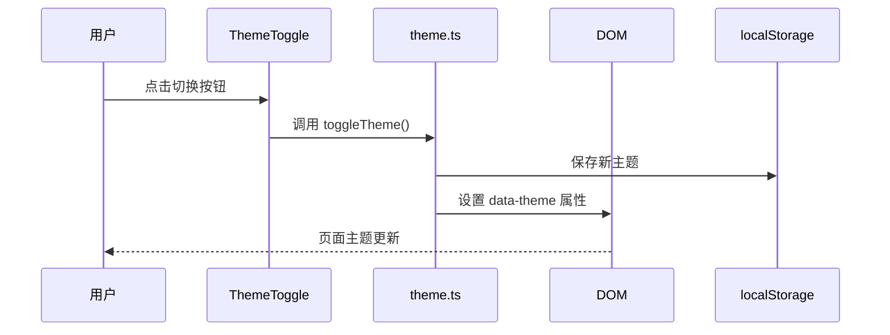
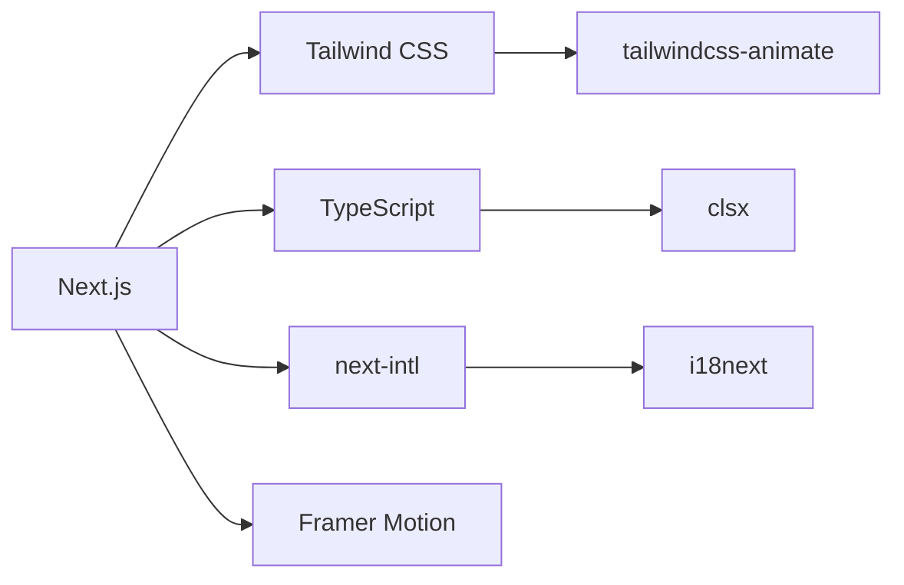

# 项目概述

<cite>
**本文档引用的文件**  
- [package.json](file://package.json)
- [README.md](file://README.md)
- [next.config.ts](file://next.config.ts)
- [app/page.tsx](file://app/page.tsx)
- [app/layout.tsx](file://app/layout.tsx)
- [app/lib/i18n.ts](file://app/lib/i18n.ts)
- [app/lib/theme.ts](file://app/lib/theme.ts)
- [app/components/Header.js](file://app/components/Header.js)
- [app/components/ThemeToggle.tsx](file://app/components/ThemeToggle.tsx)
- [app/components/LanguageSwicher.tsx](file://app/components/LanguageSwicher.tsx)
- [app/blog/page.js](file://app/blog/page.js)
- [app/blog/[slug]/page.js](file://app/blog/[slug]/page.js)
- [app/projects/page.tsx](file://app/projects/page.tsx)
- [app/time-planning/page.tsx](file://app/time-planning/page.tsx)
- [app/lib/posts.js](file://app/lib/posts.js)
- [tailwind.config.js](file://tailwind.config.js)
- [tsconfig.json](file://tsconfig.json)
</cite>

## 目录

1. [简介](#简介)
2. [项目结构](#项目结构)
3. [核心功能模块](#核心功能模块)
4. [技术架构与选型](#技术架构与选型)
5. [依赖库分析](#依赖库分析)
6. [用户工作流示例](#用户工作流示例)
7. [可扩展性与部署策略](#可扩展性与部署策略)
8. [结论](#结论)

## 简介

andylili-website-nextjs 是一个基于 **Next.js 15** 和 **React 19** 构建的现代化个人技术博客与作品集网站。该项目融合了博客系统、项目展示、时间规划、主题切换和多语言支持等核心功能，旨在为开发者提供一个高性能、可维护且用户体验优秀的全栈应用范例。

项目采用 Next.js App Router 架构，充分利用服务端组件（Server Components）、静态生成（Static Generation）和增量静态再生（ISR）等特性，实现快速加载和 SEO 友好。同时，通过集成 Turbopack 构建工具，显著提升开发环境的冷启动和热更新速度。

该网站不仅适合作为个人博客平台，还展示了现代 Web 开发中的最佳实践，包括响应式设计、动画交互、国际化支持和主题管理，适合从初学者到高级开发者不同层次的技术人员学习和参考。

**Section sources**
- [README.md](file://README.md#L1-L274)

## 项目结构

项目采用 Next.js App Router 的标准目录结构，模块化清晰，职责分明。主要目录和文件组织如下：

```mermaid
graph TB
A[根目录] --> B[app/]
A --> C[public/locales/]
A --> D[components/magicui/]
A --> E[lib/]
A --> F[配置文件]
B --> B1[blog/]
B --> B2[projects/]
B --> B3[time-planning/]
B --> B4[components/]
B --> B5[lib/]
B --> B6[layout.tsx]
B --> B7[page.tsx]
B1 --> B1a[[slug]/page.js]
B1 --> B1b[page.js]
B4 --> B4a[Header.js]
B4 --> B4b[Footer.js]
B4 --> B4c[ThemeToggle.tsx]
B4 --> B4d[LanguageSwicher.tsx]
B5 --> B5a[i18n.ts]
B5 --> B5b[theme.ts]
B5 --> B5c[posts.js]
C --> C1[en/]
C --> C2[zh/]
F --> F1[package.json]
F --> F2[next.config.ts]
F --> F3[tailwind.config.js]
F --> F4[tsconfig.json]
```

**Diagram sources**
- [README.md](file://README.md#L30-L100)

**Section sources**
- [README.md](file://README.md#L30-L100)

## 核心功能模块

### 博客系统

博客系统是项目的核心内容模块，支持动态路由、文章列表展示和详情页渲染。通过 `[slug]` 动态路由实现文章的唯一访问路径，结合 `app/lib/posts.js` 中的数据管理逻辑，实现文章的排序、筛选和查询。

首页通过 `getFeaturedPosts()` 获取精选文章并在首页预览展示，博客列表页则通过 `getAllPosts()` 获取所有文章并按时间倒序排列。

**Section sources**
- [app/blog/page.js](file://app/blog/page.js#L1-L60)
- [app/blog/[slug]/page.js](file://app/blog/[slug]/page.js#L1-L35)
- [app/lib/posts.js](file://app/lib/posts.js#L1-L55)
- [app/page.tsx](file://app/page.tsx#L1-L62)

### 项目展示

项目展示模块通过 `app/projects/page.tsx` 实现，采用响应式网格布局展示多个项目卡片。每个项目包含标题、描述、技术栈、截图及链接，便于访客快速了解开发者的技术能力和项目经验。

该模块为客户端组件（'use client'），支持交互式浏览。

**Section sources**
- [app/projects/page.tsx](file://app/projects/page.tsx#L1-L60)

### 时间规划与追踪

时间规划模块位于 `app/time-planning/page.tsx`，是一个完整的客户端交互式功能，用于记录和分析每日时间分配。包含时间条形图、统计卡片和详细日志表格，支持计划时间与实际时间的对比分析。

该模块展示了如何在 Next.js 中构建复杂的状态管理 UI，适合学习 React 状态更新和数据可视化。

**Section sources**
- [app/time-planning/page.tsx](file://app/time-planning/page.tsx#L1-L156)

### 主题切换

主题切换功能由 `app/lib/theme.ts` 提供核心逻辑，通过读取 `localStorage` 或系统偏好设置初始主题，并在切换时更新 `document.documentElement` 的 `data-theme` 属性。

`app/components/ThemeToggle.tsx` 为客户端组件，提供用户交互按钮，点击后切换亮色/暗色模式并持久化用户偏好。



**Diagram sources**
- [app/components/ThemeToggle.tsx](file://app/components/ThemeToggle.tsx#L1-L55)
- [app/lib/theme.ts](file://app/lib/theme.ts#L1-L15)

**Section sources**
- [app/components/ThemeToggle.tsx](file://app/components/ThemeToggle.tsx#L1-L55)
- [app/lib/theme.ts](file://app/lib/theme.ts#L1-L15)

### 多语言支持

多语言功能基于 `next-intl` 和 `i18next` 实现，语言资源文件存储在 `public/locales/` 目录下，支持中文（zh）和英文（en）。

`app/lib/i18n.ts` 配置国际化实例，通过后端资源加载机制动态导入对应语言的 JSON 文件。`LanguageSwicher.tsx` 组件提供语言切换入口。

**Section sources**
- [app/lib/i18n.ts](file://app/lib/i18n.ts#L1-L23)
- [app/components/LanguageSwicher.tsx](file://app/components/LanguageSwicher.tsx#L1-L29)
- [public/locales](file://public/locales)

## 技术架构与选型

### Next.js App Router

项目采用 Next.js 13+ 的 App Router 架构，优势包括：
- 基于文件系统的路由，无需手动配置
- 服务端组件优先，提升首屏性能
- 内置数据获取支持（如 `generateStaticParams`）
- 更好的代码分割和加载性能

**Section sources**
- [README.md](file://README.md#L150-L160)

### TypeScript

TypeScript 提供静态类型检查，增强代码可维护性和开发体验。通过 `tsconfig.json` 配置严格模式，确保类型安全。

**Section sources**
- [tsconfig.json](file://tsconfig.json#L1-L28)

### Tailwind CSS

Tailwind CSS 作为原子化 CSS 框架，结合 `tailwind.config.js` 进行主题扩展，支持暗色模式切换。通过 `dark:` 前缀实现主题样式控制。

**Section sources**
- [tailwind.config.js](file://tailwind.config.js#L1-L27)

### next-intl

`next-intl` 是专为 Next.js 设计的国际化解决方案，与 App Router 深度集成，支持服务端和客户端的翻译功能，简化多语言开发流程。

**Section sources**
- [app/lib/i18n.ts](file://app/lib/i18n.ts#L1-L23)

## 依赖库分析

根据 `package.json` 文件，项目依赖可分为核心框架、样式与 UI、功能库三类：

| 类别 | 依赖包 | 作用 |
|------|--------|------|
| 核心框架 | next, react, react-dom | 构建应用的基础框架 |
| 样式与 UI | tailwindcss, lucide-react, class-variance-authority | 样式、图标和类名管理 |
| 功能库 | next-intl, i18next, framer-motion | 国际化、动画和交互 |
| 构建工具 | turbopack | 加速开发构建 |



**Diagram sources**
- [package.json](file://package.json#L1-L38)

**Section sources**
- [package.json](file://package.json#L1-L38)
- [README.md](file://README.md#L110-L140)

## 用户工作流示例

### 浏览博客

1. 用户访问首页 → 2. 查看精选文章预览 → 3. 点击“查看所有文章”进入博客列表 → 4. 点击某篇文章进入详情页

### 切换主题

1. 用户点击页面右上角“切换主题”按钮 → 2. JavaScript 更新 `localStorage` 和 DOM 属性 → 3. CSS 根据 `data-theme` 切换样式

### 查看项目

1. 用户点击导航栏“项目” → 2. 进入项目页面 → 3. 浏览项目卡片 → 4. 点击链接查看源码或演示

**Section sources**
- [app/page.tsx](file://app/page.tsx#L1-L62)
- [app/blog/page.js](file://app/blog/page.js#L1-L60)
- [app/components/Header.js](file://app/components/Header.js#L1-L82)

## 可扩展性与部署策略

### 可扩展性机制

- **模块化组件设计**：UI 组件独立封装，易于复用和替换
- **数据抽象层**：`app/lib/posts.js` 抽象数据访问，便于未来接入 CMS 或数据库
- **国际化支持**：通过 `next-intl` 可轻松添加新语言
- **主题系统**：基于 `data-theme` 的 CSS 变量机制，支持多主题扩展

### 部署优化策略

- **Turbopack 构建**：显著提升开发构建速度
- **静态生成（SSG）**：博客页面预渲染，提升加载性能
- **Vercel 部署**：推荐使用 Vercel 平台，自动优化 Next.js 应用
- **图片优化**：通过 `next/image` 或外部 CDN 优化资源加载

**Section sources**
- [README.md](file://README.md#L200-L250)
- [next.config.ts](file://next.config.ts#L1-L18)

## 结论

andylili-website-nextjs 是一个功能完整、架构清晰的现代化个人网站模板。它不仅展示了 Next.js 15 和 React 19 的最新特性，还集成了国际化、主题切换、动画交互等实用功能，具备良好的可维护性和扩展性。

对于初学者，该项目提供了学习现代 Web 开发技术栈的优秀范例；对于高级开发者，其模块化设计和性能优化策略具有实际参考价值。通过本项目，开发者可以快速搭建自己的技术博客或作品集网站，并在此基础上进行个性化扩展。